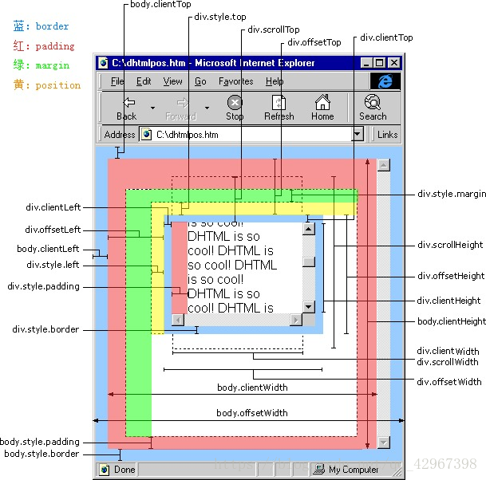
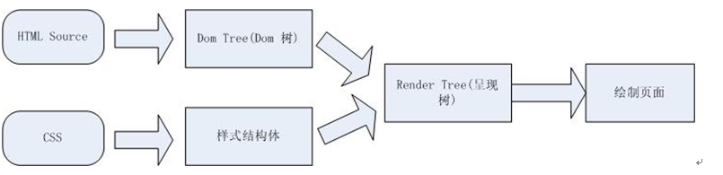
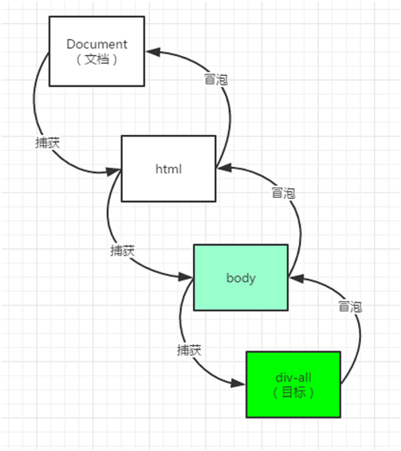

### 一、前言

JS：核心语法   DOM   BOM

HTML：负责提供内容；

CSS：负责修饰页面；

JS：**搞事情** (事件)，另外，**JS 的三大模块** (ES、DOM、BOM)


#### （一）事件简介

​	1、事件的三要素：eg1—进到教室要开灯，eg2—点击按钮弹出提示框

```
1) 事件源：eg1—开关，eg2—界面元素的按钮
2) 事件(事件类型)：eg1—摁一下，eg2—点击—滚轮—键盘敲入
3) 事件处理函数：eg1—接通火线，点亮灯泡，eg2—定义具体的操作
```

​	2、基本语法结构：

```
事件源**.**事件 = function(){
   	//  事件处理，可用this；
}

Eg: div.onclick=function(){   //……定义具体的操作}
```

小练习：标签页实现


### 二、DOM

#### （一）什么是DOM操作

​	DOM 是document object model  ，文档对象模型： 

​      它是W3C 制定的浏览器提供的对HTML文档操作的**接口**，把文档中的代码内容翻译成一个对象模型，在这个模型中，所有相关的标签属性注释文本等等12种数据，都翻译为一种类型的对象，统称**节点对象**，节点对象之间，在文档模型数据结构中存在某种**关系**：根节点 父子节点  同胞节点等等。

-  D（document）：document的意思是文档，在dom中会将HTML这个页面给解析为一个文档，并在解析的同时会提供一个 document对象。

  document对象：每个载入浏览器的HTML文档都会成为document对象，使我们可以从脚本中对HTML页面中的所有元素进行访问，因为document对象是window对象的一部分，所以也可通过window.doucument进行访问。

-  O（object）：object就是对象，相必大家对于这个都不陌生，而DOM则把HTML页面中的所有元素都解析为一个对象。  

-  M（model）：M代表的就是model（模块），主要表现的是dom里面各个对象之间的关系。


根据 DOM规定，HTML 文档中的每个成分都是一个节点。（**一棵节点树中的所有节点彼此都是有关系的。**）

- 整个文档是一个文档节点(nodeType为9)
- 每个 HTML 标签/body标签是一个元素节点(nodeType为1)
- 包含在 HTML 元素中的文本是文本节点(如换行、包裹在html标签中的文本 nodeType为3)
- 每一个 HTML 属性是一个属性节点(nodeType为2)
- 注释属于注释节点(nodeType为8)

例如下代码：

```html
<html>
  <head>
    <title>DOM Tutorial</title> 
  </head> 
  <body> 
    <h1>DOM Lesson one</h1> 
    <p>Hello world!</p> 
  </body> 
</html>
<!-- 
	1. <head> 和 <body> 的父节点是 <html> 节点，文本节点 "Hello world!" 的父节点是 <p> 节点。
 	2. 大部分元素节点都有子节点。比方说，<head> 节点有一个子节点：<title> 节点。<title> 节点也有一个子节点：文本节点 "DOM Tutorial"。
	3. 当节点分享同一个父节点时，它们就是同辈（同级节点）。比方说，<h1> 和 <p>是同辈，因为它们的父节点均是 <body> 节点。
	4. 节点也可以拥有后代，后代指某个节点的所有子节点，或者这些子节点的子节点，以此类推。比方说，所有的文本节点都是 <html>节点的后代，而第一个文本节点是 <head> 节点的后代。
	5. 节点也可以拥有先辈。先辈是某个节点的父节点，或者父节点的父节点，以此类推。比方说，所有的文本节点都可把 <html> 节点作为先辈节点。
-->
```

​	注意：

	1. 只有一个根节点document 
	2. 除了根节点外，其他所有节点都有唯一的一个父节点
	3. document是window对象的属性 
	4. 元素的属性/文本/注释也是独立节点，注意属性节点 不是元素节点的子节点

​	补充：

​		全局对象模型属于**BOM**操作 Browser Object Model  把浏览器对外提供的接口翻译为一个对象，BOM操作会在接下来的知识点讲到  它不属于标准的接口  但是浏览器厂商都提供了几乎一样的功能


#### （二）获取元素的方式

##### 1、系统提供的方法

```react
// 旧方法
document.getElementById // 查找速度最快
document.getElementsByClassName
document.getElementsByName // 根据标签的name属性
document.getElementsByTagName

// H5出的新方法（在ie8 以下的版本中没有）
document.querySelector
document.querySelectorAll

// 不建议使用
直接使用标签的id作为节点对象引用
```

**注意**：

1. dom方法中除了getElementById和querySelector方法，其他方法获取的都是类数组

2. IE 版本测试：<meta http-equiv="X-UA-Compatible" content="IE=10" />

3. getElementsByTagName、getElementsByClassName、querySelectorAll、querySelector在元素节点上可以链式调用(先找父级再找子级,  以上方法可以写在链式调用的后面位置，但是getElementsByName getElementById不行)

   ```html
   <div class="ss" id="zz" name="mmm">
       <span id="sss" name="www" class="hhh">111</span>
   </div>
   <script>
   console.log(document.getElementsByClassName('ss')[0].getElementsByTagName('span')[0]); // 成功获取span
   
   console.log(document.getElementById('zz').querySelectorAll('#sss')); // 成功获取span
   
   console.log(document.getElementsByName('mmm')[0].querySelector('#sss')); // 成功获取span
   
   console.log(document.getElementsByName('mmm')[0].getElementsByClassName('fff')); // 成功获取span
   
   console.log(document.getElementsByName('mmm')[0].getElementById('sss')); // 报错
   
   console.log(document.querySelectorAll('.ss')[0].getElementsByName('www')); // 报错
   </script>
   ```


##### 2、系统提供的直接获取的方式

除了body  其他不怎么用  看你自己实际项目

```react
document.body  // body标签
document.forms  // form表单们
document.anchors // 锚点 --- 废弃
document.images // 图片们
document.links // 超链接们
document.URL // 当前文档的网址
document.documentElement // 根节点

// 界面所有元素节点
document.all
document.getElementsByTagName("*");
document.querySelectorAll("*");
document.querySelector("*"); // ?
```


##### 3、通过关系获取(重点,难点)

结合节点关系（父子、兄弟、后代），可以通过以下方式找到文档里面所有的节点

**注意**：以下每种关系的遍历方式，分为 遍历节点树 和 遍历元素节点树 两种

```react
// 1. 父子
// 父级 父元素和父节点是同一个 因为存在父子关系只有标签元素
var re=document.getElementById("div1").parentElement  // 父元素
var re=document.getElementById("div1").parentNode  // 父节点
console.log(re)

// 所有子级，子元素和子节点不一定是同一个
var son1=document.getElementById("box1").children  // 返回值是子元素们 没有返回空数组
console.log(son1)
var son1=document.getElementById("box1").childNodes // 返回值是子节点们 没有返回空数组
console.log(son1)
            
// 第1个子级
var son1=document.getElementById("box1").firstChild  // 第一个子节点
var son2=document.getElementById("box1").firstElementChild // 第一个子元素节点
console.log(son1,son2)
						
// 最后一个子级
var son1=document.getElementById("box1").lastChild  // 最后一个子节点
var son2=document.getElementById("box1").lastElementChild // 最后一个子元素节点


// 2. 兄弟
var re = document.getElementById("box4").nextSibling  // 下一个兄弟节点 没有返回null
console.log(re)
var re = document.getElementById("box2").nextElementSibling  // 下一个兄弟元素 没有返回null
console.log(re)
var re=document.getElementById("box3").previousSibling  // 上一个兄弟节点 没有返回null
console.log(re)
var re=document.getElementById("box3").previousElementSibling  // 上一个兄弟元素 没有返回null
console.log(re)	
			
// eg1：获取自己是父元素中的第几个子元素/节点
// 自己实现这个方法: 调用者是父元素中的第几个元素 .index()						
 Object.prototype.index2=function() {
 	console.log(this)
 	// var arr=this.parentElement.childNodes;
     var arr=this.parentElement.children;
 	for (let i = 0; i<arr.length; i++) {
 		if(this==arr[i]){
 			return i + 1;
		}
 	}
 }
 var index=document.getElementById("box4").index2()
console.log(index);

			
// eg2：父元素中的第几个子元素/节点					
var son1=document.getElementById("box1").children[1] // 第二个子元素
var son2=document.getElementById("box1").childNodes[1] // 第二个子节点
```


#### （三）节点的增删改查

##### 1、增

1）创建元素节点

```js
// 创建的元素只在内存中  不在文档树中
document.createElement(标签名);
```

2）克隆元素节点

克隆一个box节点，box节点可以在文档树中也可以是创建的

```javascript
box.cloneNode(true/false);
// 参数默认为false；
// false克隆元素本身: 不包含子元素
// true: 克隆元素和它的子代元素
```

3）添加元素节点

```javascript
box.appendChild(el);
// box可以是文档树中的节点也可以是创建的节点

box.insertBefore(a, b);	
// 向box中插入节点a, 插入后a在b的前边
```

**注**：只有在文档树中的节点才会显示出来

4）创建文本节点

```js
// 创建的元素只在内存中  不在文档树中
document.createTextNode("文本节点");

let newDiv = document.createElement("div");
// 给它一些内容
let newContent = document.createTextNode("内容");
// 添加文本节点 到这个新的 div 元素
newDiv.appendChild(newContent);
```

5）使用innerHTML+=

```js
document.body.innerHTML += '<div>111</div>';
```


##### 2、删

1）直接删除节点

```javascript
// 从文档树中移除box
box.remove() 

// 从文档树中移除box的子元素son1
box.removeChild(son1)   
```

2）替换节点(了解)

```javascript
// 调用方法的节点必须是父节点，通过new替换到原有节点origin 同时达到新增和删除
parent.replaceChild(new, origin);  
```


##### 3、改与查

###### 1）修改（获取）内容

```javascript
// 包括内部html标签，修改符为= 和 +=  可对内容进行新增、修改、删除
el.innerHTML;
document.body.innerHTML += '<div>111</div>'; // 新增
document.body.innerHTML = ''; // 清空内容
document.body.innerHTML = '<li></li>'; // 修改/替换

// 包括内部html标签，还包括自己
el.outerHTML

// 返回文本，没有html标签，赋值要小心
el.innerText
```

###### 2）修改（获取）类名

```javascript
// 一次性修改元素的classList
el.className;

// classList：节点的classList提供了操作class的更专业的方法：
classList.add()  // 在不影响原始class的情况下追加新的class；
classList.remove()  // 删除指定的class，没指定的不会删除；
classList.contains()  // 检查是否存在指定的class；
classList.replace() // 将前者类名替换为后者类名

<div class="name1 name2"></div>
var div = document.getElementsByTagName('div')[0];
console.log(div.className); // 1. 获取
console.log(div.classList); // 1. 获取

div.className = 'www mmm sss'; // 2. 修改
div.classList.replace('rrr', 'uuu'); // 2. 修改 将div的className为rrr的替换为uuu
div.classList[0] = 'sdf'; // 2. 修改不成功

div.className = 'www mmm'; // 3. 删除
div.classList.remove('www'); // 3. 删除

div.className = 'www mmm ddd'; // 4. 新增
div.classList.add('rrr'); // 4. 新增

console.log(div.classList.contains('rrr')); // 5. 检测 true 
console.log(div.classList.contains('www')); // false  
```

###### 3）修改（获取）属性

- A. 标准属性，一个盒子的 id/style、input的value、img的src、a的href、checkbox的checked……

  ```javascript
  // 标准属性可以直接获取或修改：node.attr = ‘新值’; 比如：
  input.value="请输入关键词"
  img.src="./img/logo.png"
  a.href="http://www.hqyj.com"
  
  <div name="33" id="ww"></div>
  document.getElementsByTagName('div')[0].name = '99'; // 不成功
  document.getElementsByTagName('div')[0].id = 'mm'; // 成功
  ```

  注意：class 属性不能直接操作

  

- B. 自定义属性，W3C 规定的自定义属性

  ```javascript
  // 获取自定义属性的值, 例如标签的data-myattr = ‘value’
  el.dataset.myattr;
  
  <div data-id="6"></div>
  var div = document.getElementsByTagName('div')[0];
  console.log(div.dataset.id); // 1. 获取
  div.dataset.id = 9; // 2. 更改
  div.dataset.name = 'Florence'; // 3. 新增
  delete div.dataset.name; // 4. 删除
  ```

- C. 任意属性

  ```javascript
  setAttribute(‘属性名’，‘属性值’)  // 设置指定的属性名的值
  getAttribute()  // 获取指定的属性名的值 attributes属性获取所有
  hasAttribute()  // 检查一个属性是否存在
  removeAttribute()  // 删除指定的属性
  
  
  <div data-id="6" name="'111" id="sss" class="ccc"></div>
  var div = document.getElementsByTagName('div')[0];
  // 1. 获取属性
  console.log(div.attributes, div.attributes[0].value); // 获取所有属性 某个属性
  console.log(div.getAttribute(name)); 
  console.log(div.getAttribute('name')); 
  
  // 2. 设置属性(新增/修改)
  div.attributes[0].value = '9'; // 修改属性成功
  div.setAttribute('name', 'florence');  // 修改
  div.setAttribute('data-arr', '333'); // 新增
  
  // 3. 检测是否包含某个属性
  console.log(div.hasAttribute('name')); // true
  
  // 4. 删除某个属性
  div.removeAttribute('name');
  console.log(div.hasAttribute('name')); // false
  ```

###### 4）修改（获取）样式

- A. 修改样式

  ```js
  // 通过元素的style属性间接操作css样式
  el.style.property="value"
  
  <div style="color: red;" class="ccc">111</div>
  var div = document.getElementsByTagName('div')[0];
  console.log(div.style.color); // 1. 获取
  div.style.fontSize = '32px'; // 2. 新增
  div.style.color = 'blue'; // 3. 修改
  div.style.color = ''; // 4. 删除
  ```

  a. 写入的值必须是字符串格式

  b. 复合属性必需拆解，组合单词必须变成小驼峰式写法

  c. property碰到float这样的保留字属性，前面应加“css”，eg：float——》cssFloat

  d. 如果改的属性比较多，推荐使用class进行样式修改；或通过改变引用的CSS文件改变样式

  e. style只能设置和获取行内样式

  

- B. 获取最终绘制样式

  ```js
  let styleobj = window.getComputedStyle(ele);
  // styleobj对象是一个最终绘制的样式结果对象,有with height等270多个样式值
  // 只能获取样式,要设置使用el.style.xx
  
  window.getComputedStyle(ele, "after")
  // 拓展: 第二个参数解决的是获取伪元素样式
  
  ele.currentStyle
  // 计算样式，只读，IE独有的属性
  ```


### 三、BOM/DOM盒子

#### （一）让窗口滚动到指定位置
1. 滚到指定坐标，前提是页面够长 要能滚动。

```js
// 1. window.scroll()  此方法接收两个参数，依次为X坐标和Y坐标；设置滚动条的偏移位置

// 2. window.scrollTo() 此方法和scroll()作用一样，都是设置滚动条的偏移位置。

// 3. window.scrollBy() 此法发同样接收两个参数，不过参数分别为X轴的偏移量和Y轴的偏移量，并且可以增加或者减少。

scroll(0, 200); // 设置滚动条Y轴位置在200像素的地方。比如：当前坐标为0，执行后便是200，当前坐标为100，执行后是200。

scrollTo(0, 200); // 同scroll()方法。

scrollBy(0, 200); // 使得滚动条Y轴的位置，在当前的基础上增加200。比如：当前Y轴位置为0，执行后便是200；当前为100，执行后便是300。
```

2. 滚动到指定元素可见，调用元素的底部会尽量与视口的顶部齐平

```js
el.scrollIntoView(true)  
// 默认为true
// 如果传递参数false，则将元素的下边缘和视口的下边缘对齐
```

#### （二）页面滚动的距离
```js
window.pageXOffset/window.pageYOffset // bom操作，IE8及IE8以下不兼容
document.body.scrollLeft/scrollTop
document.documentElement.scrollLeft/scrollTop

// 兼容做法: sY=window.pageYOffset || document.body.scrollTop || document.documentElement.scrollTop;
```

1. window.pageXOffset：返回文档/页面水平方向滚动的像素值。

   ```js
   // 1. x 为该文档从左侧开始滚动的像素值。
   var y = window.scrollY; 
   
   // 2. 示例：如果 scrollX 大于 400，则把文档重新滚动到左上角。
   if (window.scrollX > 400) {
     window.scroll(0, 0);
   }
   
   // 3. pageYOffset 属性是 scrollY 属性的别名，为了跨浏览器兼容，请使用 window.pageYOffset 代替 window.scrollY。
   window.pageXOffset === window.scrollX; // true
   
   // 4. 旧版本IE（<9）两个属性都不支持，必须使用其他的非标准属性。完整的兼容性代码如下：
   var x = (window.pageXOffset !== undefined) ? window.pageXOffset : (document.documentElement || document.body.parentNode || document.body).scrollLeft;
   ```

   

2. window.pageYOffset：返回文档在垂直方向已滚动的像素值。

   ```js
   // 1. y 是文档从顶部开始滚动过的像素值。
   var y = window.scrollY; 
   
   // 2. 示例：保证刚好滚动到第二页
   if (window.scrollY) {
     window.scroll(0, 0);  // 重置滚动位置为文档的左上角
   }
   window.scrollByPages(1);
   
   // 3. pageYOffset 属性是 scrollY 属性的别名，为了跨浏览器兼容，请使用 window.pageYOffset 代替 window.scrollY。
   window.pageYOffset === window.scrollY; // true
   
   // 4. 旧版本IE（<9）两个属性都不支持，必须使用其他的非标准属性。完整的兼容性代码如下：
   var y = (window.pageYOffset !== undefined) ? window.pageYOffset : (document.documentElement || document.body.parentNode || document.body).scrollTop;
   ```

#### （三）窗口的可视区域尺寸

- 对于IE9+、Chrome、Firefox、Opera 以及 Safari：

  ```js
  // 获取浏览器窗口文档显示区域的宽度，包括滚动条。
  window.innerHeight; // 浏览器窗口的内部高度
  window.innerWidth; // 浏览器窗口的内部宽度
  ```

- 对于 Internet Explorer 8、7、6、5：

  ```js
  // 获取浏览器窗口文档显示区域的宽度，不包括滚动条，包含边框。
  document.documentElement.clientHeight; // 表示HTML文档所在窗口的当前高度。
  document.documentElement.clientWidth; // 表示HTML文档所在窗口的当前宽度。
  
  // Document对象的body属性对应HTML文档的<body>标签
  // 获取浏览器窗口文档显示区域的宽度，不包括滚动条，不包含边框(body边框以及以外的不包含)。
  document.body.clientHeight;
  document.body.clientWidth;
  ```
  
- 在不同浏览器都实用的 JavaScript 方案：

  ```js
  var w = window.innerWidth || document.documentElement.clientWidth || document.body.clientWidth;
  var h = window.innerHeight || document.documentElement.clientHeight || document.body.clientHeight;
  ```

- 混杂模式与标准模式

  ```js
  // 混杂模式是没有<!DOCTYPE html>声明语句的情况下 叫做混杂模式，混杂模式下document.body.clientWidth;
  var w = window.innerWidth || document.body.clientWidth; || document.documentElement.clientWidth
  // 标准模式具有<!DOCTYPE html>声明语句的情况下 叫做标准模式，标准模式下，document.documentElement.clientWidth;会更加真实
  
  // 获取当前模式
  document.compatMode; 
  // 'CSS1Compat'表示标准模式 'BackCompat'表示混杂模式
  ```

- 拓展(了解)：

  ```js
  Chrome/FF/Safari/opera
  对这些浏览器而言，window有个属性innerWidth/innerHeight包含的是整个文档的可视区域尺寸，注意，这个尺寸是包含滚动条大小的。
  如果我们不计滚动条的影响，就可以直接使用这两个属性。
  如果滚动条会影响（比如最大化弹出框），那么应该想另外的办法。
   
  Document对象是每个DOM树的根，但是它并不代表树中的一个HTML元素，document.documentElement属性引用了作为文档根元素的html标记，document.body属性引用了body标记
  我们这里获取常见的三个值（scrollWidth、offsetWidth和clientwidth）来比较一下
   
  document.documentElement.scrollWidth返回整个文档的宽度
  document.documentElement.offsetWidth返回整个文档的可见宽度
  document.documentElement.clientwidth返回整个文档的可见宽度（不包含边框），clientwidth = offsetWidth - borderWidth
  不过一般来说，我们不会给document.documentElement来设置边框，所以这里的clientwidth 与 offsetWidth一致
   
  document.body.scrollWidth返回body的宽度
   
  opera和FF返回的就是标准的body 的scrollWidth，个人觉得opera和FF算是比较合理的。
  document.body.offsetWidth返回body的offsetWidth
  document.body.clientwidth返回body的clientwidth（不包含边框），clientwidth = offsetWidth - borderWidth
   
  我们看上面的例子，会发现body和documentElement的有些值是相等的，这并不是表示他们是等同的。而是因为当我们没有给body设置宽度的时候，document.body默认占满整个窗口宽度，于是就有：
  document.body.scrollWidth = document.documentElement.scrollWidth
  document.body.offsetWidth = document.documentElement.offsetWidth
  document.body.clientwidth = document.documentElement.clientwidth - document.body.borderWidth（body的边框宽度）
  当我们给body设置了一个宽度的时候，区别就出来了。
   
  IE9/IE8
  这两个差不多，唯一的区别是IE9包含windows.innerWidth属性，而IE8不包含windows.innerWidth属性。
  document.documentElement.scrollWidth返回整个文档的宽度，和FF等浏览器一致
  document.documentElement.offsetWidth返回整个文档的可见宽度（包含滚动条，值和innerWidth一致），注意，这里和FF等浏览器又有点区别。
  document.documentElement.clientwidth返回整个文档的可见宽度（不包含边框），和FF等浏览器一致。clientwidth = offsetWidth - 滚动条宽度
   
  document.body.scrollWidth返回body的宽度，
   
  document.body.offsetWidth返回body的offsetWidth，和FF等浏览器一致
  document.body.clientwidth返回body的clientwidth（不包含边框），和FF等浏览器一致，clientwidth = offsetWidth - borderWidth
   
  IE7
  IE7与IE9/IE8的主要区别是
  第一、document.documentElement.offsetWidth的返回值不一样，
  参见上面说的，IE9/IE8的document.documentElement.offsetWidth包含滚动条，
  第二、document.documentElement.scrollWidth返回整个文档的宽度，
  其他倒是挺一致的。
   
  最后是IE6了
  IE6的document.documentElement返回值与IE9/IE8没有区别（由此可见，对于document.documentElement，IE7就是个奇葩）。
   
  因此，在算上IE6在解析width方面的bug，和其他的浏览器的区别就淋漓尽致了。
  document.body.scrollWidth返回body的宽度，和IE9/IE8/IE7一致
  document.body.offsetWidth返回body的offsetWidth，注意，由于body的不同，这里的offsetWidth = scrollWidth + borderWidth
  document.body.clientwidth返回body的clientwidth（不包含边框）clientwidth = offsetWidth - borderWidth
  ```

  


#### （四）元素的几何尺寸
元素隐藏状态下获取不到相关信息

**el.getBoundingClientRect();    获取元素的几何尺寸  相对于可视区域** 

该方法返回一个对象，对象里边有 left,top,right,bottom,height,width等属性。

1. **x,  y 表示的是元素左顶点相对于页面body左顶点的距离**

   包含body的border margin padding 元素margin 不包含元素border

2. **height和 width属性**老版本， IE并未实现

   盒子内容高度+左右内边距+左右border，类似于el.clientWidth：本身的宽度+左右内边距;	el.clientHeight：本身的高度+上下内边距

3. left和 top代表该元素左上角的 X和 Y坐标(不包含元素border)

4. right和 bottom代表元素右下角的 X和 Y坐标(包含元素border)

   

   ```js
   el.offsetWidth
   el.offsetHeight
   ```


#### （五）元素的位置

```javascript
// 返回最近的定位父级元素，如无，返回body元素，document.body.offsetParent为 null
dom.offsetParent

// 对于无定位父级的元素，返回相对文档的坐标；注意：与自己是否是定位元素无关
dom.offsetLeft
dom.offsetTop
```

封装一个求元素相对于文档的坐标:
```react
Object.prototype.offset = function() {
    // 获取上一级定位元素对象
	let parent1 = this.offsetParent; 
	let x=this.offsetLeft
	let y=this.offsetTop
	while (parent1 != null) {
		x += parent1.offsetLeft;
		y += parent1.offsetTop;
		parent1 = parent1.offsetParent;
	}
	return {x,y};
}
```


#### （六）盒子模型

获取  而且是数字类型的数据  主要提供用来做计算操作(了解)

```
el.offsetWidth：本身宽度+边框线+左右内边距；
el.offsetHeight：本身高度+边框线+上下内边距；

el.clientWidth：本身的宽度+左右内边距;					
el.clientHeight：本身的高度+上下内边距；				
el.clientTop：上边框线的宽度
el.clientLeft：左边框线的宽度

// 如果所有父级都没有定位 是该元素的左上角距离页面窗口左边 顶部的距离(包含父元素的padding、margin 和 子元素的margin)；
el.offsetTop：相对有定位属性的父节点上偏移量(包含父元素的padding 和 子元素的marigin, 不含父元素margin)；
el.offsetLeft：相对有定位属性的父节点左偏移量；                                                                                                                                                                                // 内容宽+左右内外间距+滚动条不可见的部分---不用        
el.scrollWidth：盒子的实际宽度(包括滚动条不可见部分+滚动条的宽度，不包括边线)	
el.scrollHeight：盒子的实际高度(包括滚动条不可见部分+滚动条的高度，不包括边线)
el.scrollTop：滚动条向下滚动的距离；
el.scrollLeft：滚动条向右滚动的距离；

window.innerHeight：浏览器窗口可见区域高度；
window.innerWidth：浏览器窗口可见区域宽度; 
```



详解:
clientTop：元素上边框的厚度，当没有指定边框厚底时，一般为0。

scrollTop：位于对象最顶端和窗口中可见内容的最顶端之间的距离，简单地说就是滚动后被隐藏的高度。

offsetTop：获取对象相对于由offsetParent属性指定的父坐标(css定位的元素或body元素)距离顶端的高度。

clientHeight：内容可视区域的高度，也就是说页面浏览器中可以看到内容的这个区域的高度，一般是最后一个工具条以下到状态栏以上的这个区域，与页面内容无关。

scrollHeight：IE、Opera 认为 scrollHeight 是网页内容实际高度，可以小于 clientHeight。FF 认为 scrollHeight 是网页内容高度，不过最小值是 clientHeight。

offsetHeight：获取对象相对于由offsetParent属性指定的父坐标(css定位的元素或body元素)的高度。IE、Opera 认为 offsetHeight = clientHeight + 滚动条 + 边框。FF 认为 offsetHeight 是网页内容实际高度，可以小于 clientHeight。offsetHeight在新版本的FF和IE中是一样的，表示网页的高度，与滚动条无关，chrome中不包括滚动条。


#### （七）页面渲染流程

**面试题:   一个页面从用户输入网址开始 到页面呈现出来  中间发生了什么?**




1.页面呈现过程
不同的浏览器略微会有些不同。但基本上都是类似的

①. 浏览器把html代码解析成1个Dom树，html中的每个tag都是Dom树中的1个节点，根节点就是我们常用的document对象。dom树就是html结构，里面包含了所有的html tag，包括用JS添加的元素。

②. 浏览器把所有样式(主要包括css和浏览器自带的样式设置)解析成样式结构体，在解析的过程中会去掉浏览器不能识别的样式。

③. dom tree和样式结构体结合后构建呈现树(render tree), render tree有点类似于dom tree，但有区别，render tree能识别样式，render tree中每个node都有自己的style，而且render tree不包含隐藏的节点(比如display:none的节点，还有head节点)，因为这些节点不会用于呈现，而且不会影响呈现的，所以就不会包含到render tree中。但是visibility:hidden隐藏的元素还是会包含到render tree中的，因为visibility:hidden 会影响布局，会占有位置。

④. 一旦render tree构建完毕后，浏览器就根据render tree来绘制页面。


2.回流与重绘(重点)
① 当render tree中因为元素的数量,尺寸，布局，隐藏等改变而需要重新构建。这就称为回流或者回档(其实我觉得叫重新布局更简单明了些)。每个页面至少需要一次回流，就是在页面第一次加载的时候。
② 当render tree中的一些元素需要更新属性，而这些属性只是影响元素的外观，风格，而不会影响布局的，比如background-color。则就叫称为重绘。

③ (面试,选择题,问答题就答上面)从上面可以看出，**回流必将引起重绘，而重绘不一定会引起回流。**


3.常见的回流和重绘操作
任何对render tree中元素的操作都会引起回流或者重绘
① 添加、删除元素(回流+重绘)
② 隐藏元素，display:none(回流+重绘)，visibility:hidden(只重绘，不回流)
③ 移动元素，比如改变top,left(jquery的animate方法就是,改变top,left不一定会影响回流)，或者移动元素到另外1个父元素中。(重绘+回流)
④ 对style的操作(对不同的属性操作，影响不一样)
⑤ 还有一种是用户的操作，比如改变浏览器大小，改变浏览器的字体大小等(回流+重绘)

④重绘与回流操作的注意点
// 重绘与回流操作的次数越多,   计算机的性能消耗越大
   进行dom操作的时候,就要考虑


### 四、表单操作

1.获取表单和表单元素

```react
// 返回页面中所有表单元素；
document.forms

// 表单和表单元素也可以用标准的节点获取方式来获取；
// 获取id是myform表单下所有的复选按钮
document.querySelector('#myform input[type="checkbox"]');

// 获取id是myform表单下所有的name是newsid的复选按钮
document.querySelector('#myform input[type="checkbox"][name="newsid"]');

// 获取下拉菜单中 用户选中项
// :select $(option:selected)  Vue(DOM --- 可不可以用原生DOM代替 --- 练习思维) React Angular 
```
2.表单和表单类元素的属性和方法

```react
// 表单提交 
表单.submit()

// 表单重置；
表单.reset()：

// 可读可写, 表单元素类型；
元素.type

// 只读，包含该元素的form表单对象，不存在返回null；
元素.form

// 可读可写，元素的名称；
元素.name

// 可读可写，简单理解就是输入框的值；
元素.value

// ps: post提交数据时查看浏览器控制台数据,在network中header中的formdata中查看
```


3.开关按钮的选中
```react
el.checked=false/true
单选按钮和复选框定义了checked属性，可读可写；
选中时为true，你也可以用js把他设置为true表示选中；

```

4.表单和元素的事件处理程序
```react
表单.onsubmit：监听表单提交事件，表单提交到服务器前，先执行该事件；
// 该事件由 input_submit/button_submit按钮触发,多用于数据提交前的验证
// 如果事件处理程序返回false，则表单提交取消，数据不会提交到服务器处理；
// 需要注意，表单.submit()方法不会触发onsubmit事件；

表单.onreset：监听表单重置事件，处理过程和onsubmit大致相似；
// 表单.reset ()方法可以触发onreset事件，多用于获取用户确认confirm
```


### 五、事件

事件,就是函数在某种状态下被调用.JS捕捉到的发生在网页上的行为,官方称为事件句柄,是交互体验的核心功能

事件的三要素:
1 事件源
2 事件类型
3 事件处理程序

#### 绑定事件

1.行内绑定方式
在标签行内 的事件值上写上标志"javaScript:后跟js代码"
```react
<a href="javaScript:alert(666)">点我</a>
<a href="javaScript:void(0)">点我</a>
<button onclick="javaScript:alert(666)">点我</button>
```

2.元素属性绑定方式
```react
ele.onxxx=function(event){}
// 兼容性很好，但是一个元素的同一个时间上只能绑定一个处理程序
// 句柄式写法，基本等同于写在HTML行间上

obj.onclick = method1;
obj.onclick = method2;
obj.onclick = method3;
// 以上代码只有method3执行
```

3.同元素多处理程序绑定方式1(可通过这种方式绑定多次)

```react
obj.addEventListener(type,fn,false);
// IE9以下不兼容，可以为一个事件绑定多个处理程序
// 第三个参数表示是否捕获阶段触发,跟冒泡没关系(笔试陷阱题)

btn1Obj.addEventListener('click',method1,false);
btn1Obj.addEventListener('click',method2,false);
btn1Obj.addEventListener('click',method3,false);
// 以上代码执行顺序是method1、method2、method3
```

4.同元素多处理程序绑定方式2(了解)

```react
obj.attachEvent('on'+type,fn);
// IE专有( ie11例外)，一个事件同样可以绑定多个处理程序
// <meta http-equiv="X-UA-Compatible" content="IE=9" />，解决 IE11向后兼容 IE9的问题

btn1Obj.attachEvent("onclick",method1);
btn1Obj.attachEvent("onclick",method2);
btn1Obj.attachEvent("onclick",method3);
// 注意的是需要加on，比如onclick,onsubmit,onchange, 执行顺序是method3、method2、method1
// 这是微软的私人方法，火狐和其他浏览器都不支持


// 兼容解决
<script>
    function addEvent(elem,evType,fn,useCapture){
        if (elem.addEventListener) {
            elem.addEventListener(evType,fn,useCapture);//DOM 2.0
            return true;
        }else if(elem.attachEvent){
            var r = elem.attachEvent('on'+evType,fn); //IE5+
            return r;
        }else{
            elem['on'+evType] = fn; //DOM 0
        }
    }
</script>
```

5.多元素同事件同处理程序绑定方式==>代理模式

```react
box.onclick=function(e) {
	e.target
}
// 父元素绑定事件  通过事件对象来区分用户触发的事件属于哪一个具体的对象
```
#### 事件解绑

1、ele.onclick=false / '' / null;

2、ele.removeEventListener(type, fn, false);

3、ele.detachEvent("on"+type, fn);

提示:  2,3若绑定的是匿名函数，则永远无法解除


#### 事件中的this和事件对象
1.行内:

```react
<button type="button" onclick="fn(this)">xxx</button>
<script type="text/javascript">
		function fn (e) {
			console.log(e,this)//btn和window
		}
</script>
// 行内绑定时  行内的环境对象是btn  函数的调用者是window 无法获取事件对象
```

2.元素属性: 
this指向的是dom元素本身
事件对象在参数中

3.addEventListener:
this指向的是dom元素本身
事件对象在参数中

4.attachEvent: 
this指向 window
事件对象在参数中

#### 事件响应链

**1.事件的三个阶段:**
**先捕获，后目标，再冒泡,只能有一个阶段触发程序执行,比如捕获阶段触发了到了冒泡阶段就不再触发**

**事件经过所有元素都没有被处理,这个事件消失**

**事件传递的过程 只跟文档树的结构有关系  跟界面显示的层叠效果没有任何关系**


事件冒泡：结构上（非视觉上）嵌套关系的元素，会存在事件冒泡的功能，即同一事件，自子元素冒泡向父元素。（自底向上）

事件捕获:   结构上（非视觉上）嵌套关系的元素，会存在事件捕获的功能，即同一事件，自父元素捕获至子元素（事件源元素）。（自顶向下）

2.默认在冒泡的时候执行事件:   onclick/attach和 addEventListener默认情况下。

**3.addEventListener绑定事件，如果把第三个参数设置为true，则在捕捉的时候执行事件(只有这种方式可以让事件在捕获阶段执行，句柄式式在冒泡阶段执行)**

3.整个事件处理过程，会有个event事件对象在整个事件过程传播（W3C标准，ie8及其以下没有）

4.ie8以下不支持addEventListener，attach没有第三个参数

5.focus,blur,change,submit,reset,select等事件不冒泡

#### 阻止冒泡和系统默认事件
1、阻止事件冒泡:  无论程序是在捕获或冒泡阶段执行 都会被阻止(阻止事件传递)

```html
<body>
    <div class="outer">
        <div class="middle">
            <div class="inner"></div>
        </div>
    </div>
    <script>
        var outer = document.getElementsByClassName('outer')[0];
        var middle = document.getElementsByClassName('middle')[0];
        var inner = document.getElementsByClassName('inner')[0];

        outer.addEventListener('click', function(e) {
            console.log('outer---冒泡');
        });
        middle.addEventListener('click', function() {
            console.log('middle---冒泡');
        });
        inner.addEventListener('click', function() {
            console.log('inner---冒泡');
        });

        outer.addEventListener('click', function(e) {
            console.log('outer---捕获');
            e.stopPropagation(); // 无论点击inner middle outer都只会打印 'outer---捕获'
        }, true);
        middle.addEventListener('click', function(e) {
            console.log('middle---捕获');
        }, true);
        inner.addEventListener('click', function(e) {
            console.log('inner---捕获');
        }, true);
    </script>
</body>
```

W3C标准 event.stopPropagation();  但不支持 ie9以下版本

stopImmediatePropagation()
支持stopPropagation的浏览器中也可以用stopImmediatePropagation()方法，这个不仅会阻止事件向祖元素的冒泡，也会阻止同一个节点上同一事件的其他的事件处理程序(优先级比它低的,同元素同事件多处理程序时)

```js
var outer = document.getElementsByClassName('outer')[0];
outer.addEventListener('click', function(e) {
    console.log('outer---冒泡');
    e.stopPropagation();
});
outer.addEventListener('click', function(e) {
    console.log('outer---捕获');
});
// 执行结果：'outer---冒泡' 'outer---捕获'


var outer = document.getElementsByClassName('outer')[0];

outer.addEventListener('click', function(e) {
    console.log('outer---冒泡');
     e.stopImmediatePropagation();
});
outer.addEventListener('click', function(e) {
    console.log('outer---捕获');
});
// 执行结果：'outer---冒泡'
```

event.cancelBubble=true; ie8及ie8以下可用

```js
 inner.attachEvent("onclick", function(event){
    console.log("=======inner==========");
    //2、IE9以下 的停止冒泡的方式
    event.cancelBubble = true;
});
```

2、阻止默认事件:
默认事件——表单提交，a标签跳转，右键菜单等等

**return false; 以对象属性(句柄式)的方式注册的事件才生效，用addEventListener/attachEvent这种是不生效的**

```html
<body>
    <form action="">
        用户名：<input type="text" name="username" value="" placeholder="请输入用户名">
        <br><br>
        密码：<input type="text" name="password" value="" placeholder="请输入密码">
        <br><br>
        <!-- <input type="submit" value="提交"> -->
        <!-- <button>提交</button> -->
        <!-- 真正的普通按钮 -->
        <button type="button">提交</button>

        <!-- <input type="reset" value="重置"> -->
        <!-- <button type="reset">重置</button> -->
        <button type="button">重置</button>
    </form>
    <script src>
        // 阻止默认事件 return false
        // <button>提交</button> 这样的按钮也会触发form.onsubmit事件 <button type="button">提交</button>不会触发
        var form = document.querySelector('form');
        form.onsubmit = function() {
            var username = document.querySelector('input[name="username"]').value;
            var password = document.querySelector('input[name="password"]').value;
            if (!username || !password) {
                return false;
            }
        }
    </script>
    <script src>
        // 改成普通按钮提交
        var submit = document.querySelector('button');
        var form = document.querySelector('form');
        submit.onclick = function() {
            var username = document.querySelector('input[name="username"]').value;
            var password = document.querySelector('input[name="password"]').value;
            if (!username || !password) {
                return;
            } else {
                form.submit();
            }
        }
    </script>
    <script>
        // 重置 <button type="button">提交</button>这样的button也会触发form.onreset
        // 注意 如果不加type则是触发的form.onsubmit
        /* var form = document.querySelector('form');
        form.onreset = function() {
            var res = confirm('确认重置吗？');
            if(!res) {
                return false;
            }
        } */

        var form = document.querySelector('form');
        document.querySelectorAll('button')[1].onclick = function() {
            var res = confirm('确认重置吗？');
            if(!res) {
                return;
            } else {
                form.reset();
            }
        }
    </script>
</body>
```

event.preventDefault(); W3C标准，IE9以下不兼容

```html
<a href="http://www.hqyj.com">华清远见</a>
<script>
    let a = document.querySelector("a");
    a.onclick = function(event) {
        //1、事件对象的preventDefault 方法阻止默认事件
        event.preventDefault();

        //2、句柄式写法里阻止默认事件的方式
        return false;
    }     
</script>
```

event.returnValue=false; 兼容IE
​	

#### 事件类型
##### 鼠标事件

| 事件类型   | 事件描述                                                     |
| ---------- | ------------------------------------------------------------ |
| dblclick   | 双击鼠标左键时发生，如果右键也按下则不会发生                 |
| mousedown  | 单击任意一个鼠标按钮时发生                                   |
| mouseup    | 松开任意一个鼠标按钮时发生                                   |
| mouseout   | 鼠标指针位于某个元素上且将要移出元素的边界时发生             |
| mouseover  | 鼠标指针移出某个元素到另一个元素上时发生                     |
| click      | 单击鼠标左键时发生，如果右键也按下则不会发生。当用户的焦点在按钮上并按了 Enter 键时，同样会触发这个事件 |
| mouseleave | 指点设备（通常是鼠标）的指针移出某个元素时，会触发`mouseleave`事件。 |
| mouseenter | 当定点设备（通常指鼠标）移动到元素上时就会触发 `mouseenter 事件` |
| mousemove  | 鼠标在某个元素上时持续发生                                   |

1. mouseenter/mouseleave  与  mouseover/mouseout区别

   `mouseleave` 和 `mouseout` 是相似的，但是两者的不同在于`mouseleave` 不会冒泡而`mouseout` 会冒泡。
   这意味着当指针离开元素及其所有后代时，会触发`mouseleave`，而当指针离开元素或离开元素的后代（即使指针仍在元素内）时，会触发`mouseout`。`mouseenter `不会[冒泡](https://developer.mozilla.org/zh-CN/docs/Web/API/Event/bubbles)（bubble），也就是说当指针从它的子层物理空间移到它的物理空间上时不会触发。

   

2. 顺序：mousedown-->mouseup-->click

   mousedown是鼠标按下一次就只触发一次；

   mousemove与 mousedown无关，相互独立；

   移动端没有 mousemove事件，对应的是 touchstart--touchmove--touchend

   

3. DOM3标准规定

   click事件只能监听左键，mousedown和 mouseup来判断鼠标键,

   event.button来区分鼠标的按键，0:左键 1:滚轮键 2:右键  3:大指姆下键 4:大指姆上键

   

##### 键盘事件

1. keydown：在键盘上按下某个键时触发。如果按住某个键，会不断触发该事件，但是 Opera 浏览器不支持这种连续操作。

2. keypress：按下某个键盘键并释放时触发。如果按住某个键，会不断触发该事件。

3. keyup：释放某个键盘键时触发。该事件仅在松开键盘时触发一次，不是一个持续的响应状态。

4. 三个事件执行顺序

   keydown-->keypress-->keyup

5. keydown和 keypress的区别
   - keydown可以获取特殊键盘的事件(除Fn)，对于字母按键，大小写情况下按键对应值都一样。
   - keypress只可以响应字符类键盘按键（event.charCode）
   - keydown常用于绑定操作类事件处理，keypress常用于绑定字符类事件处理

6. 事件对象的 keyCode altkey shiftkey ctrlkey

   ```js
   document.onkeydown=function(event){
    	let key_code =  event.keyCode;
        
        // 判断是否按钮了shift键
        if(e.shiftKey){
        	console.log("你按下了shift键");
        }
        
        // 是否按钮了ctrl键
        if(e.ctrlKey){
        	console.log("你按下了ctrl键");
        }
        
        // 是否按钮了alt键
        if(e.altKey){
        	console.log("你按下了alt键");
         }
   }
   ```

7. div等非输入性质的元素(与其对应的可输入性元素有input, textarea，button)， 是不可被聚焦的。 所以无法监听其的键盘事件。而通过增加 `tabindex` 属性，可以指定该元素可触焦。(只有可聚焦元素聚焦后，才能监听到键盘事件，可聚焦元素（Focusable Elements），顾名思义，就是可以聚焦（focus）的元素（=。=）。常用的，比如Input、Textarea、Button都属于可聚焦元素)

   - tabindex=负值 (通常是tabindex=“-1”)，表示元素是可聚焦的，但是不能通过键盘导航来访问到该元素，用JS做页面小组件内部键盘导航的时候非常有用。

   - tabindex=“0” ，表示元素是可聚焦的，并且可以通过键盘导航来聚焦到该元素，它的相对顺序是当前处于的DOM结构来决定的。

   - tabindex=正值，表示元素是可聚焦的，并且可以通过键盘导航来访问到该元素；它的相对顺序按照tabindex 的数值递增而滞后获焦。如果多个元素拥有相同的 tabindex，它们的相对顺序按照他们在当前DOM中的先后顺序决定。

   - `tabindex` 的最大值不应超过 `32767`。如果没有指定，它的默认值为 `-1`。

     

##### 输入框操作事件

1、input、focus、blur、change
	a) input监听 input框在聚焦状态下的文本变化，例：百度搜索
	b) change监听 input框在失焦后的文本变化（与前一次失焦状态的文本对比变化）
	c) focus和blur只在聚焦和失焦的一刻触发一次

| 属性     | 描述                                                         |
| :------- | :----------------------------------------------------------- |
| onblur   | 元素失去焦点时触发                                           |
| onchange | 该事件在表单元素的内容改变时触发 当输入文本变化且失去焦点( <input>, <select>, 和 <textarea>) |
| onfocus  | 元素获取焦点时触发                                           |
| oninput  | 元素获取用户输入时触发                                       |
| onreset  | 表单重置时触发                                               |
| onsearch | 用户向搜索域输入文本时触发 ( <input="search">)               |
| onselect | 用户选取文本时触发 ( <input> 和 <textarea>)                  |
| onsubmit | 表单提交时触发                                               |

##### 其他事件

1、scroll
scroll：常用于绑定在window对象上,  滚动鼠标时触发
window.onscroll=func

// wheel 它是鼠标的

2、load
load：等待网页资源下载完毕再执行

**面试题:	window onload事件和img或者其他媒体资源的onload加载事件的区别**

img.onload 图片节点加载完毕不会调用 要资源加载完毕就会调用

window.onload：等待页面所有资源下载完成才执行,包括图片资源的下载，所以它是最慢的
​	
网页加载顺序：url-->下载页面-->domTree，cssTree并行-->渲染树renderTree-->绘制页面-->继续下载图片资源，下载完毕再放到页面上去onload
domTree：domTree的形成，是先把元素翻译成的节点对象挂到 domTree上去，再把属性 img_src放到渲染树上去

**每年都考的面试题:用户从地址栏输入网址按下回车到页面展示出来 整个过程发生了什么?**
**答案:前端=>网络=>后端=>网络=>前端  这4步都得分析**


#### 事件对象
##### 事件对象
事件对象上存储着事件发生时的相关信息(例如:event.which)

```js
a) 事件处理函数形参ev(event)，W3C制定的标准，IE9以下不行
b) 全局对象 window.event用于IE9以下
// 兼容性写法 var event= ev || window.event
```

##### 事件对象携带的信息
事件源对象：

```
event.target	火狐只有这个
event.srcElement	IE6/78只有这个
这两个chrome都有	
兼容性写法 var eletarget=event.target || event.srcElement
```

鼠标事件触发时:
```
altKey 鼠标事件发生时，是否按下alt键, 返回一个布尔
ctrlKey 鼠标事件发生时，是否按下ctrl键, 返回一个布尔
metaKey  鼠标事件发生时，是否按下windows/commond键, 返回一个布尔
shiftKey 鼠标事件发生时，是否按下shift键, 返回一个布尔

pageX  鼠标点击位置相对于网页左上角的水平偏移量，也就是clientX加上水平滚动条的距离
pageY  鼠标点击位置相对于网页左上角的垂直偏移量，也就是clientY加上垂直滚动条的距离
clientX clientY 返回鼠标位置相对于 浏览器窗口左上角 的坐标，单位为像素(不包括body隐藏的 不会计算水平滚动条的距离)
screenX screenY 返回鼠标位置相对于 屏幕(电脑)左上角 的坐标，单位为像素
movementX movementY返回一个位移值，单位为像素，表示当前位置与上一个mousemove事件之间的距离
offsetX offsetY 相对于元素自己的x/y 跟它是否是定位的元素无关(鼠标点击位置相对于触发事件对象的水平距离)
x  y 与 clientX clientY 一样
```


键盘事件触发时:

```
charCode/keyCode  键码值  key  键码
37左
38上
39右
40下 
13enter
```


### 六、媒体和图形编程

自己去百度
音频视频操作  // H5给提供了两个标签  还提供了一些js的API 来操作视频和音频
canvas图形绘制  // 金融 医疗 教育 游戏等等
svg矢量图编程 //


### 七、BOM操作 **了解**

#### （一）BOM是什么

​		Browser Object Model 是浏览器对象模型，浏览器对象模型提供了独立与内容的、可以与浏览器窗口进行互动的对象结构，BOM由多个对象构成，其中代表浏览器窗口的window对象是BOM的顶层对象，其他对象都是该对象的子对象。

#### （二）BOM对象

1. **window 对象，是 JS 的最顶层对象，其他的 BOM 对象都是 window 对象的属性；**

   BOM的核心对象是window，它表示浏览器的一个实例。在浏览器中，window对象有双重角色，它既是通过javascript访问浏览器窗口的一个接口，又是ECMAScript规定的Global对象。 

   - 所有 JavaScript 全局对象、函数以及变量均自动成为 window 对象的成员。
   - 全局变量是 window 对象的属性。
   - 全局函数是 window 对象的方法。

2. document 对象，文档对象；

3. location 对象，浏览器当前URL信息；

   用于获得当前页面的地址 (URL)，并把浏览器重定向到新的页面。在编写时可不使用 window 这个前缀。

   ```js
   location.herf = 'url地址'
   hash 返回#号后面的字符串，不包含散列，则返回空字符串。
   host 返回服务器名称和端口号
   pathname 返回目录和文件名。 /project/test.html
   search 返回？号后面的所有值。
   port 返回URL中的指定的端口号，如URL中不包含端口号返回空字符串
   portocol 返回页面使用的协议。 http:或https:
   ```

4. navigator 对象，浏览器本身信息；

   包含有关访问者浏览器的信息。在编写时可不使用 window 这个前缀。

   ```js
   navigator.platform：操作系统类型；
   navigator.userAgent：浏览器设定的User-Agent字符串。
   navigator.appName：浏览器名称；
   navigator.appVersion：浏览器版本；
   navigator.language：浏览器设置的语言；
   userAgent是最常用的属性，用来完成浏览器判断。
   
   if(window.navigator.userAgent.indexOf('MSIE')!=-1){
         alert('我是IE');
   } else {
        alert('我不是IE');
   }
   ```

5. screen 对象，客户端屏幕信息；

   包含有关用户屏幕的信息。

   ```js
   screen.availWidth 属性返回访问者屏幕的宽度，以像素计，减去界面特性，比如窗口任务栏。                               screen.availHeight 属性返回访问者屏幕的高度，以像素计，减去界面特性，比如窗口任务栏。
   
   document.write(screen.availHeight+screen.availWidth); // 获取屏幕的宽度和高度之和
   ```

6. history 对象，浏览器访问历史信息；

   包含浏览器的历史。为了保护用户隐私，对 JavaScript 访问该对象的方法做出了限制。

   ```js
   history.forward() - 加载历史列表中的下一个 URL。返回下一页。   
   history.go("baidu.com"); 
   history.forward() - 加载历史列表中的下一个 URL。返回下一页。   
   ```

7. 页面跳转方法

   ```js
   1、window.location.href = '你所要跳转到的页面';
   2、window.open('你所要跳转到的页面’);
   3、window.history.back(-1):返回上一页
   4、window.history.go(-1/1):返回上一页或下一页
   5、history.go("baidu.com");
   ```

1.BOM是browser object model的缩写，简称浏览器对象模型
由一系列功能的对象构成，核心对象是window
BOM缺乏标准(不过所有浏览器都支持)，JavaScript语法的标准化组织是ECMA，DOM的标准化组织是W3C//一定要记住,BOM不是W3C的标准模型

2.window
window对象是BOM的顶层(核心)对象，所有对象都是通过它延伸出来的，也可以称为window的子对象,由于window是顶层对象，因此调用它的子对象时可以不显示的指明//window.document.write(666)等价于document.write(666)
window下的几大功能对象(window的属性)有:navigatior,screen,document,history,location

3.window的属性
closed	返回窗口是否已被关闭。
document	对 Document 对象的只读引用
history	对 History 对象的只读引用

innerHeight	返回窗口的文档显示区的高度
innerWidth	返回窗口的文档显示区的宽度
outerHeight	返回窗口的外部高度，包含工具条与滚动条
outerWidth	返回窗口的外部宽度，包含工具条与滚动条

screenLeft	返回相对于屏幕窗口的x坐标
screenTop	返回相对于屏幕窗口的y坐标

screenX	返回相对于屏幕窗口的x坐标
screenY	返回相对于屏幕窗口的y坐标

location	用于窗口或框架的 Location 对象
navigator	对 Navigator 对象的只读引用
**onload** 指定所有配置都加载完成时(图片例外)调用的函数. 
pageXOffset	返回当前页面相对于窗口显示区左上角的 X 位置(body横向滚动的距离)
pageYOffset	返回当前页面相对于窗口显示区左上角的 Y 位置(body纵向滚动的距离)
screen	对 Screen 对象的只读引用

4.window的方法
**alert()**	显示带有一段消息和一个确认按钮的警告框。
close()	关闭浏览器窗口。
confirm()	显示带有一段消息以及确认按钮和取消按钮的对话框。
**open(url,打开方式,新窗口配置,BOOL)**	打开一个新的浏览器窗口
//4个参数都可选(一般就填第一个参数)
//url:新窗口地址  打开方式:_blank(默认),_parent,_self,_top  配置(各种):一般默认 BOOL:新窗口在历史记录里面有,要不要替换 
print()	打印当前窗口的内容。
prompt(tishi,value)	显示可提示用户输入的对话框。 
**scrollBy()**	按照指定的像素值来滚动内容(前提是你的有滚动条:内容够多)
**scrollTo()**	把内容滚动到指定的坐标。(前提是你的有滚动条:内容够多)
**setInterval(callback,times)**	按照指定的周期（以毫秒计）来调用函数
**setTimeout(callback,times)**	在指定的毫秒数后调用函数
**clearInterval()**	取消由 setInterval() 设置的 timeout。
**clearTimeout()	取**消由 setTimeout() 方法设置的 timeout。

5.navigator
属性:
appCodeName	返回浏览器的代码名
appName	返回浏览器的名称
appVersion	返回浏览器的平台和版本信息
cookieEnabled	返回指明浏览器中是否启用 cookie 的布尔值
platform	返回运行浏览器的操作系统平台
userAgent	返回由客户机发送服务器的user-agent 头部的值


6.screen
属性:
availHeight	返回屏幕的高度（不包括Windows任务栏）
availWidth	返回屏幕的宽度（不包括Windows任务栏）
height	返回屏幕的总高度
width	返回屏幕的总宽度
pixelDepth	返回屏幕的颜色分辨率（每象素的位数）

7.history
属性:
length返回访问历史列表中的网址数
back()	加载 history 列表中的前一个 URL
forward()	加载 history 列表中的下一个 URL
go(number|url)加载 history列表中的某个具体页面//负数后退,正数前进

8.location
当前页面的url
属性:
hash	返回一个URL的锚部分//192.168.1.102:8081?name=jack&pwd=123#page1
host	返回一个URL的主机名和端口
hostname	返回URL的主机名
**href	返回完整的URL**
pathname	返回的URL路径名。
port	返回一个URL服务器使用的端口号
protocol	返回一个URL协议
search	返回一个URL的查询部分
方法:
assign(url)	载入一个新的文档
reload()	重新载入当前文档
replace(url)	用新的文档替换当前文档


### 八、常见网页效果

代码见demo文件:

滑动变大(字体,元素)

表单前端验证

工作表格的隔行变色

美团外卖的下拉菜单

12306购票网站多级联动

登录按钮点击跳出模态窗口

模态窗口的拖动

华清远见官网学员信息半透明底部滑动进入

淘宝商品的放大镜效果
京东滚动条滑到一定位置的固定导航栏
app底部的Tab选项卡切换
优化后的无缝轮播图
图片资源加载优化  //1.同源加载优化:浏览器做    2.懒加载优化:自己做
新浪微博JSON数据转UI界面
缓动动画:  index=index+(result-index)/n
活动广告弹性效果
斗鱼TV无规则弹幕特效
鼠标移出背景色淡出
百度搜索条动态输入下拉瀑布
信息录入系统(增删改查)

### 补充1：window与document的关系图


BOM的核心对象是window，它表示浏览器的一个实例。在浏览器中，window对象有双重角色，它既是通过JavaScript访问浏览器窗口的一个接口，又是ECMAScript规定的Global对象，这意味着在网页中定义的任何一个对象、变量和函数都以widow作为其Global对象，因此window具有访问全局属性的能力，例如parseInt()等方法。


### 补充2：HTMLCollection 与 NodeList 的区别

1. HTMLCollection是 HTML 元素的集合。

2. NodeList 是一个文档节点的集合。

3. NodeList 与 HTMLCollection 都与数组对象有点类似，可以使用索引 (0, 1, 2, 3, 4, ...) 来获取元素。

4. NodeList 与 HTMLCollection 都有 length 属性。

5. HTMLCollection 元素可以通过 name，id 或索引来获取。

   ```html
   <div name="ll" id="sss">1</div>
   <div name="ll" id="sss1">2</div>
   
   <script>
       console.log(document.querySelectorAll('div').sss); 
       console.log(document.querySelectorAll('div').ll);
   </script>
   ```

6. NodeList 只能通过索引来获取。

   ```html
   <div name="ll" id="sss">1</div>
   <div name="ll" id="sss1">2</div>
   
   <script>
   	console.log(document.querySelectorAll('div').sss); // undefined
       console.log(document.querySelectorAll('div').ll); // undefined
   </script>
   ```

7. 只有 NodeList 对象有包含属性节点和文本节点。


### 补充3：append与 appendChild的区别

ParentNode.append 方法在 ParentNode的最后一个子节点之后插入一组 Node 对象或 DOMString 对象。

ParentNode.append方法的参数是一个Node对象,返回值依然是该Node对象（参数中的childNode和返回值childNode指向同一个Node对象）

1. ParentNode.append()允许追加 DOMString 对象(添加后对应成text文本节点)，而 Node.appendChild() 只接受 Node 对象。

   ```js
   document.body.append('1', '2');
   
   // Failed to execute 'appendChild' on 'Node': parameter 1 is not of type 'Node'.
   document.body.appendChild('1', '2');
   ```

2. ParentNode.append() 没有返回值，而 Node.appendChild() 返回追加的 Node 对象。

3. ParentNode.append() 可以追加多个节点和字符串，而 Node.appendChild() 只能追加一个节点。


### 补充4：Document.createDocumentFragment()

概念：

创建一个新的空白的文档片段。

语法：

```js
// fragment是一个指向空DocumentFragment对象的引用。
let fragment = document.createDocumentFragment(); 
```

描述：

`DocumentFragments` 是DOM节点。它们不是主DOM树的一部分。通常的用例是创建文档片段，将元素附加到文档片段，然后将文档片段附加到DOM树。在DOM树中，文档片段被其所有的子元素所代替。

因为文档片段存在于**内存中**，并不在DOM树中，所以将子元素插入到文档片段时不会引起页面[回流](https://developer.mozilla.org/zh-CN/docs/Glossary/Reflow)（对元素位置和几何上的计算）。因此，使用文档片段通常会带来更好的性能。

示例:

```html
<ul id="ul"> </ul>
<script>
	var element  = document.getElementById('ul'); 
    var fragment = document.createDocumentFragment();
    var browsers = ['Firefox', 'Chrome', 'Opera',
        'Safari', 'Internet Explorer'];

    browsers.forEach(function(browser) {
        var li = document.createElement('li');
        li.textContent = browser;
        // fragment.appendChild(li);
        element.appendChild(li);
    });

    element.appendChild(fragment);
</script>
```

结果：

```
Firefox
Chrome
Opera
Safari
Internet Explorer
```

作用：

假如想创建十个段落，使用常规的方式可能会写出这样的代码：

```js
for(var i = 0 ; i < 10; i ++) {
    var p = document.createElement("p");
    var oTxt = document.createTextNode("段落" + i);
    p.appendChild(oTxt);
    document.body.appendChild(p);
}
```

当然，这段代码运行是没有问题，但是他调用了十次document.body.appendChild()，每次都要产生一次页面渲染。这时碎片就十分有用了：

```js
var oFragment = document.createDocumentFragment();
for(var i = 0 ; i < 10; i ++) {
    var p = document.createElement("p");
    var oTxt = document.createTextNode("段落" + i);
    p.appendChild(oTxt);
    oFragment.appendChild(p);
}
document.body.appendChild(oFragment);

// 在这段代码中，每个新的<p />元素都被添加到文档碎片中，然后这个碎片被作为参数传递给appendChild()。这里对appendChild()的调用实际上并不是把文档碎片本省追加到body元素中，而是仅仅追加碎片中的子节点，然后可以看到明显的性能提升，document.body.appenChild()一次替代十次，这意味着只需要进行一个内容渲染刷新。
```

往界面上添加元素写法：

```js
 // 1-1
 let divs = document.createElement('div');
 for (let i = 0; i < 10; i++) {
     let div = document.createElement('div');
     divs.append(div);
 }
 document.body.appendChild(divs);

 // 1-2
 for (let i = 0; i < 10; i++) {
     let div = document.createElement('div');
     document.body.appendChild(div);
 }

 // 2
 let fragment = document.createDocumentFragment();
 for (let i = 0; i < 10; i++) {
     let div = document.createElement('div');
     fragment.append(div);
 }
 document.body.appendChild(fragment);

 // 3
 let str = '';
 for (let i = 0; i < 10; i++) {
     str += `<div>${i+1}</div>`;
 }
 document.body.innerHTML = str;
```


### 补充5：给元素节点添加文方式

```js
// 1. 通过textContent属性给 元素节点 添加文本
var li = document.createElement('li');
li.textContent = '这是text';
document.body.append(li);
console.log(document.querySelectorAll('li')[0].childNodes);

// 2. 通过创建文本节点给 元素节点 添加文本
var li1 = document.createElement('li');
var li1_text = document.createTextNode('这是text');
li1.appendChild(li1_text);
document.body.append(li1);
console.log(document.querySelectorAll('li')[1].childNodes);

// 3. 通过append可以传DOMString给 元素节点 添加文本
var li2 = document.createElement('li');
li2.append('这是text');
document.body.append(li2);
console.log(document.querySelectorAll('li')[2].childNodes);

// 4. 通过innerHTML给 元素节点 添加文本
var li3 = document.createElement('li');
li3.innerHTML = '这是text';
document.body.append(li3);
console.log(document.querySelectorAll('li')[3].childNodes);

// 5. 通过innerText给 元素节点 添加文本
var li4 = document.createElement('li');
li4.innerText = '这是text';
document.body.append(li4);
console.log(document.querySelectorAll('li')[4].childNodes);
```


### 补充6：字符串的replace方法

概念：replace() 方法用于在字符串中用一些字符替换另一些字符，或替换一个与正则表达式匹配的字符串。

语法：stringObject.replace(*regexp/substr*,   *replacement*)

参数：

​	第一个参数regexp/substr：字符串或正则表达式

​	第二个参数replacement：替换后的字符串或函数

返回值：

一个新的字符串，是用 *replacement* 替换了 *regexp/substr* 的第一次匹配或所有匹配之后得到的。

说明：

这个replace() 方法执行的是**查找并替换**的操作。

它将在 stringObject（字符串对象） 中查找与 **regexp/substr** 相匹配的子字符串，然后用 **replacement** 来替换这些字符串。如果 *regexp/substr* 具有全局标志 g，那么 replace() 方法将替换所有匹配的子串。否则，它只替换第一个匹配子串。

*replacement* 可以是字符串，也可以是函数。如果它是字符串，那么每个匹配都将由字符串替换。但是 replacement 中的 $ 字符具有特定的含义。如下表所示，它说明从模式匹配得到的字符串将用于替换

| 字符             | 替换文本                                            |
| ---------------- | --------------------------------------------------- |
| $1、$2、...、$99 | 与 regexp 中的第 1 到第 99 个子表达式相匹配的文本。 |
| $&               | 与 regexp 相匹配的子串。                            |
| $`               | 位于匹配子串左侧的文本。                            |
| $'               | 位于匹配子串右侧的文本。                            |
| $$               | 直接量符号。****                                    |

示例：

```js
let str = 'learn JavaScript'
let newStr = str.replace(/JavaScript/, 'Python')
console.log(newStr); // learn Python

let str = 'learn JavaScript'
let newStr = str.replace('JavaScript', 'Python')
console.log(newStr); // learn Python
```


### 补充7：HTML5 DOM复杂数据类型

 HTML 5 DOM定义了一下集合、列表等复杂的数据类型用于实现便捷的操作。相对于HTML 4 DOM，HTML 5 DOM增加了HTMLCollection、DOMTokenList、DOMStringMap、HTMLAllCollection、 HTMLFormControlsCollection等。

**一、HTMLCollection、HTMLAllCollection和HTMLFormControlsCollection**

   三个接口均用于表示一组元素组成的列表。HTMLAllCollection和HTMLFormControlsCollection均继承自 HTMLCollection接口，对HTMLCollection接口中定义的namedItem()方法进行了重写。在[DOM笔记（一）：HTMLDocument接口](http://www.ido321.com/1315.html)， 利用document.forms(/images/embeds等)返回一个HTMLCollection对象，document.all则返回一个 HTMLAllCollection对象，document.forms.elements则返回一个 HTMLFormControlsCollection对象，该对象包含了form中的所有表单元素。

| 属性或者方法 | 数据类型          | 说明                                                         |
| ------------ | ----------------- | ------------------------------------------------------------ |
| length       | long              | 只读，返回集合中的元素数量。三个接口均有此属性               |
| item()       | object            | 1、根据索引获取集合中的元素。在HTMLCollection中定义2、在HTMLCollection中有如下等价：     document.forms(0)<=>document.forms[0]<=>document.forms.item(0) |
| tags()       | HTMLAllCollection | 根据标签名获取元素。在HTMLAllCollection中定义                |
| namedItem()  | object            | 根据name或者id属性获取集合中的元素，区别如下：1、在HTMLCollection中，先根据name查找，在根据id查找，但是只返回第一个符合的元素。若不存在符合的元素则返回null。存在如下等价： document.forms['formname']<=>document.forms(‘formname’)<=>document.forms.namedItem(‘formname’)2、在HTMLAllCollection中，若有多个符合的元素，则返回一个HTMLCollection对象；若只有一个符合元素，则返回该元素。3、在HTMLFormControlsCollection中，若有多个符合的元素，则返回一个RadioNodeList对象；若只有一个符合元素，则返回该元素。 |

 

**二、HTMLOptionsCollection接口**

   该接口返回一组元素组成的列表，与HTMLCollection不同的是，它特定于返回的是一组option元素责成的列表，并且重写了length属性 和namedItem()方法。HTMLSelectElement.options属性返回的数据类型就是 HTMLOptionsCollection。

| 属性或方法名 | 数据类型 | 说明                                                         |
| ------------ | -------- | ------------------------------------------------------------ |
| length       | long     | 可读写。若属性值大于实际的option元素个数，则HTMLSelectElement自动添加空的option元素; 若属性值小于实际的option元素个数，则HTMLSelectElement自动删除多余的option元素 |
| add()        | void     | 插入一个option元素                                           |
| namedItem()  | object   | 根据name或id获取集合中的元素                                 |
| remove()     | void     | 删除一个option元素                                           |

 

**三、DOMTokenList和DOMSettableTokenList**

   DOMTokenList表示空格隔开的一系列标识。在[DOM笔记（三）：Element接口和HTMLElement接口](http://www.ido321.com/1321.html)中,HTMLElement.classList 属性返回的数据类型就是DOMTokenList。DOMSettableTokenList继承自DOMTokenList，唯一不同的就是增加了 value属性。HTMLLinkElement.size返回的数据类型是DOMSettableTokenList。

| 属性或方法 | 数据类型  | 说明                         |
| ---------- | --------- | ---------------------------- |
| length     | long      | 集合中标识的数量             |
| value      | DOMString | 获取或设置DOMTokenList值     |
| add()      | void      | 插入一个标识                 |
| contains() | boolean   | 判断是否包含某标识           |
| remove()   | void      | 删除一个标识                 |
| item()     | object    | 根据索引获取标识             |
| toggle()   | boolean   | 标识存在则删除，不存在则添加 |
| toString() | DOMString | 返回对象的字符串形式         |

**四、DOMStringMap和NodeList**

   DOMStringMap接口标示一些“键/值对”组成的集合，可以通过JavaScript语法对键值对进行删除、修改等操作。在Element接口和HTMLElement接口中,HTMLElement.dataset属性返回的数据类型就是DOMStringMap

```html
<html>
<head>
     <title>DOMStringMap</title>
</head>
<body>
     
     <script>
           var img = document.getElementById("ex");
         //访问键值
           alert(img.dataset.z);
         //设置键值
          img.dataset.shipId="343434";
         //创建新键值对
          img.dataset.defend=100;
         //删除键值
          delete img.dataset.y;
     </script>
</body>
</html>
```

**五、NodeList接口表示一系列节点组成的列表。**

document.getElementsByTagName()返回的是NodeList对象。其有一 个只读的length属性，用于返回节点的数量；还有一个item()方法，用于根据索引访问节点。有如下等价方式：

```js
nodelist.item(0) <=>nodelist[0]<=>nodelist(0)
```

