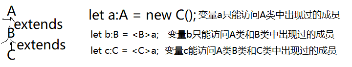
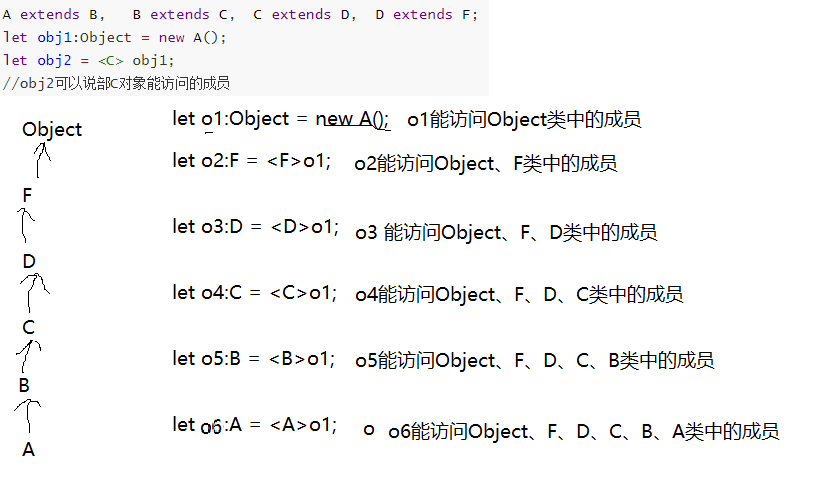
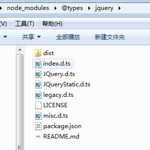

# 第①章  TS 初识

## 一、TS简介

### 1、定义

1.  TypeScript，简称为TS，是JS的超级；Vue3.0就是使用TS开发出来的，并且推荐开发者使用TS进行开发；
2.  TS是可以直接运行的（比如使用ts-node），最终编译为纯的JS运行在任意的平台之上，是开源的；
3.  始于JavaScript，归于JavaScript！


### 2、特征

1.  类型系统

    ```D
    1.TypeScript是静态类型:
    	类型系统按照「类型检查时机」来分类，可以分为动态类型和静态类型。
        动态类型是指在运行时才会进行类型检查，这种语言的类型错误往往会导致运行时错误。JS是一门解释型语言，没有编译阶段，所以JS是动态类型。
    
    2.TypeScript 是弱类型:
    	类型系统按照「是否允许隐式类型转换」来分类，可以分为强类型和弱类型,TS是完全兼容JS的，它不会修改JS运行时的特性，所以它们都是弱类型。
    
    例子:
    console.log(1 + '1');
    // 打印出字符串 '11', ts和js都不会报错
    
    print(1 + '1')
    Python 是强类型会报错
    # TypeError: unsupported operand type(s) for +: 'int' and 'str' 
    ```

    

2.  适用于任何规模

    ```D
    1.TypeScript 非常适用于大型项目——这是显而易见的，类型系统可以为大型项目带来更高的可维护性，以及更少的 bug。
    
    2.在中小型项目中推行 TypeScript 的最大障碍就是认为使用 TypeScript 需要写额外的代码，降低开发效率。但事实上，由于有[类型推论]，大部分类型都不需要手动声明了。相反，TypeScript 增强了编辑器（IDE）的功能，包括代码补全、接口提示、跳转到定义、代码重构等，这在很大程度上提高了开发效率。而且 TypeScript 有近百个[编译选项]，如果你认为类型检查过于严格，那么可以通过修改编译选项来降低类型检查的标准。
    
    3.TypeScript 还可以和 JavaScript 共存。这意味着如果你有一个使用 JavaScript 开发的旧项目，又想使用 TypeScript 的特性，那么你不需要急着把整个项目都迁移到 TypeScript，你可以使用 TypeScript 编写新文件，然后在后续更迭中逐步迁移旧文件。如果一些 JavaScript 文件的迁移成本太高，TypeScript 也提供了一个方案，可以让你在不修改 JavaScript 文件的前提下，编写一个[类型声明文件]，实现旧项目的渐进式迁移。
    
    4.就算你从来没学习过 TypeScript，你也可能已经在不知不觉中使用到了 TypeScript——在 VSCode 编辑器中编写 JavaScript 时，代码补全和接口提示等功能就是通过 TypeScript Language Service 实现的
    
    5.一些第三方库原生支持了 TypeScript，在使用时就能获得代码补全了，比如 Vue 3.0  React
    ```

    

3.  与标准同步

    ```
    1.TypeScript 的另一个重要的特性就是坚持与 ECMAScript 标准同步发展。
    
    ECMAScript 是 JavaScript 核心语法的标准，自 2015 年起，每年都会发布一个新版本，包含一些新的语法。
    
    一个新的语法从提案到变成正式标准，需要经历以下几个阶段：
    
    Stage 0：展示阶段，仅仅是提出了讨论、想法，尚未正式提案。
    Stage 1：征求意见阶段，提供抽象的 API 描述，讨论可行性，关键算法等。
    Stage 2：草案阶段，使用正式的规范语言精确描述其语法和语义。
    Stage 3：候选人阶段，语法的设计工作已完成，需要浏览器、Node.js 等环境支持，搜集用户的反馈。
    Stage 4：定案阶段，已准备好将其添加到正式的 ECMAScript 标准中。
    一个语法进入到 Stage 3 阶段后，TypeScript 就会实现它。一方面，让我们可以尽早的使用到最新的语法，帮助它进入到下一个阶段；另一方面，处于 Stage 3 阶段的语法已经比较稳定了，基本不会有语法的变更，这使得我们能够放心的使用它
    
    2.TypeScript 的发展历史
    2012-10：微软发布了 TypeScript 第一个版本（0.8），此前已经在微软内部开发了两年。
    2014-04：TypeScript 发布了 1.0 版本。
    2014-10：Angular 发布了 2.0 版本，它是一个基于 TypeScript 开发的前端框架。
    2015-01：ts-loader 发布，webpack 可以编译 TypeScript 文件了。
    2015-04：微软发布了 Visual Studio Code，它内置了对 TypeScript 语言的支持，它自身也是用 TypeScript 开发的。
    2016-05：@types/react 发布，TypeScript 可以开发 React 应用了。
    2016-05：@types/node 发布，TypeScript 可以开发 Node.js 应用了。
    2016-09：TypeScript 发布了 2.0 版本。
    2018-06：TypeScript 发布了 3.0 版本。
    2019-02：TypeScript 宣布由官方团队来维护 typescript-eslint，以支持在 TypeScript 文件中运行 ESLint 检查。
    2020-05：Deno 发布了 1.0 版本，它是一个 JavaScript 和 TypeScript 运行时。
    2020-08：TypeScript 发布了 4.0 版本。
    2020-09：Vue 发布了 3.0 版本，官方支持 TypeScript。
    ```

    

4.  有点渣的地方

    ```D
    1.有一定的学习成本，需要理解接口（Interfaces）、泛型（Generics）、类（Class）、枚举类型（Enums）等前端工程师可能不是很熟悉的概念；
    2.短期可能会增加一些开发成本，毕竟要多写一些类型的定义，不过对于一个需要长期维护的项目，TypeScript 能够减少其维护成本；
    3.集成到构建流程需要一些工作量；ts-loader
    4.可能和一些库结合的不是很完美；
    ```

    

### 3、官网

https://www.tslang.cn/docs/home.html


## 二、运行环境

### 1、环境搭建

1.安装node (推荐16+)

>   应该都装了吧

2.全局安装 typescript

>   npm    i    -g    typescript
>

3.查看版本  <!--tsc:TypeScriptCompile   TS编译-->

>   tsc    -v
>

4.创建tsconfig.js文件

>   tsc    --init

```D
{
    "compilerOptions": {
        "target": "es5",
        "noImplicitAny": false,
        "module": "amd",
        "removeComments": false,
        "sourceMap": false,
        "outDir": "./js"
    }
}
```


### 2、编译并运行


**step1	创建**

```typescript
//app.ts 
const hello : string = "Hello World!";
console.log(hello);
```

**step2	编译**

进入app.ts文件所在目录，执行命令

> $ tsc  app.ts

**step3    运行**

> $ node  app.js

### 3、直接运行

*安装全局的ts-node模块*

>   npm    install    -g   ts-node      

然后就可以直接执行ts文件了

>   ts-node    app.ts

### 4、自动编译

自动编译成js文件

>   终端 -> 运行任务 -> 选择里面的tsc:监视

### 5、使用tsconfig进行构建

>   tsc   --build   tsconfig.json

# 第②章  变量声明

1. 与js相同，使用var、let或const等;  思考：所有变量声明的方式；

2. 声明变量指定类型(任意类型都可)，这样的变量赋值时只能使用指定类型的值，以达到强类型语言变量的特点及其优点；

    ```typescript
    //string
    var names:string = '小王'
    //number
    var age:number = 23;
    //bollean
    let flag:boolean = true;
    flag = 23;//编译出错
    ```

# 第③章 基础类型

注：这里的基础是指普通的、常规的、内置的的意思；不是JS里面所说的基础类型和引用类型。

## 一、布尔值

最基本的数据类型，只有简单的true/false两个值，在JS和TS里叫做 Boolean。

```typescript

let isLogin: boolean = false;
// 编译通过
// 后面约定，未强调编译错误的代码片段，默认为编译通过

let isLogin2: boolean = new Boolean(1);
//编译报错
//使用构造函数 Boolean 创造的对象不是布尔值
```

## 二、数字

和JS一样，TS里的所有数字都是浮点数，类型是 number。 支持`2、8、10、16`等各种进制。

```typescript
let n1: number = 6;
let n2: number = 0xf00d;// ES6 中的十六进制表示法,会被编译为十进制数字
let n3: number = 0b1010;// ES6 中的二进制表示法,会被编译为十进制数字
let n4: number = 0o744;// ES6 中的八进制表示法,会被编译为十进制数字
let n5: number = NaN;
let n6: number = Infinity;
```

是的，还是不适合进行科学计算；

## 三、字符串

使用 `string`表示文本数据类型。 和JS一样，可以使用双引号（ `"`）、单引号（`'`）和反引号(`)表示字符串。总之，和JS的玩法一样。

```typescript
let myName: string = 'karen';
let myAge: number = 25;

// 模板字符串
let str: string = `Hello, my name is ${myName}.
I'll be ${myAge + 1} years old next month.`;
```

**字符串字面量类型**

字符串字面量类型用来约束取值只能是某几个字符串中的一个。

```typescript
type EventNames = 'click' | 'scroll' | 'mousemove';
function handleEvent(ele: Element, event: EventNames) {
    // do something
}
handleEvent(<Element>document.getElementById('hello'), 'scroll');  // 没问题
handleEvent(<Element>document.getElementById('world'), 'dblclick'); // 报错，event 不能为 'dblclick'
```

## 四、数组

TS像JS一样可以操作数组元素。 有两种方式可以定义数组。 第一种，可以在元素类型后面接上 `[]`，表示由此类型元素组成的一个数组。

```typescript
let score:number[] = [1,20, parseInt('50')];
let fruit:Array<string|number> = ['apple', 'banana', 'pear', 20];
let arr1: number[] = [1, 1, 2, 3, 5];//正确
let arr2: number[] = [1, '1', 2, 3, 5];//错误
let arr3: number[] = [1, 1, 2, 3, 5];
arr3.push('8');//错误

let arr4: Array<number> = [1, 1, 2, 3, 5];//正确
let arr5: Array<string> = ["hello","h5"];//正确
```

## 五、元组Tuple

元组类型允许表示一个**`已知元素数量和类型的数组`**，各元素的类型不必相同。 比如，你可以定义一对值分别为 `string`和`number`类型的元组。

数组合并了相同类型的对象，而`元组（Tuple）合并了不同类型的对象`。

```typescript
//1.默认值
let tom: [string, number] = ['Tom', 25];
//2.通过下标赋值
let tom: [string, number] = ['', 0];
tom[0] = 'Tom';
tom[1] = 25;
//通过下标获取元组的元素并进行对应的操作
tom[0].slice(1);
tom[1].toFixed(2);
//3.越界操作
let tom: [string, number];
tom = ['Tom', 25];
tom.push('male');
tom.push(true);//报错,当添加越界的元素时，它的类型会被限制为元组中每个类型的联合类型

//解构赋值
const lilei: [string, number] = ["Lilei", 23];
console.log(lilei);
const [myname, myage]: [string, number] = lilei;
console.log(myname, myage);
```

## 六、枚举

`enum`类型是对JS标准数据类型的一个补充。 使用枚举类型可以为一组数值赋予友好的名字。

枚举类型用于取值被限定在一定范围内的场景，比如一周只能有七天，颜色限定为红绿蓝等。
枚举成员会被赋值为从 0 开始递增的数字，同时也会对枚举值到枚举名进行反向映射，也可以手动的指定成员的数值；

```typescript
//性别 一般是存储为数字的
enum Gender {Secret, Male, Female};
console.log(Gender.Male);

//一周的每天
enum Days {Sun, Mon, Tue, Wed, Thu, Fri, Sat};
console.log(Days.Sun, Days.Mon, Days.Tue, Days.Sat);

console.log(Days["Sun"] === 0); // true
console.log(Days["Sat"] === 6); // true
//根据编号得到元素名
console.log(Days[0] === "Sun"); // true
console.log(Days[6] === "Sat"); // true

//商品的状态  可以手动设置初识值  或 每个都设置具体的值
enum orderStatus {Car=-1, Order, Payed, Deliver, Receive, Comment, Return};
console.log(orderStatus.Payed, orderStatus.Comment);

```

## 七、Any

有时需要为那些在编程阶段还不清楚类型的变量指定一个类型。 这些值可能来自于动态的内容，比如来自用户输入或第三方代码库。 这种情况下，我们不希望类型检查器对这些值进行检查而是直接让它们通过编译阶段的检查。 那么我们可以使用 `any`类型来标记这些变量：

```typescript
let notSure: any = 4;
notSure = "maybe a string instead";
notSure = false; // okay, definitely a boolean
```

可以认为，声明一个变量为任意值之后，对它的任何操作，返回的内容类型都是任意值。

```typescript
let anyThing: any = 'hello';
console.log(anyThing.myName);
```


## 八、Void

void，无效的，表示没有任何类型。 当一个函数没有返回值时，其返回值类型是 `void`；

```typescript
function warnUser(): void {
    console.log("This is my warning message");
}
```

声明一个`void`类型的变量没什么用，因为你只能为它赋予`undefined`和`null`：

```typescript
let unusable: void = undefined;
```

## 九、Null 和 Undefined

`undefined`和`null`两者各自有自己的类型undefined和null。 和 `void`相似，用处不大：

## 十、Never

`never`类型表示的是那些永不存在的值的类型。 例如， `never`类型是那些总是会抛出异常或根本就不会有返回值的函数表达式或箭头函数表达式的返回值类型；

```typescript
// 返回never的函数必须存在无法达到的终点
function error(message: string): never {
    throw new Error(message);
}

// 推断的返回值类型为never
function fail() {
    return error("Something failed");
}
```

## 十一、Object

`object`表示非原始类型，也就是引用类型，是除`number`，`string`，`boolean`，`symbol`，`null`或`undefined`之外的类型，可以使用"对象", "数组对象"、string、number等为其赋值，null和undefined不行的。  之所以Object变量可以接收任何对象，是因为Object是所有类的父类。

```typescript
let a:Object = [1, 2, 3]
console.log(a);
a = {id:1, name:'华清'}
console.log(a); 
a = '{id:1, name:"华清"}'
console.log(typeof a); 
```

## 十二、类型别名与联合类型

多个类型的联合，它们之间是或的关系。

```typescript
type manyType = number | boolean | string;
let a: manyType
a = 0o700;
console.log(a);
a = true;
console.log(a);
a = '华清远见';
console.log(a);
```

## 十三、类型推论

没有声明类型的变量被赋值一次后，变量的类型就确定了，之后再次被赋值时，不可改变赋值的类型。

```typescript
let r = 100;//确定了r的类型为number
r = "fds";//编译报错，因为r的类型为number
```


# 第④章 类型断言

有些时候，我们需要做一些“自己比编译器更清楚的知道自己在做什么”，这个时候就用到断言，告诉编译器：没错，就是这样的，就是要这么干。编译器也就假设：嗯，这个程序员已经进行了相关检查，不会有事的。

类型断言只能够「欺骗」TypeScript 编译器，无法避免运行时的错误。

语法:  **值  as  类型**  或者  **<类型>值**

类型断言有两种形式。 其一是“尖括号”语法：

```typescript
let someValue: any = "this is a string";
let strLength: number = (<string>someValue).length;
```

另一个为`as`语法：

```typescript
let someValue: any = "this is a string";
let strLength: number = (someValue as string).length;
```

类型断言不是类型转换，断言成一个联合类型中不存在的类型是不允许的。

# 第⑤章 初识接口

TS的核心原则之一就是对值所具有的结构进行类型检查。TS里面接口的作用就是为这些类型命名 和 为你的代码 或 第三方代码定义契约。

在面向对象语言中，接口（**Interfaces**）是一个很重要的概念，它是对行为的抽象，而具体如何行动需要由类（classes）去实现（implement）。

TypeScript 中的接口是一个非常灵活的概念，除了可用于[对类的一部分行为进行抽象]()以外，也常用于对「对象的形状（Shape）」进行描述。

## 一、接口初探

```typescript
function printLabel(labelledObj: { label: string }) {
  console.log(labelledObj.label);
}

let myObj = { size: 10, label: "Size 10 Object" };
printLabel(myObj);
```

 `printLabel`有一个参数，类型检查器会要求这个对象参数有一个名为`label`类型为`string`的属性。 注意：我们**传入的对象参数可能会包含很多属性**，但编译器只会检查那些必需的属性是否存在，以及其类型是否匹配。

接下来，我们用接口来约束参数的类型结构（对象的形状）：

1.  ​	只关注值的外形， 只要传入的对象满足提到的条件，那么它就是被允许的。
2.  ​	对象是无序的：类型检查器不会去检查属性的顺序，只要相应的属性存在且类型是对的就可以。

```typescript
interface labelledVale{
    label:string;
    size:number;
    show?:boolean;
}
function printLabel(labelledObj: labelledVale) {
    console.log(labelledObj.label);
}
```

## 二、可选属性

接口里的属性不全都是必需的。 有些是只在某些条件下存在，或者根本不存在。 可选属性在应用“option bags”模式时很常用，即给函数传入的参数对象中只有部分属性赋值了。

```typescript
interface SquareConfig {
  color?: string;
  width?: number;
}

function createSquare(config: SquareConfig): {color: string; area: number} {
  let newSquare = {color: "white", area: 100};
  if (config.color) {
    newSquare.color = config.color;
  }
  if (config.width) {
    newSquare.area = config.width * config.width;
  }
  return newSquare;
}

let mySquare = createSquare({color: "black"});
```

带有可选属性的接口与普通的接口定义差不多，只是在可选属性名字定义的后面加一个`?`符号。好处：

1.  ​	可以对可能存在的属性进行预定义；
2.  ​	可以捕获引用了不存在的属性（往往是无意之中敲错的代码）时的错误；

## 三、只读属性

一些对象属性只能在对象刚刚创建的时候修改其值。 你可以在属性名前用 `readonly`来指定只读属性:

注：TypeScript具有`ReadonlyArray<T>`类型，它与`Array<T>`相似，只是把所有可变方法去掉了，因此可以确保数组创建后再也不能被修改。

**`readonly` vs `const`**：做为变量使用的话用 `const`，若做为属性则使用`readonly`。


# 第⑥章 函数

接口可以描述函数类型；为了使用接口表示函数类型，我们需要给接口定义一个调用签名。它就像是一个只有参数列表和返回值类型的函数定义。参数列表里面的每个参数都需要名称和类型。

## 一、为函数定义类型

```typescript
function add(x: number, y: number): number {
    return x + y;
}
let myAdd = function(x: number, y: number): number { return x + y; };
```

我们可以给每个参数添加类型之后再为函数本身添加返回值类型。 TypeScript能够根据返回语句自动推断出返回值类型，因此我们通常省略它。

## 二、可选参数和默认参数

传递给一个函数的参数个数必须与函数期望的参数个数一致。

```typescript
function buildName(firstName: string, lastName: string) {
    return firstName + " " + lastName;
}

let result1 = buildName("Bob");                  // error, too few parameters
let result2 = buildName("Bob", "Adams", "Sr.");  // error, too many parameters
let result3 = buildName("Bob", "Adams");         // ah, just right
```

不过，在TypeScript里我们可以在参数名旁使用 `?`实现可选参数的功能。毫无疑问，可选参数必须跟在必选参数后面，捋一捋就明白了。

```typescript
function buildName(firstName: string, lastName?: string) {
    if (lastName)
        return firstName + " " + lastName;
    else
        return firstName;
}

let result1 = buildName("Bob");  // works correctly now
let result2 = buildName("Bob", "Adams", "Sr.");  // error, too many parameters
let result3 = buildName("Bob", "Adams");  // ah, just right
```

当然，还可以给参数设置默认值，在所有必选参数后面带默认值的参数都是可选的，与可选参数一样，在调用函数的时候可以省略。

ps:带默认值的参数不需要放在必选参数的后面。 如果带默认值的参数出现在必须参数前面，用户必须明确的传入 `undefined`值从而来获得默认值。

## 三、剩余参数

在js里面叫rest参数   ...restArr

```typescript
function buildName(firstName: string, ...restOfName: string[]) {
  return firstName + " " + restOfName.join(" ");
}

let employeeName = buildName("Joseph", "Samuel", "Lucas", "MacKinzie");
```

## 四、函数类型变量

1.  变量的类型可以声明为函数类型;

    ```typescript
    let myAdd: (x: number, y: number) => number =
        function(x: number, y: number): number { return x + y; };
    ```

2.  函数类型属于自定义类型，包含两部分：参数类型和返回值类型；

    ```typescript
    //声明一个变量并指定类型为自定义的函数类型
    let myadd:(x:number, y:number)=>number;
    //声明一个函数
    function add(x: number, y: number): number {
    	return x + y;
    }
    //把函数赋值给类型为函数类型的变量
    myadd = add;
    
    //赋值匿名函数
    myadd =  function(x: number, y: number): number {
    	return x + y;
    }
    //赋值箭头函数
    myadd =  (x: number, y: number):number=>{
    	return x + y;
    }
    ```

3.  只要参数类型是匹配的，那么就认为它是有效的函数类型，并不要求参数名一样，很多时候参数名是为了增加可读性

    ```typescript
    let myAdd: (baseValue: number, increment: number) => number =
        function(x: number, y: number): number { return x + y; };
    ```

4.  在函数和返回值类型之前使用( `=>`)符号，返回值类型是函数类型的必要部分，如果函数没有返回任何值，你也必须指定返回值类型为 `void`而不能留空。

## 五、使用接口封装函数变量类型

自定函数类型代码往往很长，可以使用接口来封装该类型，之后使用接口来代表该类型

```typescript
//函数类型接口
interface addType {
	(number, number):number
}
function add(x: number, y: number): number {
	return x + y;
}
let myadd1:addType = add;
let myadd2:addType = (x:number, y:number):number=>{
	return x+y;
}
```


# 第⑥章 类

## 一、基本概念

**简单认知**

1.  类是现实世界或思维世界中的实体在计算机中的反映，它将数据（属性）以及这些数据上的操作（方法）封装在一起。
2.  对象是具有**类类型**的变量。类和对象是面向对象编程技术中的最基本的概念。

**类与对象的关系**

1.  类是对象的抽象，而对象是类的具体实例，是通过new classname产生的。
2.  类是抽象的，不占用内存，而对象是具体的，占用存储空间。
3.  类是用于创建对象的蓝图（规划，抽象）。

**专业术语**

1.  面向对象（OOP）的三大特性：封装、继承、多态；
    -   封装（Encapsulation）：将对数据的操作细节隐藏起来，只暴露对外的接口。外界调用端不需要（也不可能）知道细节，就能通过对外提供的接口来访问该对象，同时也保证了外界无法任意更改对象内部的数据；
    -   继承（Inheritance）：子类继承父类，子类除了拥有父类的所有特性外，还有一些更具体的特性；
    -   多态（Polymorphism）：由继承而产生了相关的不同的类，对同一个方法可以有不同的响应。比如 Cat 和 Dog 都继承自 Animal，但是分别实现了自己的 eat 方法；
2.  存取器（getter & setter）：用以改变属性的读取和赋值行为；
3.  修饰符（Modifiers）：修饰符是一些关键字，用于限定成员或类型的性质。比如 public 表示公有属性或方法；
4.  抽象类（Abstract Class）：抽象类是供其他类继承的基类，抽象类不允许被实例化。抽象类中的抽象方法必须在子类中被实现；
5.  接口（Interfaces）：不同类之间公有的属性或方法，可以抽象成一个接口。接口可以被类实现（implements）。一个类只能继承自另一个类，但是可以实现多个接口；


##  二、类和对象语法

**类的定义**

```css
class Class_name {      
	// 类体 
}
```

1. 定义类的关键字为 class；

2. 类体中声明类的成员(都是可选的)

- **字段** −  也就是属性，可包含0到多个
- **构造函数** −  constructor，可包含0到1个
- **方法** − 也就是行为动作，可包含0到多个

 **类的属性** 

```typescript
class Car {
    // 属性      
    engine:string; //没有初始化 	
    price:number = 15;//初始化值为15 
}
let car = new Car();
console.log(car.engine, car.price); 
```

(1)声明属性时加类型声明是可选的；

(2)声明字段时初始化值是可选的；

**类的方法**

 类的方法参数和返回值都可声明类型，但都是可选的；

```typescript
class Car {
    // 属性
    engine:string; //没有初始化
	price:number = 15;//初始化值为15
  
    //方法
	disp():void {
		console.log(this.engine, this.price);
	}
	toGo(len:number):boolean {
		console.log(`走了${len}米远`);
		return true;
	}
  
	//字段式的方法，本质上这不是方法，而是字段
	m1 = (a:number, b:number):void=>{
		console.log("m1()")
	}
	m2:(a:number,b:number)=>void = (a, b)=>{
		console.log("m1()",a+b)
	}
	m3 = function():void {
		console.log("m3()")
	}
}

let car = new Car();
console.log(car.engine);
console.log(car.price);
car.disp();
car.toGo(100);
car.m1(1,2);
car.m2(11,22);
car.m3();
```

## 三、对象和内存

1.  new多次本质上是创建了多个了对象, 只有创建了对象，才能使用对象访问对象的字段或方法；
2.  对象在堆中,计算机堆中内存无名字，只能通过地址使用之，堆中对象地址通过hash后得到引用值，引用类型变量保存的就是引用值；
3.  每个对象都有唯一引用, 只能通过对象的引用使用对象, new 会返回对象的引用（this）；
4.  当类中定义了属性，该类的每个对象都会独立开辟出属性成员，当前对象独享；
5.  创建对象时，方法不会被开辟出来，同一个类的方法被所有该类对象共用（原型和原型链）；
6.  同一对象可被多个变量引用，当一个对象没有引用时，对象的生命就被GC(拉圾回收机制)管理了, 当对象销毁时，对象中独享的字段成员也会随之销毁；
7.  只有类不能做事情，类的对象才有用, 类成员(静态成员例外);

## 四、this

方法中可以使用this，该this引用调用方法的对象, 所以方法里可以使用 `this.方法`和`this.字段`访问实例成员；

## 五、**构造函数**

1.  函数名为 constructor；

2.  可带0到多个参数 (构造函数没有返值,也不用声明返回值类型)；

3.  实例化对象；

    3.1 构造函数无参时

     	new 类名();

    3.2 构造函数有参时

    ​	new 类名(为构造函数传实参)

4.  实例化过程(new 的过程发生了什么)；

    ​    (1)在堆中实例化对象, 包括创建字段成员

    ​	(2)执行构造函数

    ​	(3)返回对象引用

5.  构造函数存在的价值

​      (1)初始化一些操作并为对象属性赋值；

​      (2)构造函数中this值为新实例化的对象引用, 常通过"this.字段=值"为新对象的字段赋值；

```typescript
class Car {
    engine:string; 
	price:numbe;
	constructor(engine:string, price:number) {
		this.engine = engine;
		this.price = price;
	}
    printf():void {
	   console.log(`engin=${this.engine}, price=${this.price}`);
    }
}
let car = new Car("德国进口", 30);
car.printf();
```

## 六、静态方法

```typescript
//静态方法
使用 static 修饰符修饰的方法称为静态方法，它们不需要实例化，而是直接通过类来调用：
class Animal {
  static isAnimal(a) {
    return a instanceof Animal;
  }
}

let a = new Animal('Jack');
Animal.isAnimal(a); // true
a.isAnimal(a); // TypeError: a.isAnimal is not a function
```

## 七、存取器

```typescript
//存取器
使用 getter 和 setter 可以改变属性的赋值和读取行为：
class Animal {
  constructor(name) {
    this.name = name;
  }
  get name() {
    return 'Jack';
  }
  set name(value) {
    console.log('setter: ' + value);
  }
}

let a = new Animal('Kitty'); // setter: Kitty
a.name = 'Tom'; // setter: Tom
console.log(a.name); // Jack
```

## 八、继承

1.  语法

    ```typescript
    class child_class_name extends parent_class_name { }
    ```

2.  只能单继承(多继承会违背类本质), 一个类的父类只能有一个，但是一个类可以有多个子类。子类也可以再次被当作父类，形成树结构;

3.  子类继承父类后，不会影响父类的独立使用;

4.  类型上包含关系才能使用继承(同类事物才能使用继承, 如人是动物，所以人可以继承动物);

5.  类中只能写本质的东西，如一个表示人的类，不能在类中写打乒乓球的方法,一个表示动物的类中不能写在水里游的方法。否则父类会侵略子类；

6.  子类对象可以访问从直接和间接父类中继承下来的成员；

7.  继承最原始的作用是什么？就是为了代码重用

```typescript
class Animal {
    public name;
    constructor(name) {
        this.name = name;
    }
    sayHi() {
        return `My name is ${this.name}`;
    }
}

let a = new Animal('Jack');
console.log(a.sayHi()); // My name is Jack


//类的继承
使用 extends 关键字实现继承，子类中使用 super 关键字来调用父类的构造函数和方法。
class Cat extends Animal {
  constructor(name) {
    super(name); // 调用父类的 constructor(name)
    console.log(this.name);
  }
  sayHi() {
    return 'Meow, ' + super.sayHi(); // 调用父类的 sayHi()
  }
}

let c = new Cat('Tom'); // Tom
console.log(c.sayHi()); // Meow, My name is Tom
```


## 九、super

1.  子类并且该子类带有构造方法，则该子类构造函数必须使用super(<实参>)，不管父类是否写了构造方法；

2.  super要位于构造方法中的this使用之前；

3.  子类对象的创建过程：创建父类对象，然后在父类对象基础上追加子类成员得到子类对象,然后子类构造函数先执行，子类构造函数中super(<实参>)再调用父类构造函数的执行 ；

4.  没有继承父类，构造函数中就不能有super(<实参>);

    ```typescript
    class Shape { 
       area:number = 10;
       constructor() {
    	   console.log("Shape")
       } 
    } 
    class Circle extends Shape { 
    	length:number = 300;
    	constructor() {
    		super();//父类中没有构造方法也得加这该代码
    		console.log("Circle");
    	} 
       disp():void { 
          console.log(this.area, this.length); 
       } 
    }
    var obj = new Circle(); 
    obj.disp()
    ```

    

5.  super(父类所需参数)

    如果父类和子类都有构造函数，并且父类构造函数有参数，那么要求子类构造函数 super(...)中必须为父类传参数。

6.  new 创建对象时，如果类中有构造方法，则以该构造方法所需参数传参

    ```typescript
    class Shape {
       area:number = 10;
       constructor(area) {
    		console.log("Shape");
    		this.area = area;
       }
    }
    class Circle extends Shape {
       length:number = 300;
       constructor(area, length) {
    	   super(area);//area为父类构造函数传参数
    	   console.log("Circle");
    	   this.length = length;
       } 
       disp():void {
          console.log(this.area, this.length); 
       }
    }
    var obj = new Circle(10, 20); //以Circle构造函数所需参数传参
    obj.disp()
    ```

    

7.  new 对象时，如果类中无构造函数，并且该类又有父类，则以父类构造方法所需参数传参。(不提倡使用)

    ```typescript
    class Shape { 
       area:number = 10;
       constructor(area:number) {
            this.area = area;
    			  console.log("Shape");
       } 
    } 
    class Circle extends Shape { 
        length:number = 300;
        disp():void { 
    		    console.log("==>",this.area, this.length); 
        } 
    }
    var obj = new Circle(20); //以父类Shape所需参数传参
    obj.disp()
    ```

8.  构造函数中的super还可以访问父类中继承下来的成员.(如果没有重写，不提倡使用)

    实际上同一个类中super和this可以出现在构造函数和方法中，它们的值都是一样的，但是它们的偏移量不相同，super只管到父类对象，而this管到子类对象，而父类对象只是子类对象的一个组成部分。所以super只能访问父类的成员，而this可以访问父类和子类的成员


## 十、访问权限修饰符

**修饰符分类**

public：公用 

private：私有 

protected:  受保护 

**字段或方法的权限修饰符**

private修饰的字段和方法只能在当前类中被使用

protected修饰的字段和方法只能在当前类及其子类中被使用

public 修饰的字段和方法在任何地方都可被使用, 

（如果没有加权限修饰符，则默认为public）

**构造函数权限修饰符**

private修饰构造函数，“new 类(...)” 只能在当前类的方法中进行, 构造函数为private的类不能当作父类

protected修饰构造函数, “new 类(...)” 只能在当前类及其子类中进行

public修饰构造函数， "new 类(...)" 任何地方可进行

**访问修饰符与开闭原则**

(1) 类中成员使用什么修饰符修饰，思想上必须符合开闭原则.

(2) 成员量写成私有，为成员变量提供get/set方法, 之所以这样做是因为函数安全性大于字段安全性

```typescript
class Person { 
	private name: string;
	private age: number;
    
	public getName() {
		return this.name;
	}
	public setName(name) {
		this.name = name;
	}
} 

let p = new Person();
p.setName("小王");  //p.name = "小王"
```

(3)一个类中有一个功能，可以会分成多个步骤，可以把这些步骤使用private修饰方法进行封装，这样可以把实现细节隐藏(重要)，还可以代码重用(次要)

```typescript
class Person { 
	//脱衣服
	private disrobe() {
		//.....
	}
	// 穿衣服
	private dress() {
		//.....
	}
	//洗操
	public takeAbath() {
		this.disrobe();
		console.log("来看我洗澡了");
		this.dress();
	} 
	//睡觉
	public sleep() {
		this.disrobe();
		console.log("来看我睡觉了");
		this.dress();
	}
} 
```


## 十一、静态成员 static

1, 概念: 

 	类中使用static修饰的字段或方法，被修饰的成员称为静态成员，也称为类成员

2, 生命周期

(1)静态成员也叫类成员，不创建对象时就存在了，对象的创建与销毁不会影响类成员的创建与销毁

(2)天生永恒的存在， 因为类成员所在内存是"数据段"，而计算机数据段中的内存是不会被销毁的

3, 静态成员的访问

  	类名.成员 

4, 静态方法中的this 

​     ( 就是ES5中的函数对象 )

-  	   非静态方法中"this"表示当前类的对象（new 当前类()）
-  	   静态方法中"this"表示当前类

5,static解决不能创建构造函数为private和protected的问题

(1)构造函数使用private修饰,该类不能当作父类, 并且也只能在当前类中 "new..."的操作

(2)怎样得到private修饰构造函数的类的对象，使用static

```typescript
class MyObj {
	private constructor() {
	}
	public m1() {
		console.log("m1()")
	}
	static public getMyObj() {
		return new MyObj();
	}
}

let obj1 = MyObj.getMyObj();
obj1.m1();
```


## 十二、重写

1 方法可以被重写。字段被重写无意义，不要做这种操作。

2 重写的语法：

​	在父类和子类中, 两个方法名相同, 返回值类型相同, 参数相同, 子类重写方法时不能使用比父类中被重写的方法更加严格的修饰符

3 不能重写私有的方法 

4 重写的思想

  所有子类都需要的方法，但是有些子类对方法不满意

5 使用子类对象访问有重写的方法时，父类方法会被隐藏，如果要访问父类中被重写的方法， 子类的构造函数或子类的方法中使用super来访问

6 实战中，super只有两种情况有实战意义

(1) 子类重写的方法里面使用super调用父类中被重写的方法

(2) 子类构造函数使用super调用父类构造函数

## 十三、里氏替换原则

​	里氏替换原则通俗的来讲就是:子类可以扩展父类的功能,但不能改变父类原有的功能。
里氏代换原则告诉我们,在软件中将一个基类对象替换成它的子类对象,程序将不会产生任何错误和异常,反过来则不成立,如果一个软件实体使用的是一个子类对象的话,那么它不一定能够使用基类对象。
里氏代换原则是实现开闭原则的重要方式之一,由于使用基类对象的地方都可以使用子类对象,因此在程序中尽量使用基类类型来对对象进行定义,而在运行时再确定其子类类型,用子类对象来替换父类对象。
里氏替换原则指导下要求父类的私有的成员，也必须有公用的方法间接你传递给子类。


# 第⑦章 类类型变量

```typescript
class Person { 
	//脱衣服
	private disrobe() {
		//.....
	}
	// 穿衣服
	private dress() {
		//.....
	}
	//洗操
	public takeAbath() {
		this.disrobe();
		console.log("洗澡了");
		this.dress();
	} 
	//睡觉
	public sleep() {
		this.disrobe();
		console.log("睡觉了");
		this.dress();
	}
	public eat() {
		console.log("吃东西了...");
	}
} 

class Boy extends Person {
	static eat() {
		super.eat();
		console.log("别忘记了做好看的吃像...")
	}
	static birth() {
		console.log("生...");
	}
}
```

##  一、类变量指向该类的对象

类也是一种自定义类型，用于指向该类对象,  类变量也可以赋值为null或undefined

```typescript
let person1:Person = new Person();
person1.eat(); 

let boy1: Boy = new Boy();
boy1.eat();
```

## 二、父类变量指向子类对象

> 此处只讲语法， 关于类变量指向子类对象的核心思想，见后面多态相关章节

父类变量可以指向子类对象，指向子类的子类的对象也可以,  比如父类是"人(Person)",子类是"男孩（Boy）"，因为男孩本就是人，所以可以用人指向它,  只是男孩对象被人指向后，只把男孩当人看待，不当男孩看待. 以当前示例为例，对于let person2: Person = new Boy();而言。 person2只能访问Person类中的成员，不能访问Boy中的成员

```typescript
let person2: Person = new Boy();
person2.eat();//执行了父类Person中的eat方法 
person2.sleep();//执行了父类Person中的sleep方法 
// person2.birth();错，因为不能把person2当作Boy看待，所以不能访问Boy中的成员
```

## 三、类型断言



当一个父类类型变量指向子类对象时，可以通过”类型断言“ 把该变量强制转换成子类类型变量

```typescript
let person: Person = new Boy();
let boy = <Boy>person;//类型断言
//let boy = person as Boy;
boy.sleep();
boy.eat();
```

当父类类型变量指向间接子类对象时，该变量可以类型断言成子类的父类类型，断言成什么类，就只能当作该类的对象访问成员了。

如：  

```typescript
A extends B,   B extends C,  C extends D,  D extends F;
let obj1: F = new A();
let obj2 = <C> obj1;
//obj2可以说部C对象能访问的成员
```

## 四、Object变量



Object是一切类的父类，所以可以指向一切对象。

```tsx
A extends B,   B extends C,  C extends D,  D extends F;
let obj1:Object = new A();
let obj2 = <C> obj1;
//obj2可以说部C对象能访问的成员
```


# 第⑧章 接口和多态

接口是一种自定义类型, 也就是类型了, 所以不但可以声明变量的类型，也可以声明函数参数(也是变量类型)，函数返回值的类型

## 一、接口定义函数变量类型

```typescript
//函数类型接口
interface addType {
	(number, number):number
}
function add(x: number, y: number): number {
	return x + y;
}
let myadd1:addType = add;

let myadd2:addType = (x:number, y:number):number=>{
	return x+y;
}
```

## 二、接口与对象

(1)对象是字面量对象, 对象中成员必须与接口中声明的成员完全相同，不可多，也不可少

```typescript
interface IPerson { 
    firstName:string, 
    lastName:string, 
    sayHi: ()=>string 
} 

let teacher:IPerson = { 
    firstName:"Tom",
    lastName:"Hanks", 
    sayHi: ():string =>{return "Hi there"} 
} 
console.log(teacher);


以下代码也是对的
let teacher: { 
    firstName:string, 
    lastName:string, 
    sayHi: ()=>string 
} = { 
    firstName:"Tom",
    lastName:"Hanks", 
    sayHi: ():string =>{return "Hi there"} 
} 
```

(2)对象是通过new 出的对象,  对象中成员必须包含接口中声明的成员不可少，但是可以增加接口中未声明的成员

```typescript
interface IPerson { 
    firstName:string, 
    lastName:string, 
    sayHi: ()=>string 
} 

class Teacher {
	firstName:string="小五";
	lastName:string="小二";
	age:number= 30; //接口中没有声明,但是不会错
	sayHi():string {
		return "Hi there";
	} 
}

let teacher:IPerson = new Teacher();
console.log(teacher);

以下代码也是对的
let teacher:{ 
    firstName:string, 
    lastName:string, 
    sayHi: ()=>string 
}  = new Teacher();
```

(3)类型断言情况下。对象中成员只能是接口中声明过的成员，但是可少

对于下面示例中stu对象中的成员可以包含firstName,lastName,sayHI, 可以少，不能出现接口中没有出现过的

```typescript
interface IPerson { 
    firstName:string, 
    lastName:string, 
    sayHi: ()=>string 
} 
let stu:IPerson = <IPerson> {};  


stu.firstName = "司空";
stu.sayHi = ():string =>{return "Hi there"} 
console.log(stu);
//stu.xx = "dfds"//错,因为接口中没有出现过
```

## 三、接口与数组

接口可以规定数组中元素的索引类型和元素类型,先看一个与默认情况相同的示例

```typescript
//规定以number为元素索引、string为元素类型
interface Inamelist { 
	[index:number]: string
} 

let list: string[] = ["John","Bran"] 
list[2] = "jeep";
console.log(list);

console.log(list[0]);
console.log(list[1]);
console.log(list[2]);
```

也可以使用非number类型为元素索引

```typescript
//规定以string为元素索引、string为元素类型
interface Inamelist {
    [index: string]: string
}
let list: Inamelist = [] as unknown as Inamelist;
list['a'] = "好的";
list['b'] = "不错的";
console.log(list);
console.log(list['a']);//好的
console.log(list["b"]);//不错的
```

## 四、接口继承接口

接口继承接口后，子接口就除了自身接口声明之外还包含了父接口声明

```typescript
interface Person { 
   age:number 
} 
 
interface Musician extends Person { 
   instrument:string 
} 
```

接口继承接口是可以多继承的

```typescript
interface IParent1 { 
    v1:number 
} 
interface IParent2 { 
    v2:number 
} 
//Iparent1和Iparent2顺序是无关仅要的
interface Child extends IParent1, IParent2 { 
	v3:string
} 
```

## 五、类实现接口

> 类可以实现接口，并可以多实现
>
> 类实现接口后，类体中必须实现接口所有字段和方法，当然类可以扩展自己本质的成员

```typescript
interface IShape { 
   draw():void; 
   size:number;
}
interface IName {
	name: string;
}
class Circle implements IShape, IName { 
   public size:number = 30;
   public name:string = "圆";
   public draw():void { 
      console.log("会绘制一个"+this.name); 
   } 
   public show() {
	   console.log("本来是Circle");
   }
}
let c:Circle = new Circle();
c.draw();
c.size = 31;
c.name = "四边型";
c.show();
```

> 类可以继承父类的同时实现接口

```typescript
interface IShape { 
   draw():void; 
   size:number;
}
interface IName {
	name: string;
}
class Shape {
	public showArea():void {
		console.log("面积是?平方")
	}
}
class Circle extends Shape implements IShape, IName { 
   public size:number = 30;
   public name:string = "圆";
   public draw():void { 
      console.log("会绘制一个"+this.name); 
   } 
   public show() {
	   console.log("本来是Circle");
   }
}
let c:Circle = new Circle();
c.draw();
c.size = 31;
c.name = "四边型";
c.showArea();
c.show();
```

## 六、 泛型函数类型接口(见泛型章节 )

```typescript
//泛型函数类型接口1
interface GenericIdentityFn1 {
	(arg: T): T;
}
//泛型类函数型接口2
interface GenericIdentityFn2<T> {
    (arg: T): T;
}
```

## 七、接口与泛型(见泛型章节)

## 八、接口变量指向实现类对象

> 只讲语法，关于接口变量指向实现类对象的核心思，见后面多态相关单节

接口变量可以引用接口实现类对象, 但是只能访问接口中声明过的成员, 接口变量也可赋值为null或undefined, 

如果想使用此接口变量访问所有对象成员，那么可以对接口变量进行"类型断言"为对象所属类的类型。

```typescript
interface IShape { 
   draw(); 
   size:number;
}
interface IName {
	name: string;
}
class Circle implements IShape, IName {
   size:number = 30;
   name:string = "圆";
   draw():void { 
      console.log("会绘制一个"+this.name); 
   } 
   show() {
	   console.log("本来是Circle");
   }
}
let c:IShape = new Circle();
c.draw();//对,因为IShape中出现过
c.size = 31;//对,因为IShape中出现过
//c.name = "四边型";//错
//c.show();//错
let c2 = <Circle>c;//类型断言
c2.name = "四边型";//对
c2.show();//对
```

## 九、多态

> 面向对象核心思想是继承、封装与多态, 本小节只讲多态

### 1 概念

- 多态概念: 一种状态多种表现形式
- 方法中this在编译时并不知道是哪个对象，执行过程中动态确定,  因为是在执行过程中确定的this,所以this属于运行时多态。
- "接口变量指向实现类对象"或"父类指向子类对象+重写"，可以实现运行时多态。
- 有了接口变量引用对象，或父类变量引用子类对象，可以非常清晰的代码实现动态代理设计模式。

### 2 接口变量实现多态

下面示例， 在myshow方法中的 "a.show()"在编译的时候并不确定是执行X中的show()还是执行Y中的show(),还是其它类中的show, 只有运行过程中才能确定，完美实现动态多态性 

```tsx
interface A {
	show();
}
class X implements A {
	show() {
		console.log("这是X的show()")
	}
}
class Y implements A {
	show() {
		console.log("这是Y的show()")
	}
}
class Test {
	myshow(a: A) { //a=new X()  a=new Y()
		a.show();
	}
}
let x = new X();
let y = new Y();
let t = new Test();
t.myshow(x);//这是X的show()
t.myshow(y);//这是Y的show()
```

### 3 父类变量+重写实现多态

下面示例中， 同样 myshow方法中的 "a.show()" 在运行过程中才知道是调用哪个类中的show()

```typescript
class A {
	show() {
		console.log("A中的show")
	}
}
class X extends A {
	show() {
		super.show()
		console.log("这是X的show()")
	}
}
class Y extends A {
	show() {
		super.show();
		console.log("这是Y的show()")
	}
}
class Test {
	myshow(a: A) {//a=new A() a=new X(); a=new Y();
		a.show();
	}
}
let y = new Y();
let t = new Test();
t.myshow(new X());//这是X的show()
t.myshow(new Y());//这是Y的show()
t.myshow(new A());//主是A的show()
```


# 第⑨章 泛型

> 泛型（Generics）是指在定义函数、接口或类的时候，不预先指定具体的类型，而在使用的时候再指定类型的一种特性。。

### 1 函数泛型

```typescript
//<T>表示定义模板类型，(arg: T): T 表示参数和返回值类型都是同一个类型,
//具体T是什么类型就实参决定
function a<T>(arg: T): T {
  return arg;
}
let r1 = a(100);//T的类型是number
let r2 = a("小王");//T的类型是string
console.log(r1, r2);
```

匿名函数和箭头函数泛型语法

```typescript
//匿名函数
let a = function <T>(arg: T): T {
  return arg;
}
```

```typescript
//箭头函数
let a = <T>(arg: T):T =>{
  return arg;
}
```

### 2 模板类型可以是多个

```typescript
function a<T1, T2>(a:string, b:T1, c:T2): T2 {
       return c;
}
a("纟", 100, true)
```

```typescript
function a<T1, T2>(a:string, b:T1, c:T2): string {
       return "小王";
}
```

```typescript
let a = function<T1, T2>(a:string, b:T1, c:T2): T2 {
       return c;
}
```

```typescript
let a = <T1, T2>(a:string, b:T1, c:T2): T2 => {
       return c;
}
```

### 3 泛型的错误

```tsx
function a(a:T1, b:T2): T1 {
   let r = a + b;//编译报错，因为编译器不知道T1和T2是什么类型，所以不确定是否能进行 + 运算
   return r;
}
let r = a("小王", 100);
console.log(r);
```

```tsx
function a(a:T1): T1 {
   return a+100;//编译报错，因为编译器不知道T1是什么类型，所以不确定是否能进行 + 100
}
```

```tsx
function loggingIdentity(arg: T): T {
    console.log(arg.length) //编译报错，因为编译器不知道T1是什么类型，所以不确定是否有属性length
    return arg
}
```

### 4 泛型函数变量

> ​	函数的变量类型也可以使用泛型

```typescript
function identity<T>(arg: T): T {
    return arg;
}

interface IM {
  {<x>(arg: x):x}
}
let x:IM = identity;//


let myIdentity1: <U>(arg:U)=>U = identity;
let myIdentity2: {<U>(arg:U):U} = identity;
```


### 5 泛型函数类型接口

> (1)泛型函数类型接口1

```typescript
function identity<T>(arg: T): T {
	console.log("identity")
    return arg;
}
//泛型函数类型接口1, 其中的T可以改为其它自定我，不必与函数中T相同
interface GenericIdentityFn1 {
    <T>(arg: T): T;
}
//值也必须是有泛型的函数
let myIdentity: GenericIdentityFn1 = identity;
//<string>决定了参数只能使用string
myIdentity<string>("sddssd"); 
//<number>决定了参数只能使用number
myIdentity<number>(234); 
```

> (2)泛型类函数型接口2

```typescript
//泛型类函数型接口2
interface GenericIdentityFn2<T> {
    (arg: T): T;
}
//<number>决定了参数只能使用number
let myIdentity2: GenericIdentityFn2<number> = identity;
myIdentity2(234); 

//<string>决定了参数只能使用string
let myIdentity3: GenericIdentityFn2<string> = identity;
myIdentity3("小王"); 
console.log(r);
```

### 6 泛型类1

(1)新new出对象是{ }，其中无成员

(2)对象中只能全部或部分实现类中声明好的成员，不能增加其它成员 

```typescript
class GenericNumber<T> {
    zeroValue: T;
    add: (x: T, y: T) => T;
}
let myGenericNumber = new GenericNumber<number>();
myGenericNumber.zeroValue = 0;
myGenericNumber.add = function(x, y) { return x + y; };
// 或 yGenericNumber.add = function(x:number, y:number) { return x + y; };
let r = myGenericNumber.add(1, 22);
console.log(r);
//myGenericNumber.sex = ‘男’; 错，因为类中没有声明sex


let stringNumeric = new GenericNumber<string>();
stringNumeric.zeroValue = "fds";
stringNumeric.add = function(x, y) { return x + y; };
let r2 = stringNumeric.add("1", "22");
console.log(r2);
```

### 7 泛型类2

new出的对象已经具体类中的成员

```typescript
class A<T> {
    a:T;
	  show(a:T, b:T) {
				console.log(a, b);
	  }
}
let a1 = new A<string>();
a1.show("fsd","fsd")

let a2 = new A<number>();
a2.show(123,444)

//下面代码也不会报错，T不生效
let a3 = new A();
a3.show(444,"555");
```


### 8 泛型约束

> <T extends IA> 要求T类型数据至少有IA中声明的成员

```typescript
interface IA {
    length: number;
}
//要求T类型数据有length属性
function m1<T extends IA>(arg: T): T {
    console.log(arg.length);   
    return arg;
}
let r;
r = m1("小王");//"小王"有length属性
console.log(r);//2


r = m1({length: 10, value: 3});//{length: 10, value: 3}有length属性
console.log(r);//10
```

```typescript
interface IA {
    length: number;
	  value: number;
}
//要求T有属性length和value
function m1<T extends IA>(arg: T): T {
    console.log(arg.length, arg.value);   
    return arg;
}
m1({length: 10, value: 3, age:30});
```

>  以上泛型约束示例仅仅是函数中使用，实计上也可以使用于其它使用泛型的地方，看看下面的示例吧

```typescript
class Person {
	name:string;
	sex:string;
	constructor(name, sex) {
		this.name = name;
		this.sex = sex;
	}
	show() {
		console.log(this.name, this.sex);
	}
}

class Stu<T> {
	show(p:T) {
		console.log(p);
        p.show();//有错
 	}
}
let stu = new Stu<Person>();
let p = new Person("小王", '男');
stu.show(p);
```

以下示例有一个问题，p.show()会出错, 如果改为下面的泛型约束就可以解决该类问题

```typescript
class Person {
	name:string;
	sex:string;
	constructor(name, sex) {
		this.name = name;
		this.sex = sex;
	}
	show() {
		console.log(this.name, this.sex);
	}
}

class Stu<T extends Person> {
	show(p:T) {
		console.log(p);
		p.show();
	}
}
let stu = new Stu<Person>();
stu.show()
let p = new Person("小王", '男');
stu.show(p);
```


# 第⑩章 声明文件

当使用第三方库时，我们需要引用它的声明文件，才能获得对应的代码补全、接口提示等功能。

```typescript
假如我们想使用第三方库 jQuery，一种常见的方式是在 html 中通过 <script> 标签引入 jQuery，然后就可以使用全局变量 $ 或 jQuery 了。
我们通常这样获取一个 id 是 foo 的元素：
$('#foo');
// or
jQuery('#foo');

但是在 ts 中，编译器并不知道 $ 或 jQuery 是什么东西，就不会有代码补全、接口提示等：
jQuery('#foo');
```

什么是声明文件
通常我们会把声明语句放到一个单独的文件（jQuery.d.ts）中，这就是声明文件
**声明文件必须以 .d.ts 为后缀**

```react
// src/jQuery.d.ts
// ES6模块化：定义名称为jquery的模块
declare module 'jquery' {
    // 定义名称为$, 参数为函数类型，返回值为void的函数
    function $(readyFunc: () => void): void;
    // 定义名称为$, 参数为string，内部包含一个接收string参数，返回值为void的函数
    function $(selector: string): {
        html: (html: string) => void;
    }
    // 命名空间
    namespace $ {
        namespace fn {
            class init { }
        }
    }
    // 导出自定义函数
    export = $;
}

// src/index.ts
jQuery('#foo');

```

第三方声明文件
jQuery 的声明文件不需要我们定义了，社区已经帮我们定义好了
我们可以直接下载下来使用，但是更推荐的是使用 @types 统一管理第三方库的声明文件。
@types 的使用方式很简单，直接用 npm 安装对应的声明模块即可，以 jQuery 举例
`npm  install  @types/jquery --save-dev`




# 第⑪章 内置对象

JS中有很多内置对象，它们可以直接在 TypeScript 中当做定义好了的类型。

内置对象是指根据标准在全局作用域（Global）上存在的对象。这里的标准是指 ECMAScript 和其他环境（比如 DOM）的标准。

ECMAScript 的内置对象

ECMAScript 标准提供的内置对象有：Boolean、Error、Date、RegExp 等。

我们可以在 TypeScript 中将变量定义为这些类型。

### 1 ES内置对象

```typescript
let b: Boolean = new Boolean(1);
let n: Number = new Number(true);
let s: String = new String('abc');
let d: Date = new Date();
let r: RegExp = /^1/;
let e: Error = new Error('error message');
b = true;
//let bb: boolean = new Boolean(2)  // error
```


### 2 DOM和BOM

DOM 和 BOM 提供的内置对象有：Document、HTMLElement、Event、MouseEvent、NodeList 等。

```typescript
const div: HTMLElement = document.getElementById('test');
const divs: NodeList = document.querySelectorAll('div');
document.addEventListener('click', (event: MouseEvent) => {
    console.dir(event.target);
});
const fragment: DocumentFragment = document.createDocumentFragment();
```

示例中 `HTMLElement`、`NodeList` 和 `MouseEvent` 就是 DOM 与 BOM 内置对象。


#   学习展望

1. 少部分未讲的语法
2. 七大设计原则
3. 23种面向对象设计模式


