# 一 React开发环境搭建。

（1）安装node, 要求在14以上版本因为大家都学习过node,所以相信所有同学的电脑上面都已经安装了node,
 可以使用 node -v 查看一下版本号。

（2）安装react脚手架
npm   install -g create-react-app

 或

cnpm install -g create-react-app:

安装cnpm:
npm install cnpm -g --registry=https://registry.npmmirror.com

# 二 使用脚手架创建项目

npx create-react-app 符合标识符命名的项目名  --template typescript    

或    

create-react-app 符合标识符命名的项目名  --template typescript

运行项目:
   保证命令窗口当前路径在项目目录下，执行命令: 

  npm start  或 cnpm start
   打开浏览器输入： http://localhost:3000    

# 三 简化默认项目

删除src中的文件，只留下图中的三个文件，修改index.tsx中文件内容。另外两个文件不修改

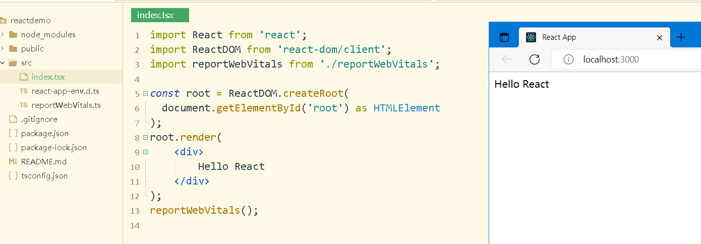

# 四 简化项目后文件的意义

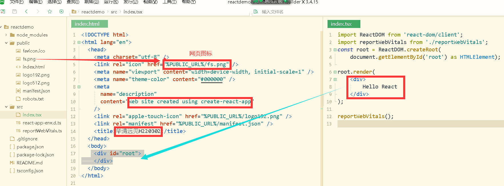

# 五 创建组件，并挂载到id为root的div中

# (一)创建组件

1.创建一个tsx文件, 前缀名要大写字母开头,比如App.tsx

2.文件中写一个返回 声明式的标签文档 jsx的函数，该函数可以是普通函数、匿名函数或箭头函数, 函数名一般与文件名前缀相同。

```jsx
function Hello() {
	return (
		<div>
			这是第一个组件
		</div>
	);
}
export default Hello; 
```

3.组件返回的jsx最外层中能有仅只有一个标签， 如果非要返回多个时，最外层使用空标签<>, 空标签不会在网页中渲染出元素。<>是React.Fragment的缩写

4.组件写完之后不能忘记使用export default 函数名  导出。

# (二)把组件挂载到id为root的div中

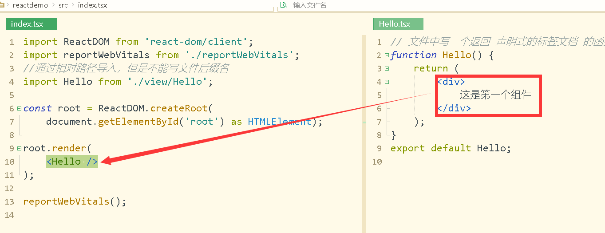

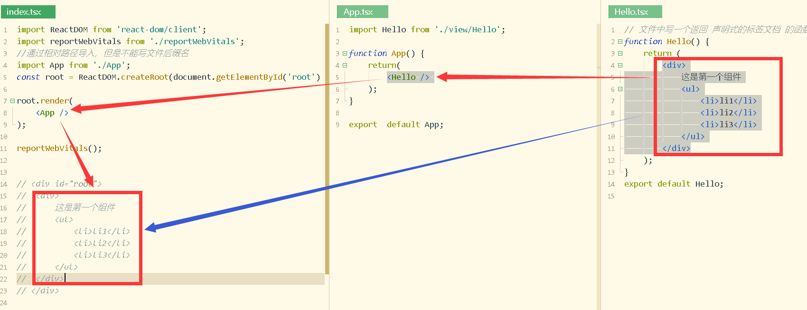

# 六 箭头函数组件

```jsx
import React from 'react';

const Mult:React.FC = ()=>{
	return(
		<div>
			<h1>Mult</h1>
		</div> 
	);
}
export default Mult;
```

# 七 组件嵌套

1.父组件决定子组件的位置

# 八 内部样式

1.属性名为style, 值{对象}

```js
<div style={对象}>
    
<div />
```

2.两个单词的样式名要改为小驼峰法则

```jsx
function NextStyle() {
	const obj = {listStyle:'none', padding:'0'};
	return (
		<div style={{color:'red', fontSize:'40px'}}>
			内部样式
			<ul style={obj}>
				<li>li1</li>
				<li>li2</li>
				<li>li3</li>
			</ul>
			<ul style={obj}>
				<li>li4</li>
				<li>li5</li>
				<li>li6</li>
			</ul>
		</div>
	);
}
export default NextStyle;
```


# 九 外部样式

1 创建css文件， 然后在组件中导入，导入格式为  import 'css文件相对路径';

2 在任何组件中导入的样式都对整个项目所有组件生效

3 类名不能写成'class',而要写"className"


# 十 tsx文件中使用图片

### 1 本地图片

img标签中使用图片

背景图片

### 2 网络图片

img标签中使用图片

背景图片

```tsx
function TsxImg() {
	return (
		<div>
			<div>
				本地图片
				
				<div style={{background:`url(${require('../../img/m2.png')})`, width:'100px',height:'100px'}}>
					背景图片
				</div>
			</div>
			<div>
				网络图片
				
				<div style={{background:`url(https://img1.baidu.com/it/u=2815700714,1203970166&fm=253&fmt=auto&app=138&f=JPEG?w=476&h=372)`, width:'200px',height:'200px'}}>
					背景图片
				</div>
			</div>
		</div>
	);
}
export default TsxImg;
```

# 十一 项目打包

package.json，中加入"homepage":"/"

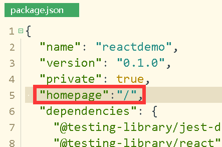

打包命令：  npm run build

# 十二 集成sass

npm i --save node-sass

创建scss,在tsx中导入scss,    import "scss文件相对路径"

# 十三 hook-useState

1 作用: 管理状态，即管理数据。

2 使用过程

```tsx
import React from 'react';

function UseState1() {
	//const [num, setNum]=[100, 修改数据函数]
	const [num, setNum] = React.useState<number>(100);
	function numAdd() {
		setNum(num+1);
	}
	return (
		<div>
			<h3>UseState1</h3>
			<div>
				<button onClick={numAdd}>num++</button>
				数字是:{num}
			</div>
		</div>
	);
} 
export default UseState1;
```

(1)导入

《1》import React from 'react';导入React, 然后在组件函数体中使用React.useState得到

《2》import React,{useState} from 'react';导入, 然后组件函数体中直接使用useState得到

(2)渲染数据

{数据}

(3)修改数据

调用setXxx(新的值)

修改数据后，界面会自动更新。

3 组件加载过程
	组件函数被调用，创建两个不变的变量num和setNum, num接收状态初始值100, setNum接收到修改状态的函数,
	组件函数最后会返回  jsx文档.该文档会被渲染到界面,   jsx文档中使用{num}得到num的值。
4 修改状态过程
    点击button后，触发函数numAdd执行，numAdd函数体中执行修改状态的语句 setNum(num+1);
    setNum(num+1)执行后发生什么事情：
    <1>组件刷新，组件刷新就是再次自动执行组件函数
    <2>所以再次执行语句: const [num, setNum] = React.useState<number>(100);
       重新创建num和setNum, num接收到的是修改状态setNum(num+1)中参数值, setNum仍然接收到修改状态的函数
    <3>组件函数最后会返回  jsx文档.该文档会被渲染到界面,   jsx文档中使用{num}得到num的值

# 十四 多种数据类型的状态

## 1 string, boolean, 对象

状态为对象/数组时，不能使用直接使用状态变量当作新的状态值,否则不会触发组件刷新。解决办法，重新创建一个新的对象/数组，或克隆出一个新的对象/数组

```tsx
import React,{useState} from 'react';

interface IStu {
	id:number,
	name:string,
	sex:string,
	major:string
}
function UseState3() {
	console.log("UseState3()")
	const[str, setStr] = useState<string>("你好");
	const[flag, setFlag] = useState<boolean>(true);
	const[stu, setStu] = useState<IStu>({id:1, name:'小王', sex:'男', major:'H5全栈开发'});
	function updateStr() {
		setStr("好好学习");
	}
	function updateFlag() {
		setFlag(!flag);
	}
	function updateStu() {
		// let newstu = {id:1, name:'小李', sex:'女', major:'React'};
		// setStu(newstu);
		let newstu = {...stu};//克隆
		newstu.major = "React";
		setStu(newstu);
	}
	return (
		<div>
			<h3>UseState3</h3>
			<div>
				<button onClick={updateStr}>修改str</button>
				str={str}
			</div>
			<div>
				<button onClick={updateFlag}>修改Flag</button>
				flag={flag?"真的":"假的"}
			</div>
			<div>
				<button onClick={updateStu}>修改stu</button>
				学生的id={stu.id},学生的name={stu.name},学生性别={stu.sex},学生的专业=<span style={{color:'red'}}>{stu.major}</span>
			</div>
		</div>
	);
}

export default UseState3;

/**
 * 状态为对象，数组时，不能使用直接使用状态变量当作新的状态值,否则不会触发组件刷新。解决办法，重新创建一个新的对象，或克隆出一个新的对象
 */
```

状态数据为对象是时，泛形类型：有两种方式实现

```tsx
interface IStu {
	id:number,
	name:string,
	sex:string,
	major:string
}
function UseState3() {
	const[stu, setStu] = useState<IStu>({id:1, name:'小王', sex:'男', major:'H5全栈开发'});
```

```tsx
function UseState3() {
	const[stu, setStu] = useState<{id:number,name:string,sex:string,major:string}>({id:1, name:'小王', sex:'男', major:'H5全栈开发'});
```

## 2 数组

1 字符串数组或数值数组

```tsx
//字符串或数值数组
import React,{useState} from 'react';
function UseState4() {
	console.log("UseState4()...")
	const[slist, setSlist] = useState<string[]>(["卡方","正态","二项","指数"]);
	
	function update1() {
		//创建一个新的数组当作新的状态值
		let newa = ["期望","方差","n阶差"];
		setSlist(newa);
	}
	function update2() {
		//克隆出一个新的数组
		let newa = [...slist];
		// newa.splice(1,2);
		newa.push("概论")
		setSlist(newa);
	}
	return (
		<div>
			<h3>UseState4</h3>
			<div>
				{/*
					 {slist[0]}分布,
					 {slist[3]}分布
				*/}
			</div>
			<div>
				<ul>
				{
					slist.map((v, i)=>{
						console.log("值为:", v,i);
						return <li key={v}> {v},{i} </li>;
					})
				}
				</ul>
				<button onClick={update1}>修改数组1</button>
				<button onClick={update2}>修改数组2</button>
			</div>
		</div>
	);
}
export default UseState4;
```

2 对象数组

```tsx
import React,{useState} from 'react';

interface IGoods {id:number,name:string,price:number};
function UseState5() {
	const[stuList, setStuList] = useState<IGoods[]>([{id:1,name:'手机',price:12.8},{id:2,name:'电脑',price:10.8},{id:3,name:'平板',price:11.8}]);
	function update1() {
		//创建出一个新的数组，当作状态的新值
		let newa = [{id:1,name:'电视机',price:22.8},{id:2,name:'小霸王',price:23.8}];
		setStuList(newa);
	}
	function update2() {
		//克隆出一个新的数组，当作状态的新值。
		let newa = [...stuList];
		newa.push({id:4, name:'淋d城', price:232.23});
		setStuList(newa);
	}
	return (
		<div><h3>对象数组</h3>
			<button onClick={update1}>修改对象1</button><button onClick={update2}>修改对象2</button>
			<div style={{width:"400px"}}>
				<table className="wgrtable">
					<thead>
						<tr>
							<td>id</td>
							<td>name</td>
							<td>price</td>
						</tr>
					</thead>
					<tbody>
						{
							stuList.map((v,i)=>{
								return (
									<tr key={v.id}>
										<td>{v.id}</td> 
										<td>{v.name}</td> 
										<td>{v.price}</td> 
									</tr>
								)
							})
						}
					</tbody>
				</table>
			</div>
			
			<div>
				{stuList[0].name}
			</div>
		</div>
	);
}
export default UseState5;
```

# 十五 {}中运算表达式

{}可以进行算术运算   +  -  *  /  % （）

```tsx
{(1+2-100*2)/7%3}
```

{}可以进行string连接运算 +

```tsx
{"123"+4}
				{4+"123"}
				{"4"+"123"}
```

{}可以进行三元运算符运算

​	{name=="小王" ? "我是小王" : "我不是小王"}

{}可以进行关系运算

​	{23>3 ? '大于': '小于'}

{}中参与运算的项，可以是直接数，也可以是状态变量

```tsx
import React,{useState} from 'react';
function Ys() {
	const[flag, setFlag] = useState<boolean>(true);
	const[no, setNo] = useState<number>(0);
	const[str, setStr] = useState<string>("你好");
	return (
		<div>
			<h1>花括号中的运算</h1>
				{(1+no-100*2)/7%3}
				{str+no}
				{no+"123"}
				{"4"+str}
				{flag ? "真": "假"}
				{no>3 ? '大于': '小于'}
		</div>
	);
}
export default Ys;
```

# 十六 数据渲染到属性中

组件函数中的局部变量还可以渲染到标签元素的属性中去

```tsx
import React,{useState} from 'react';
function Attrrender() {
	const[url, setUrl] = useState<string>(require("../../img/m3.png"));
	const[imgc, setImgc] = useState<string>("one");
	const[w, setW] = useState<number>(300);
	function biger() {
		setImgc("two");
	}
	function smaller() {
		setImgc("one");
	}
	return (
		
		</img>
	);
}
export default Attrrender;
```


```tsx
function Avatar() {
  const avatar = 'https://i.imgur.com/7vQD0fPs.jpg';
  const description = 'Gregorio Y. Zara';
  
  return (
    
  );
}
export default Avatar;
```

```tsx
function Avatar() {
  const[w,setW] = useState<number>(100);
  const[myc, setMyc] = useState<string>("myname");
  return (
    
  );
}
```

# 十七 jsx数据类型的灵活使用

1jsx数据用于声明文档

2 在组件函数体中必须要返回jsx数据

3 在{}中渲染数据时，要返回jsx数据

4  可以使用变量保存jsx数据

```tsx
function JsxDemo() {
	let jsxvar1 = 
		<div>
			<ul>
				<li>修身</li>
				<li>意得</li>
			</ul>
		</div>;
	return(
		jsxvar1 
	);
}
export default JsxDemo;
```

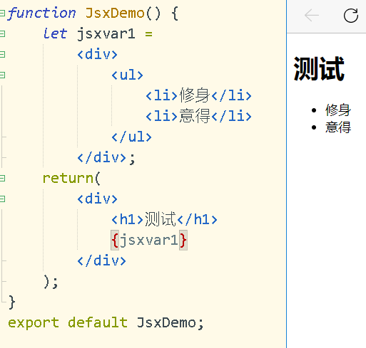

# 十八 {调用函数}组合产生jsx

可以把对数组等的渲染封装在函数体中，通过{调用函数}得到........

```tsx
function CAllFunDemo() {
	function show1() {
		return (
			<div style={{border:'1px solid red'}}>
				<h3>这是show1</h3>
				<p>
					这是一个段段
				</p>
			</div>
		)
	}
	
	return (
		<div>
			<h1>下面在调用show1()</h1>
			{show1()}
			{show1()}
		</div>
	);
}
export default  CAllFunDemo;
```

```tsx
function CAllFunDemo() {
	function show1(title:string) {
		return (
			<div style={{border:'1px solid red'}}>
				<h3>这是show1</h3>
				<p>
					{title}
				</p>
			</div>
		)
	}
	return (
		<div>
			<h1>下面在调用show1()</h1>
			{show1("天气预报")}
			{show1("小学通知")}
		</div>
	);
}
export default  CAllFunDemo;
```

```tsx
function CAllFunDemo() {
	function show1(a:string) {
		let jsx = null;
		if(a=="one") {
			jsx = 
			<div style={{border:'1px solid red'}}>
				<h3>这是show1</h3>
				<p>
					这是一个段落 
				</p>
			</div>
		}else {
			jsx =
			<div style={{border:'1px solid red'}}>
				<ul>
					<li>li1</li>
					<li>li2</li>
					<li>li3</li>
				</ul>
			</div>
		}
		return jsx;
	}
	return (
		<div>
			<h1>下面在调用show1()</h1>
			{show1("one")}
			{show1("fsdafas")}
		</div>
	);
}
export default  CAllFunDemo;
```


# 十九 条件渲染

1 三元运算实现

2 {调用函数实现}

```tsx
import React,{useState} from 'react';

function ConditionRender() {
	const[flag, setFlag] = useState<string>("a");
	if(flag=="a") {
		return (
			<div>
				条件渲染111
			</div>
		);
	}else if(flag=="b") {
		return (
			<div>
				条件渲染222
			</div>
		);
	}else {
		return (
			<div>
				条件渲染其它
			</div>
		);
	}
}
export default ConditionRender;
```

```jsx
import React,{useState} from 'react';

function ConditionRender() {
	const[flag, setFlag] = useState<string>("a");
	
	function show() {
		if(flag=="a") {
			return (
				<div style={{height:'100px', background:'red'}}>这是show中的内容</div>
			);
		}else {
			return (
				<div style={{height:'100px', background:'green'}}>这是show中的内容</div>
			);
		}
	}
	
	function updateFlag() {
		if(flag=="a") {
			setFlag("b");
		}else {
			setFlag("a");
		}
	}
	return (
		<div>
			<button onClick={updateFlag}>改变</button>
			<h3>条件渲染</h3>
			{show()}
		</div>
	)
}
export default ConditionRender;
```

## 调用函数渲染数组

```jsx
import React, { useState } from 'react';

function CallFunRenderArray1() {
	const [numlist, setNumlist] = useState<number[]>([1, 6, 2, 7, 3, 8, 4, 9, 5, 10]);

	function showNumlist() {
		numlist.push(23432432);
		return (
			numlist.map(function(val, index) {
				return (
					<div>
						<span style={{ color: 'red' }}>{index}</span>
						=
						<span style={{ color: 'blue' }}>{val}</span>
					</div>
				)
			})
		) 
	}
	return (
		<div>
			<h1>渲染number型数组</h1>
			{ showNumlist()}
		</div>
	);
}

export default CallFunRenderArray1;
```

```jsx
import React, { useState } from 'react';

function CallFunRenderArray2() {
	const arr = [
		{id:10, name:"小王", age:30},
		{id:24, name:"小李", age:40},
		{id:37, name:"小华", age:18}
	];
	const [list, setList] = useState<{id:number,name:string,age:number}[]>(arr);
	
	function showList() {
		
		return (
			list.map(function(stu, index){
				return (
					<tr key={stu.id}>
						<td>{index+1}</td>
						<td>{stu.id}</td>
						<td>{stu.name}</td>
						<td>{stu.age}</td>
					</tr>
				)
			})
		) 
	}
	return (
		<div>
			<h1>渲染number型数组</h1>
			<table className={"wgrtable"}>
				<thead>
					<tr>
						<td>编号</td>
						<td>id值</td>
						<td>名字</td>
						<td>年龄</td>
					</tr>
				</thead>
				<tbody>
					{
						showList()
					}
				</tbody>
			</table>
		</div>
	);
}

export default CallFunRenderArray2;

```


# 二十 事件处理

## 1 事件属性命名

事件属性要使用小驼峰法则, 如onClick, onChange

```tsx

```


## 2 设置事件处理函数

所有元素都可以加事件处理函数，语法为把函数当作事件属性的值, 

函数可以是有名函数

```jsx
 {/*updateState是组件函数中的内部函数*/}
<button onClick={updateState}>修改所有的状态</button>
```

函数可以是直接写在内部的匿名或箭头函数

```jsx
import React,{useState} from 'react';
function EventHandle() {
	const[str, setStr] = useState<string>("red");
	return (
		<div style={{background:str}}>
			<h3>事件处理函数</h3>
			<button onClick={()=>{setStr("green");}}>修改颜色</button>
		</div>
	);
}
export default EventHandle;
```

## 3 得到事件信息对象

事件处理函数中可带一个参数(e:any)，用于接收事件信息对象，其中 e.target就是目标对象

```typescript
import React,{useState} from 'react';
function EventHandle() {
	//e是事件信息对象，所以e.target就是目标
	function do1(e:any) {
		let btn = e.target;
		btn.style.color="yellow";
		btn.style.fontSize = "40px";
	}
	return (
		<div>
			<h3>事件处理函数</h3>
			<div>
				<button onClick={do1}>点我1</button>
			</div>
		</div>
	);
}
export default EventHandle;
```

```jsx
<button onClick={(e:any)=>{e.target.style.color="yellow"}}>点我2</button>
```

## 4  传参数

- 传参数要使用bind

- null只是占一个位置

- 实参位于null之后

```typescript
const Demo() {
    
	function doThing(name:string, age:number)=>{
		console.log(name, age)
	}
    
 	return (
 		<div>
 			<button onClick={doThing.bind(null,'小王',30)}>
        		传参数
			</button> 
 		</div>
 	);
 };
```

## 5 同时得到事件信息对象和传参数

只需要在事件处理函数的参数例表最后多加一个参数'e:any'，即可获取。

```jsx
function Demo(){
    
	const doThing = (name:string, age:number, e:any)=>{
		console.log(name, age, e.target);
	}
 	return (
 		<div>
 			<button onClick={doThing.bind(null, 'andy', 98)}>传参数</button>
 		</div>
 	);
 };
```

## 6 表单提交事件

使用from的属性onSubmit设置事件处理函数，在事件处理函数中使用e.preventDefault()阻止表单默认提交事件

```jsx
<form onSubmit={submitInf}>
```

```jsx
function submitInf (e:any){
		//阻止表单默认提交事件
		e.preventDefault();
}
```

## 7 事件处理机制

react 的事件机制利用了事件委托机制。事件并没有绑定在真实的 dom 节点上，而是把事件都绑定在 html 结构的最外层 document，使用一个统一的事件监听器。所有的事件都由这个监听器统一分发。

组件挂载和更新时，会将绑定的事件分门别类的放进一个叫做EventPluginHub的事件池里。事件触发时，根据事件产生的Event对象找到触发事件的组件，再通过组件标识和事件类型从事件池里找到对应的事件监听回调，然后执行相关的监听函数。 

# 二一 useRef

下面是几个适合使用 refs 的情况：

- 管理焦点，文本选择或媒体播放。
- 触发强制动画。
- 集成第三方 DOM 库。

useRef与useState一样是一个hook函数

useRef的作用是获取文档元素对象

useRef函数执行后返回对象，对象中属性current就是文档元素对象

使用getElementById、querySelector等原生函数获取元素对象在React严格模式下会失败的

```jsx
import React,{useRef} from 'react';
export default function UseRefDemo1() {
	const nameref = useRef<any>();
	const divref = useRef<any>();
	function show() {
		//得到input元素对象  
		let nameinput = nameref.current;
		console.log(nameinput.value);
		
		//得到div元素对象
		let mydiv = divref.current;
		mydiv.style.background="red";
	}
	
	return (
		<div>
			<h3> UserRefDemo1</h3>
			<input ref={nameref} type="text" placeholder="输入名字" />
			
			<div>
				<button onClick={show}>显示</button>
			</div>
			<div ref={divref}>
				dddd
			</div>
		</div>
	)
}
```


# 二二 表单项数据的输入与获取

## 1 使用useRef

就是最原型的文档操作，但是一般不提倡使用

```typescript

import React,{useRef} from 'react';

function UseRefDemo() {
	const noref = useRef<any>();
	const pwdref = useRef<any>();
	
	function sure(e:any) {
		//阻止表单默认提交事件,form 
		e.preventDefault();
		// noref.current 就是id为no的input对象
		// pwdref.current 就是id为pwd的input对象
		let nov = noref.current.value;
		let pwdv = pwdref.current.value;
		console.log(nov, pwdv);
	}
	return (
		<div>
			<div>useRef</div>
			<form onSubmit={sure}>
				<input ref={noref} type="text" id="no" value="wwwfs" /><br />
				<input ref={pwdref} type="text" id="pwd"  /><br />
				<input type="submit"value="确认" />
			</form>
		</div>
	)
}
export default UseRefDemo;
```

##  2 表单项绑定状态使用onChange

### 1 文本输入框

如果input中的 value的值与状态绑定，所以input无法输入

```typescript
import React,{useState} from 'react';

export default function FormItem() {
	const[no, setNo] = useState<string>("");
	const[pwd, setPwd] = useState<string>("");
	
	function mysure(e:any) {
		e.preventDefault();
		console.log(no, pwd);
	}
	return (
		<div>
			<h3>表单数据的获取</h3>
			<form onSubmit={mysure}>
				<input type="text" value={no}      
      			 onChange={(e:any)=>{setNo(e.target.value)}}  
			     placeholder="输入账号"/>
                   <br />
				<input type="password" value={pwd} 
			     onChange={(e:any)=>{setPwd(e.target.value)}} 
                  placeholder="密码" />
                   <br />
				<input type="submit" value="确定" />
			</form>
		</div>
	);
}
```

### 2 日期输入框

```jsx
const [birth, setBirth] = useState<string>("");

<input type="date" value={birth} onChange={(e)=>{setBirth(e.target.value)}}/><br />
```

### 3 单选框

```jsx
import React, {useState} from 'react';

export default function RadioData() {
	const[sex, setSex] = useState<string>("男");
	function showSex() {
		console.log(sex);
	}
	return (
		<div>
			<h3>单选择框数据获取</h3>
			性别:
			<input type="radio" name="sex" value="男" checked={sex=="男"} 
              onChange={()=>{setSex("男")}} />男生
			<input type="radio" name="sex" value="女" checked={sex=="女"} 
              onChange={()=>{setSex("女")}} />女生
        	 <br />
			<button onClick={showSex}>得到性别</button>
		</div>
	);
}
```

### 4 复选框

```jsx
mport React,{useState,Fragment,useRef} from 'react';

export default function CheckedBoxData() {
	let wx = [
		{content:'金', flag:false},
		{content:'水', flag:true},
		{content:'木', flag:true},
		{content:'火', flag:false},
		{content:'土', flag:false}
	];
	const[list, setList] = useState<{content:string,flag:boolean}[]>(wx);
	
	function changeList(i:number) {
		let newlist = [...list];
		newlist[i].flag = !newlist[i].flag;
		setList(newlist);
	}
	
	function show() {
		console.log(list);
	}
	
	return (
		<div>
			<button onClick={show}>显示复选框值</button>
			<h4>复选框</h4>
			{
				list.map(function(obj,index){
					return (
						<Fragment key={obj.content}>
							<input type="checkbox" 
								   value={obj.content} 
								   checked={obj.flag} 
								   onChange={changeList.bind(null, index)}
							/>     五行属{obj.content}
						</Fragment>
					);
				})
			}
		</div>
	);
} 
```

### 5 下拉框

```			jsx				
import React,{useState} from 'react';
export default function SelectedData1() {
	const[list, setList] = useState<string[]>(['数论','粒子论','认知论','唯心论']);
	const[item, setItem] = useState<string>("粒子论");
	return (
		<div>
			<h4>下接框简单形式</h4>
			<div>
				<button onClick={()=>{console.log(item)}}>显示</button>
				<select value={item} onChange={(e:any)=>{setItem(e.target.value)}}>
				{
					list.map(function(v,i){
						return <option value={v}>{v}</option>
					})
				}
				</select>
			</div>
		</div>
	);
}
```


```	jsx	
import React,{useState} from 'react';
function Hello() {
	let array = [	
			{content: "吃", checked: false },
			{content: "喝", checked: false },
			{content: "玩", checked: true },
			{content: "乐", checked: false }
		];
		const [list, setList] = useState<{content:string, checked:boolean }[]>(array);
		
		function updateList(e:any) {
			let newlist = [...list];
			for(let i=0; i<newlist.length; i++) {
				if(newlist[i].content==e.target.value) {
					newlist[i].checked=true;
				}else {
					newlist[i].checked=false;
				}
			}
			setList(newlist);
		}
		
		function getdefvalue() {
			for(let i=0; i<list.length; i++) {
				if(list[i].checked) {
					return  list[i].content;
				}
			}
		}
		return (
			<div>
				<select onChange={updateList} value={getdefvalue()}>
					{
						list.map((obj,i)=>{
							return (
							   <option key={obj.content} value={obj.content}>
                      {obj.content}
                 </option>
							)
						})
					}
				</select>
			</div>
		);
}
export default Hello; 
```

# 二三 组件属性(自定义属性)

在使用组件时，可以向组件传递数据，一般情况下，组件都有父组件，父组件在使用子组件时，可以通过组件属性把数据传递给子组件.

组件属性的值可以是任意类型,function,object,array, number,string........,当组件参数类型设置为any时，不传参数也不会报错。

不管有多少个属性，属性都会被封装到一个对象中进行传递，所以接收属性的形参只能是一个变量，参数常采用对象解构进行，当传递的参数为函数时，接收函数的类型使用any即可

有属性的组件， 组件函数名字必须大写写母开头

```typescript
//复习对象解构技术
let {name, age} = { name: 'mike', age: 25}; 
console.log(name); // mike 
console.log(age); // 25
```

看一个属性示例，这是一个使用组件User的代码，根据使用方式可知, name和age是他们属性

```typescript
function Index() {
	return (
		<div>
			<h3>使用User,并传递数据</h3>
			<User name={"andy"} age={10000}/>
		</div>
	);
}
```

User代码, 实计上参数是以对象传递的, 参数为 {name:‘red’, age:10000}, 所以在User函数中使用一个变量person就接收到了一个对象

任何情况下，有属性在组件中，都要为属性设置类型，示例中Iperson就是类型了

```typescript
interface IPerson {
	name:string,
	age:number
}
//也可以写成 function User(person:{name:string,age:number})
function User(person:IPerson) {
	return (
	    <div>
          <p>{ person.name }</p>
          <p>{ person.age }</p>
	    </div>
	  )
}
```

User代码,对象解构写法

```	jsx	
//可以写成 function User({name,age}:{name:string,age:number})
function User({name,age}:IPerson) {
	return (
	    <div>
			  <p>{name }</p>
			  <p>{age }</p>
	    </div>
	  )
}
```

User代码，如果使用React.FC，则匿名函数和箭头函数的参数类型只能使用FC范型,否则失败

```jsx
//可以写成const User:FC<{name:string,age:number}> = function({person}) {
const User:FC<IPerson> = function(person) {...
const User:FC<IPerson> = function({name, age}) {...  
	return (
	    <div>
			  <p>{ person.name }</p>
			  <p>{ person.age }</p>
	    </div>
	  )
}
//或
//可以写成const User:FC<{name:string,age:number}> = function({name,age}) {
const User:FC<IPerson> = function({name, age}) {
	return (
	    <div>
			  <p>{ name }</p>
			  <p>{ age }</p>
	    </div>
	  )
}
```

# 二四 组件动态属性

父组件刷新会触发后代组件刷新

把父组件中状态作为子组件属性传值叫动态属性，父组件状态数据变化时，因为会触发父组件的刷新，进而触发了所有子组件的刷新。

```jsx
interface IParams {
  name:string,
  autor:string
};

export default function Book({name,autor}: IParams) {
	return (
		<div>
			<h6>Book</h6>
			书名:{name},作者{autor}
		</div>
	);
}
```

```jsx
import Book from './Book';
import React,{useState} from 'react';
export default function DongTaiProps() {
	const[name,setName] = useState<string>("太阳");
	const[autor, setAutor] = useState<string>("小李");
	
	function update() {
        //因为两个修改状态的代码都在同一个函数里面调用了，所以只会触当前组件刷新一次
		setName("地球");
		setAutor("小王");
	}
	
	return (
		<div>
			<button onClick={update}>修改name和autor</button>
			<h3>动态组件属性</h3>
			<Book name={name} autor={autor} />
		</div>
	)
}
```

### 数据只能传一级

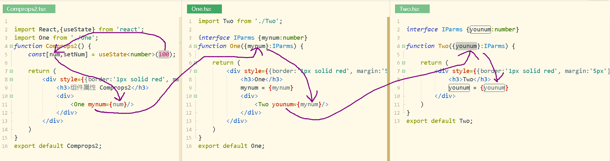


# 二五 react反向数据流-子组件主动修改父组件状态

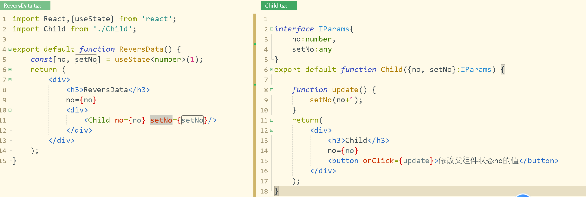

- react返向数据流
  - 把父组件的带参数的函数传递给子组件，子组件中通过调用父组件函数实现

  - 修改父组件状态
    - 把父组件的函数当作子组件属性的值, 在子组件中就可以调用父组件的函数，修改父组件的状态，并且在子组件中调用父组件函数时，通过函数参数向父组件的状态传递新的数据


```jsx
//App14.tsx
import React,{useState} from "react";
import Child1 from "./Child1";

function App14() {
  
	const[name, setName] = useState("小王");
  
	return (
		<div style={{border:'10px solid red'}}>
			<div>
				<h1>下面是两个子组件</h1>
			</div>
			<div>
				<Child1 myName={name} mySetName={setName}/>
			</div>
		</div>
	);
}

export default App14;
```

```jsx
//Child1.tsx
import React from "react";
function Child1({myName, mySetName}:any) {
	
	function updateName() {
		//调用父组件的setName，修饰了父组件的状态name的值
		mySetName("小李");
	}
	return (
		<div style={{background:"green"}}>
			这是Child1 {myName}
			<button onClick={updateName}>子组件中的按钮</button>
		</div>
	);
}

export default Child1;
```

# 二六 包含关系

- 有些组件无法提前知晓它们子组件的具体内容。在 `Sidebar`（侧边栏）和 `Dialog`（对话框）等展现通用容器（box）的组件中特别容易遇到这种情况, 我们建议这些组件使用一个特殊的 `children` prop 来将他们的子组件传递到渲染结果中。

- 组件以开标签的方式嵌入0到多个元素: 元素可以为文本、html标签，别的组件。
  组件函数形参一般设置为{children}:any,   children不可以换成别的名字。如果不想解构，则一般把参数设置为props,然后使用props.children得到嵌入的元素。
- 使用{children}可把嵌入的元素嵌入到当前jsx位置

```jsx
//Father.tsx
//自定义带插槽的组件
function Father({children}:any) {
	console.log(children);
	const s = {border:'1px solid red'};
	return (
		<div style={s}>
			下面是插入的内容<br />
			{children}
		</div>
	);
}
export default Father;
```

```jsx
//Index.tsx
//使用带插槽的组件
import Father from './Father';
import User from './User';
import Stu from './Stu';

function Index() {
	const s = {width:'100px', border:'1px solid yellow'};
	return (
		<div>
			<Father>
				文本
				<div style={s}>html标签div</div>
				<User />
        <Stu />
			</Father>
		</div>
	);
}
export default Index;
```

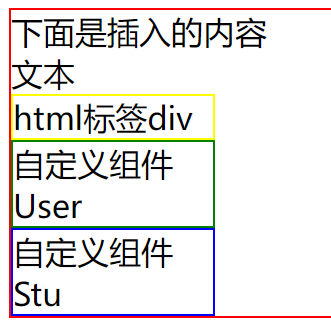


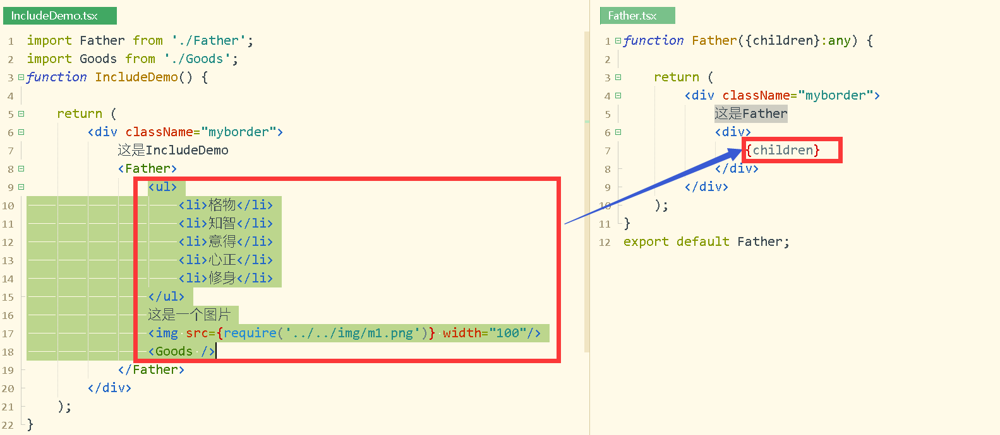

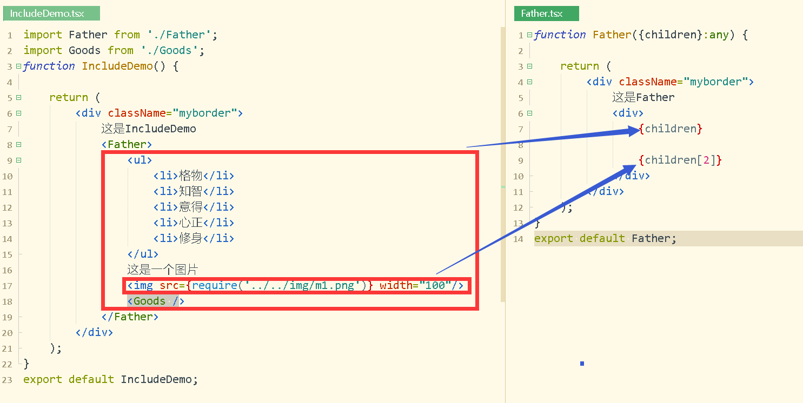

# 二七 useEffect

- userEffect也是一个hook,

- useState,useRef,useEffect的引入方式是相同的

  ```jsx
   一、useEffect(function)
   * 1. 监听组件的加载完毕事件
   * 2. 监听组件的刷新完毕事件。(状态发生改变后，组件会刷新)
   
   二、useEffect(function, [])
   * 1. 监听组件的加载完毕事件
   * 2. 不能监听组件的刷新完毕事件。（状态发生改变后，不能监听到） 
   
   三、useEffect(function, [no,name])
   * 1. 监听组件的加载完毕事件
   * 2. 监听：数组中设置的状态发生改变后触发的组件刷新完毕事件
   
   四、useEffect(function,[no,name])。要求参数function返回一个无参函数。
   * 1. 监听组件的加载完毕事件
   * 2. 当组件刷新完毕时，先执行function返回的无参数函数，再执行function函数
  ```


## 3 逻辑嵌套问题

如果在useEffect第一个参数(函数)中修改状态，而状态的修改又可能触发了“useEffect第一个参数(函数)”回调，从而出现无限执行下去的逻辑嵌套问题，开发时必须避免

以下代码有什么问题?运行结果是什么

```jsx
import React, { useState, useEffect } from 'react';

const Index = () => {
  const [name, setName] = useState<string>('')
  const [count, setCount] = useState<number>(0);
  useEffect(() => {
      console.log("useEffect");
      setCount(count+1);
  },[count])
 return (
    <div>
      <p>Current Name: { name }</p>
      <p>count: { count }</p>
      <button onClick={() => setName('Jack')}>Jack</button>
      <button onClick={() => setName('Marry')}>Marry</button>
    </div>
  )
}
export default Index
```

#  二八 useContext

1  useContext介绍

​	  useContent是一个hook,导入方式与useState,useRef,useEffect相同

> 组件属性只能实现父组件向子组件传值，而useContext可以实现父组件向后代组件传值,(后代组件指子代，孙代，再下一代......)
>
> ```jsx
> <ThemeContext.Provider value={name}>
>       <Child1 />
>    <Child2 />
> </ThemeContext.Provider>
> ```
>
> 代码中，value的值name，可以传递组Child1和Child2及其所有的后代组件。
>
> 如果value的值name是一个状态，那么当状态name的值被修改后，则所有的子代都会重新刷新。
>
> （useContext并不是提供全局数据，而是通过父组件向后代组件传递统一数据）

2 开发过程为

(1)创建ThemeContext

 最好写成一个独立的文件，因为该对象要被公用的。

```jsx
import React from 'react';
const ThemeContext = React.createContext<any>(null); 
export default ThemeContext;
```

(2)设置传递数据

使用ThemeContext.Provider的属性value设置数据，把子组件位于ThemeContent.Provider标签中.

```jsx
//其中name可以是一个状态，可以是任意类型
<ThemeContext.Provider value={name}>
   <Child />
</ThemeContext.Provider>
```

(3)接收数据

后代组件中使用useContext 得到Provider中 value的值。其中ThemeContext必须与“设置传递数据”中的ThemeContext是同一个。所以再次强调用创建ThemeContext最好写在一个独立的文件中，方便不同的同方导入到同一个ThemeContext

```jsx
const name = useContext(ThemeContext);
```

3   实现当父组件状态修改后，后代标签会更新

```jsx
//MyContext.tsx
import React from 'react';
const ThemeContext = React.createContext<any>(null); 
export default ThemeContext;
```

```jsx
//Index.tsx
import React,{useState} from 'react';
import Child from './Child';
import ThemeContext from './MyContext';

export default function Index() {
	const [name, setName] = useState("小王");
	
	const changeName = ()=>{
		setName("小王"+Math.floor(Math.random()*100));
	}
	
	return (
		<div>
			这是Index--name--{name}
			<br />
			<ThemeContext.Provider value={name}>
				<Child />
			</ThemeContext.Provider>
			<button onClick={changeName}>
				改变name
			</button>
		</div>
	);
}
```

```jsx
//Child.tsx
import React,{useContext} from 'react';
import GrandSon from "./GrandSon";
import ThemeContext from './MyContext';

export default function Child() {
	const name = useContext(ThemeContext); 
	return (
		<div>
			这是Child--name--{name}
			<br />
			<GrandSon />
		</div>
	);
}
```

```jsx
 //GrandSon.tsx
import React,{useContext} from 'react';
import ThemeContext from './MyContext';	

export default function GranSon() {
	let name = useContext(ThemeContext) 
	return (
		<div>
			这是GranSon--name--{name}
		</div>
	);
}
```

4 实现后代组件主动把数据传递组父组件，让父组件的ThemeContext.Provider中value的值产生改变，进而触使父组件的所有子代组件全部刷新。

具体实现可以把父组件中修改状态的函数和状态本身封装在一个对象中，然后把该对象当成<ThemeContext.Provider value={????}>中value的值传递后代组件，后代组件取出对象，再从对象中取出函数和状态，后代组件就可以调用取出的函数了，进行可以调用函数，调用该函数就可以修改状态的值了。


# 二九 useReducer

## 1 useReducer介绍

> useReducer是一个hook,通过React.useReducer访问
>
> useReducer与useState的相同点：都是对状态的管理，状态的使用是完全相同的，比如状态都可以是任意类型、状态值都可以使用{}插入到声明文档中、状态都可以为子组件属性传值，状态都可以当作值使用useContext传递给后代组件，状态都可以被修改进而触发组件重新加载和触发useEffect......, 
>
> 可以说useReducer能实现的功能与useState是完全相同的。但是站在代码设计的角度上看，useReducer部分代替useState时，比useState要更合适一些。 例如 state 逻辑较复杂且包含多个子值，或者下一个 state 依赖于之前的 state 等。并且，使用 useReducer 还能给那些会触发深更新的组件做性能优化，因为你可以向子组件传递dispatch而不是回调函数
>
> useReducer+useContext使用是一个经典配合。能完全达到类开发中Redux的效果。该配全使用是大家学习中必须掌握的一个重点、难点技术。

## 2 开发要点

> 导入useReducer

```jsx
import React,{useReducer} from "react";
```

> 使用useReducer，  实参reducer是函数， 实参data是状态state的初始值, 该值可以是任意类型

```jsx
//实战中不要为useReducer加泛型
const [state, dispatch] = useReducer(reducer, data);
```

> reducer函数

```jsx
const reducer = (state:number, action:string)=>{.....}
```

(1)当主动调用dispatch函数时会触发reducer函数的执行

(2)形参state: 接收上一次状态值

(3)形参action: 接收调用dispatch函数时传递的实参值

(4)函数reducer 的返回值成为状态state的新值，进而触发组件更新，也会触发useEffect执行

(5)参数的类型是按照状态和dispatch的实参来确定的，可以统一写成any


> dispatch

调用函数dispatch，dispatch(action) 执行后会触发reducer函数的执行，实参action会被reducer第二个形参接收， action的类型也可以是任意类型


> 开发时各种名字是任意的，比如

```jsx
const [count, update] = useReducer(myreducer, 10);
```

学习基础的执行流程

```jsx
import React,{useReducer, useEffect} from 'react';
function App21() {
	//a接收到状态name的旧值, b接收到调用dispatch函数时实参值, reducer函数返回值成为状态name的新值
	function reducer(a:any, b:any) {
		console.log("reducer...",a,b);
		//返回值会成为状态的新值，即修改了状态name的值
		return b;
	}
	//name是状态，默认值为小王; dispatch接收到的是函数，该函数执行后会触发reducer的执行
	const [name, dispatch] = useReducer(reducer, "小王"); // ["小王", function....]
  
	function update() {
		dispatch("小陶");//触发reducer的执行
	}
	useEffect(()=>{
		console.log("useEffect()....")
	});
	return (
		<div>
			<h5>这是App21</h5>
			{name}
			<button onClick={update}>调用dispatch,触发reducer的执行</button>
		</div>
	);
}
export default App21;
```


状态的类型可以是任意类型，当状态是对象

```jsx
import React,{useReducer,useEffect} from 'react';
interface IState {
	id:number, 
	name:string, 
	core:number
}
interface IAction {
	type:string, 
	num:number
}
function App22() {
	//state:状态旧值，返回值成为状态新值， action接收到dispatchUser的实参
	function reducer1(state:IState, action:IAction) {
		console.log("reducer1...");
		const {type, num} = action;//{type:'min', num:3}
		let newState = {...state};
		if(type=="add") {
			newState.core += num;
			return newState;
		}else if(type=="min") {
			newState.core -= num;
			return newState;
		}else {
			return state;
		}
	}
	const [person, dispatchUser] = useReducer(reducer1,  {id:1, name:'小王', core:10});
  
	// 加分
	function addCore() {
		//实参被reducer1中的action接收
		dispatchUser({type:'add', num:2});
	}
	// 减分
	function minCore() {
		//实参被reducer1中的action接收
		dispatchUser({type:'min', num:3});
	}
  // 监视
	useEffect(()=>{
		console.log("useEffect()...");
	})
	return (
		<div>
			<div>
				{person.id}----{person.name}----{person.core}
			</div>
			<h5>这是App22</h5>
			<button onClick={addCore}>加分+</button>
			<button onClick={minCore}>减分-</button>
		</div>
	);
}
export default App22;
```

## 3 多个useReducer

与useState相同，同一个组件中可以多次使用useReducer


# 三十 路由

路由完示例代码: [router.rar](static\router.rar) 

## 1 概念

从版本的React-Router5.x开始，路由彻底改变了，和以后的版本完全不兼容。所以出去开发时注意版本。

对当页面应用模式提供多页面效果

Link和useNavigate实现组件切换时，实际上伴随着组件的销毁与创建，所以建议只有整体页面切换时才使用路由，而局部切换时使用最原始的隐藏显示为佳，这样可以确保组件中通过ajax得到的数据一直存在。同样的道理，子路由的使用也需要特别小心。

## 2 环境

(1)下载第三方模块

> (a) ts开发情况下，  下载模块"react-router-dom"和 "@types/react-router-dom"
>
> npm i --save react-router-dom @types/react-router-dom
>
> (b) js开发情况下,    只需下载模块"react-router-dom" 
>
> npm i --save react-router-dom

(2)引入

```tsx
import {  
	  BrowserRouter as Router, //BrowserRouter太长，常常使用别名Router
	  Route, 
    Routes,
    Link,
    useNavigate,
    useParams,
    useLocation,
    Navigate
} from 'react-router-dom';
```

 BrowserRouter太长，常常使用别名Router

## 3 创建路由

```tsx
function Router1Demo() {
	return (
		<BrowserRouter>
			<Routes>
				<Route path='/' element={<Main />} />
				<Route path='/one' element={<One />} />
				<Route path='/two' element={<Two />} />
				<Route path="/*" element={<Page404 />} />
			</Routes>
		</BrowserRouter>
	);
}
export default Router1Demo; 
```

## 4 路由组件的嵌套问题

Routers中只能嵌套Route

```jsx

function Router2Demo() {
	return (
		<div>
			<button>main</button>
			<button>one</button>
			<button>two</button>
			<BrowserRouter>
					<div>
						dfsfa
					</div>
					<Routes>
							<Route path='/' element={<Main />} />
							<Route path='/one' element={<One />} />
							<Route path='/two' element={<Two />} />
							<Route path="/*" element={<Page404 />} />
					</Routes>
					<div>
						34444
					</div>
			</BrowserRouter>
		</div>
	);
}
```


## 4 页面跳转-Link和useNavigate

Link和useNavigate 必须位于BrowserRouter标签内部

> Link相当于超连接 a

> useNavigate是hook

```tsx
import {Link, useNavigate} from 'react-router-dom';

function Main() {
	const navigate = useNavigate();
	
	function toTwo() {
		navigate({pathname:'/two'});
	}
	
	return (
		<div className='myborder' style={{height:"200px",background:'red'}}>
		   Main
		  <Link to={{pathname:'/one'}}>进入one</Link>
		  <button onClick={toTwo}>进入two</button>
		</div>
	);
}
export default Main;
```

```
<Link to={{pathname: '/one'}}>进入one</ Link>
会被渲染成:
<a href="/one">进入one</a>
```


## 5 路由使用注意事项

Link和useNavigate实现组件切换时，实计上伴随着**组件的销毁与创建**，所以建议只有整体页面切换时才使用路由，而局部切换时使用最原始的隐藏显示为佳，这样可以保让组件中通过ajax得到的数据一直存在。同样的道理，子路由的使用也需要特别小心。

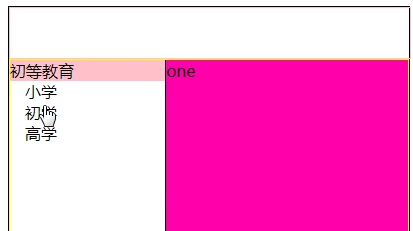


## 6 传参数

### 1 state传参数

传参数只能使用hook-useNavigate函数

```tsx
//传递参数关键代码
import {useNavigate} from 'react-router-dom';
let navigate = useNavigate();

navigate({pathname:'/one'},{state:{id:1,sex:'女',name:'小五'}});
```

接收参数使用hook-useLocation函数，接收到的对象state是一个Object类型，所以必须类型断言才能取出属性值

```tsx
//接收参数关键代码
import {useLocation} from 'react-router-dom';

const location = useLocation();
let stu = location.state;
```

### 2 动态传参数

第一步设置可传参数，第二步传参数，第三步使用hook-useParams函数接收参数

```jsx
设置可传参数
<Route path='/two/:name/:sex' element={<Two />} />
```

```tsx
传参
navigate({pathname:`/two/小王/女`});
或
<Link to={{pathname:`/two/小王/女`}}>two</Link>
```

```tsx
接收参数
import {Link, useParams} from 'react-router-dom';
let person = useParams();
console.log(person.name,person.sex)
```

### 3 通过url传参数

```tsx
传参
	{pathname:'/one?name=泪王&sex=女'}
接收
import {useLocation} from 'react-router-dom';
	let location = useLocation();
	let search = location.search;//  /one?name=泪王&sex=女   
	search = decodeURI(search);//  转码
	console.log(search);//   /one?name=泪王&sex=女
```

## 7 配置符 *

```tsx
<Route path="/*" element={<组件1 />}></Route>
<Route path="/test" element={<组件2 />}></Route>
{/*
  /test匹配到组件2
  /teacher匹配到组件1
*/}
```

## 8  子路由

### 1 子路由配置

第1步 在配置主路由的path属性后面加"/*"

```tsx
//Ziluyou.tsx
<BrowserRouter>
			<Routes>
           <Route path="/" element={<Main />}></Route>
           <Route path="/one/*" element={<One />}></Route>
           <Route path="/two" element={<Two />}></Route>
           <Route path="/three" element={<Three />}></Route>
			</Routes>
</BrowserRouter>
```

第2步在主路由对应的组件中使用配置新的路由, 子路由的访问path为"主路由+子路由"

```tsx
//One.tsx
<Routes>
			<Route  path="/" element={<Person />} />
			<Route  path="/stu" element={<Stu />} />
			<Route  path="/teacher" element={<Teacher />} />
			<Route  path="/boss" element={<Boss />} />
</Routes>
{/*
	/---Main
	/two---Two
	/Three----Three
	  
    /one/  匹配到<Person />  
	/one/stu匹配到组件<Stu />
    /one/teacher匹配到组件<Teacher />
    /one/boss 匹配到组件<Boss />
    /one/aabb 匹配不到组件
*/}
```

### 2 主路由与子路由相互跳转

- 不管是主路由还是子路由，都可以在浏览器中输入正确的地址访问到；
- 不管是主路由还是子路由，只要组件内嵌在标签"BrowserRouter"中，就可以使用hook-useNavigate或标签Link直接使用正确的路由path访问到；

## 9 路由切换时伴随并组件的创建与销毁


## 10 重定向

### 1 重定向基础

重定向需使用到组件Navigate

```tsx
import {Navigate} from 'react-router-dom';
```

Route中的element不设置组件，而设置别的已经设置好的Route的path, 显示效果就是该path对应的组件。

（1）子路由可以重定向到主路由，主路由中也可以重定向到子路由。

```tsx
<Routes>
	<Route path="/" element={<Main />}></Route>
	<Route path="/one/*" element={<One />}></Route>
	<Route path="/two" element={<Two />}></Route>
	<Route path="/three" element={<Three />}></Route>
	<Route path="/*" element={<Page404 />}></Route>
	{/* 主路由重定向到主路由:　　重定向到path:/two对应的组件<Two />中, 网址会显示为/two */}
	<Route path="/b" element={<Navigate to="/two" />} />
	{/* 主路由重定向到子路由：   定向到path:/one/stu对应的组件XXX中，网址会显示为/one/stu */}
	<Route path="/a" element={<Navigate to="/one/stu" />} />
</Routes>
```

（2）重定向还有一种方式, 在组件的返回值中使用 

```tsx
import React from 'react';
import {Navigate} from 'react-router-dom';

export default function Index({flag}:{flag:string}) {
	if(flag=="stu") {
		return <Navigate to="/one" replace={true} />
	}else {
		return <Navigate to="/two" replace={true} />
	}
}
```


### 2 路径错误默认显示页面

```
主路由中使用 /* 来匹配，子路由中重定向到主路由中的 /*
```

```tsx
//App.tsx 第一级路由(主路由)
<Route path="/" element={<Main />}></Route>
<Route path="/one/*" element={<One />}></Route>
<Route path="/two" element={<Two />}></Route>
<Route path="/three" element={<Three />}></Route>
<Route path="/*" element={<Page404 />}></Route>
{/*
    <Page404 />是路由错误的默认访问网页
    localhost:3000--<Main>
    localhost:3000/one--<One>
    localhost:3000/two--<Two>
    localhost:3000/three---<Three>
    localhost:3000/aabb---<Page404>
*/}

//One.tsx 第二级路由(子路由)
<Routes>
  <Route  path="/boss" element={<Boss />} />
  <Route  path="/*" element={<Navigate to="/404" />} />
</Routes>
{/*
localhost:3000/one/boss--<Boss>
localhost:3000/one/aabb--重定向到localhost:3000/404--匹配主路由的/*---找到<Page404 />
<Navigate to="/404" />中的"/404"是任意写的一个不存在的路由path,所以不是非要写成"/404"
*/}
```

## 11 路由守卫-登陆判断

写一个带插槽的组件，在该组件中统一判断是否登陆，进而决定该组件中插入的组件是否正常加入。

在路由配置组件时，所有组件使用插槽组件包裹。

```tsx
import {BrowserRouter,Link, Routes, Route, Navigate} from 'react-router-dom';
import Main from './Main';
import Login from './Login';
import Goods from './Goods';
import About from './About';
import RouterFilter from './ProtectedRouter/RouterFilter';
function Index() {
	return (
	 <BrowserRouter>
		<Routes>
			<Route path="/" element={<RouterFilter><Main /></RouterFilter>}></Route>
			<Route path="/goods" element={<RouterFilter><Goods /></RouterFilter>}></Route>
			<Route path="/about" element={<RouterFilter><About /></RouterFilter>}></Route>
			<Route path="/login" element={<Login />}></Route>
		</Routes>
	</BrowserRouter>
	);
}
export default Index;
```

```tsx
import {Navigate} from 'react-router-dom';

function RouterFilter({children}:any) {
	if(已经登陆) {
		return children;
	}else {//未登陆
		return <Navigate to="/login" replace={true} />
	}
}
export default RouterFilter;
```

# 三一 antd

官网：https://ant.design/index-cn

## 1下载基础模块

npm i --save antd       必需下载

npm i --save @ant-design/icons    如果要使用antd中的icon技术，才必需下载

## 2 导入antd.css 

一般建议在顶层组件中导入

方式1：在tsx组件文件中导入

import "antd/dist/antd.css";

方式2：

在css文件中导入

@import '~antd/dist/antd.css';

再把css文件导入到tsx组件文件中

## 3 示例

Button的使用

```tsx
import React,{useState} from 'react';

import Button from 'antd/lib/button';
//或使用 import { Button} from 'antd';

function Index() {
	const [res, setRes] = useState<any>(0);
	function updateRes() {
		setRes(100)
	}
	return (
		<div>
			<p>		
				<div>
					{res}
				</div>
				<Button onClick={updateRes} type="primary">Primary Button</Button>
				<Button onClick={()=>{setRes(200)}}>Default Button</Button>
				<Button type="dashed">Dashed Button</Button>
				<br />
				<Button type="text">Text Button</Button>
				<Button type="link">Link Button</Button>
			</p>
		</div>
	);
}
export default Index;
```

Icon的使用

cnpm install --save @ant-design/icons

```tsx
import React,{useState} from 'react';
import { Button} from 'antd';
import { StepForwardOutlined, SearchOutlined } from '@ant-design/icons';
function Index() {
	return (
		<div>
			<p style={{fontSize:"50px"}}>
				<SearchOutlined style={{color:"red"}} />
				<Button type="primary" shape="circle" icon={<SearchOutlined />} />
			</p>
		</div>
	);
}
export default Index;
```

## 3 Menu菜单

```tsx
<Menu items={items} />
Menu的属性
(1)mode  值vertical | horizontal | inline
(2)style	根节点样式
(3)onClick  事件处理函数  function({ item, key, keyPath, domEvent })
(4)items  菜单内容
items值的示例1： 一级菜单
items=[{label:'主页', key:'main'},{...},{...}]
items值的示例2： 多级菜单
items=[{label:'主页', key:'main'},{...},
       {
           lable:'书本', 
           key:'book',
           children:[
               {...}，{...},{...}
           ]
       }
]
items是数组，其中元素是对象，对象的属性有  
    key		  item 的唯一标志	string	-	
    label	  菜单项标题	ReactNode	-
    icon	  菜单图标	ReactNode	-    
    children  items       
    danger	  展示错误状态样式	boolean	false	
    disabled  是否禁用	boolean	false	
    title	  设置收缩时展示的悬浮标题	string
```


```tsx
const items = [
		{ label: '菜单项一', key: 'item-1' }, // 菜单项务必填写 key
		{ label: '菜单项二', key: 'item-2', icon: <StepForwardOutlined /> },
		{
			label: '子菜单',
			key: 'submenu',
			children: [
				{ label: '子菜单项1', key: 'submenu-item-1' },
				{ label: '子菜单项2', key: 'submenu-item-2' },
				{ 
					label: '子菜单项3', 
					key: 'submenu-item-3', 
					children:[
						{label:"ss",key:'sdfsa'},
						{label:'aa',key:'fffff'}
					]
				},
			],
		},
	];


<Menu items={items} mode="vertical" />
```

作业：使用Menu当作导航

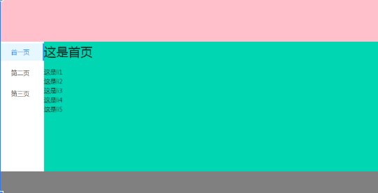


# 三二 axios的使用

1 react中使用axios分三个步骤

(1) 下载npm i --save axios

(2) 导入import axios from 'axios'

(3) 使用组件中使用axios发送请求

2 开发技巧

(1) 整体思路是,通过axios从服务器取到数据，通过数据更新状态，状态数据插入到界面中。

(2) 如果组件被加载时就自动通过axios获取数据并显示出来，要使用useEffect来协助完成

```ts
import React,{useState, useEffect} from 'react';
import axios from 'axios';
function App28() {
	const[stu, setStu] = useState<any>(null);
	function getStu() {
		axios.get("http://localhost:80/showStu.do")
		.then(function(r){
			setStu(r.data);
		})
	}
	function showStu() {
		if(stu!=null) {
			let {id, name, sex} = stu;
			//{id:1, name:'小王', sex:'男'}
			return <div>{id},{name},{sex}</div>;
		}
	}
	useEffect(function(){
		getStu();
	}, [])
	return (
		<div>
			<h1>Axios stu</h1>
			<div>
				{showStu()}
			</div>
			<button onClick={getStu}>显示学生</button>
		</div>
	);
}
export default App28;
```


# 三三  文件上传

##  1 react端

```tsx

```

## 2 服务器端 

```tsx
//router.js
module.exports = (app) => {
   const { router, controller } = app;
   router.post("/uploadMultFile.do", controller.testController.uploadMultFile);
   router.post("/uploadFile.do", controller.testController.uploadFile);
};
```

```tsx
//baseController.js
const Controller = require("egg").Controller;

class BaseController extends Controller {
	//获取请求参数的工具函数
	getParams(key) {
		if(this.ctx.request.method=="POST") {//获取post请求参数
			return this.ctx.request.body[key];
		}else {//获取get请求参数
			return this.ctx.request.query[key];
		}
	}
}
module.exports = BaseController;
```

```tsx
//testController.js
const BaseController = require("./baseController");
const path = require("path");
const fs = require("fs");

class TestController extends BaseController {
	//多文件上传
	async uploadMultFile() {
		try {
			//获取上传文件时的附加参数
			let name = this.getParams("name");
			let sex = this.getParams("sex");
			console.log(name, sex);
			//上传文件到app/public/upload目录，并得到上传后文件的访问路径
			const files = this.ctx.request.files;
			const urlList = [];
			for(let i=0; i<files.length; i++) {
				const file = files[i];
				const toFileName = '/public/upload/' + Date.now() + file.filename;
				let to = path.dirname(__dirname) + toFileName;
				fs.copyFileSync(file.filepath, to);
				fs.unlinkSync(file.filepath);
				const url = `http://${this.ctx.request.header.host}${toFileName}`;
				urlList.push(url);
			}
			this.ctx.response.body = {state:1, urlList};
		}catch(e) {
			console.log(e);
			this.ctx.response.body = {state:-1};
		}
	}
	//单文件上传
	async uploadFile() {
		try {
			//获取上传文件时的附加参数
			let name = this.getParams("name");
			let sex = this.getParams("sex");
			console.log(name, sex);
			
			//上传文件到app/public/upload目录，并得到上传后文件的访问路径
			const file = this.ctx.request.files[0];
			const toFileName = '/public/upload/' + Date.now() + file.filename;
			let to = path.dirname(__dirname) + toFileName;
			fs.copyFileSync(file.filepath, to);
			fs.unlinkSync(file.filepath);
			const url = `http://${this.ctx.request.header.host}${toFileName}`;//上传后的文件访问路径
			this.ctx.response.body = {state:1, url};
		}catch(e) {
			console.log(e);
			this.ctx.response.body = {state:-1};
		} 
	}
}
module.exports = TestController;
```

# 三四 react严格模型

# 三五 纯函数

# 三六  useCallback和useMemo

## 1 useCallback和useMemo的对比

- 要点
  - useCallback和useMemo都是hook, 都通过对象React访问
- 区别点
  - useCallback 用于缓存函数
  - useMemo 用于缓存函数返回值,该值可以是任意类型数据，但是实计开发中主要是返回jsx文档数据或一个普通的数据同，然后把该数据用于渲染在文档
- 重点提示
  - useCallback和useMemo的函数签名第二个参数都是数组。数组中元素为缓存依赖的变量。当它们的函数执行过程中如果要使用到的变量就应该设置在数组中，否则就不该设置，这样才能起到缓存的作用，又能符合业务逻辑的需求。
  - useCallback和useMemo的函数的第二个参数为数组，数组中元素为变量，变量要么为组件函数的参数，要么为组件的状态。

## 2 useCallback

- 函数签名: useCallback(fn:function，vararray:array)

  - fn这个函数不要引用其它地方写的函数，而应该直接写在这里，否则不能缓存函数。

    ```tsx
     const cbfn1 = useCallback(()=>{...},[])
    ```

- 缓存函数

  - 我们先把vararray设置为[]，只考虑fn的问题示例,该示例可以说明函数被缓存了。该示例执行后，console.log(Object.is(cbfn1,newcbfn1))打印为值为false,然后我们点击"no1++"或"no2++"修改no1或no2触发组件函数重新执行，但是console.log(Object.is(cbfn1,newcbfn1))打印的值为true。该示例中，我们在任何时时候点击"调用cbfn1"发现console.log("no1, no2)打印的结果都为"0 0"。这些现象足以说明useCallback缓存了fn，组件函数重新执行时没有新创建fn。

    ```tsx
    import React,{useState, useCallback} from 'react';
    let newcbfn1:any = null;
    function Index() {
    	const[no1, setNo1] = useState<number>(0);
    	const[no2, setNo2] = useState<number>(0); 
      const cbfn1 = useCallback(()=>{
    		console.log(no1, no2)
    	},[])
    	console.log(Object.is(cbfn1,newcbfn1));
    	newcbfn1 = cbfn1;
    	return (
    		<div>
    			<button onClick={()=>{setNo1(no1+1)}}>no1++</button> no1={no1}<br />
    			<button onClick={()=>{setNo2(no2+1)}}>no2++</button> no2={no2}<br />
    			<button onClick={cbfn1}>调用cbfn1</button>
    		</div>
    	);
    }
    export default Index;
    ```

- 依赖

  - 以上示例代码作点修改，特别注意vararray设置为[no1],完整代码以下。该示例运行的效果为:如果修改状态no1则console.log(Object.is(cbfn1,newcbfn1))的打印结果为false,如果修改状态no2,则console.log(Object.is(cbfn1,newcbfn1))打印结果为false, 说明[no1]中的状态被修改后，useCallback会重新加载fn。另外一个重要现象：修改了no1或no2后，"调用showNo1AndNo2"打印出的数据与no1、no2匹配。"调用cbfn1"打印出的数据与no1,no2不一定匹配，只有修改了no1后紧接下来立即"调用cbfn1"打印出的数据与no1,no2才匹配，原因当然还是修改了no1后，useCallback才会重新加载fn。

    ```tsx
    import React,{useState, useCallback} from 'react';
    let newcbfn1:any = null;
    function Index() {
    	const[no1, setNo1] = useState<number>(0);
    	const[no2, setNo2] = useState<number>(0); 
      const cbfn1 = useCallback(()=>{
    		console.log(no1, no2)
    	},[no1])
    	console.log(Object.is(cbfn1,newcbfn1));
    	newcbfn1 = cbfn1;
    	function showNo1AndNo2() {
    		console.log(no1, no2);
    	}
    	return (
    		<div>
    			<button onClick={()=>{setNo1(no1+1)}}>no1++</button> no1={no1}<br />
    			<button onClick={()=>{setNo2(no2+1)}}>no2++</button> no2={no2}<br />
    			<button onClick={cbfn1}>调用cbfn1</button>
    			<button onClick={showNo1AndNo2}>调用showNo1AndNo2</button>
    		</div>
    	);
    }
    export default Index;
    ```

## 3 useMemo

- 函数签名: useMemo(fn，vararray:array)

  - fn这个函数不要引用其它地方写的函数，而应该直接写在这里，否不能缓存函数。
  - fn应该有返回值

- 缓存返回值:

  - 下面示例中, 如果把vararray设置为[], 那么无论no1和no2的值发生变化后，{cbfn1}被渲染出来总是100,这说明fn的返回值被缓存了,并且发现fn只执行了一次。如果把vararray设置为no1，则当no1发生变化时，会触发fn的执行，{cbfn1}被渲染出来的值也是正确的。

    ```tsx
    import React,{useState, useMemo} from 'react';
    function Index() {
    	const[no1, setNo1] = useState<number>(0);
    	const[no2, setNo2] = useState<number>(0); 
      	const cbfn1 = useMemo(()=>{
    		console.log("useMemo");
    		return no1+100;
     	},[no1])	
    	return (
    		<div>
    		  cbfn1={cbfn1}<br />
    		  <button onClick={()=>{setNo1(no1+1)}}>no1++</button> no1={no1}	               <br />
    		  <button onClick={()=>{setNo2(no2+1)}}>no2++</button> no2={no2}                   <br />
    		</div>
    	);
    }
    export default Index;
    ```

# 三七 Fragment

<React.Fragment> </React.Fragment>是一个不产生任何元素的标签,可以简写成 <> </>
如果要在其中加上key属性时,不能简写

# 三八 Hook使用规则

1 所有的hook函数都是使用use开头的函数

2 只在最顶层使用 Hook

**不要在循环，条件或嵌套函数中调用 Hook，** 确保总是在你的 React 函数的最顶层以及任何 return 之前调用他们。遵守这条规则，你就能确保 Hook 在每一次渲染中都按照同样的顺序被调用。这让 React 能够在多次的 `useState` 和 `useEffect` 调用之间保持 hook 状态的正确。(如果你对此感到好奇，我们在[下面](https://zh-hans.reactjs.org/docs/hooks-rules.html#explanation)会有更深入的解释。)


# 实战

# 1 文件预览

```js
        <div id="box">
            <input id="fileinput" type="file" onchange="prestatic()" />
        </div>

		<style type="text/css">
			#box {
				width: 100px;
				height: 100px;
				background-image: url("./e.png");
				background-size: 100% 100%;
			}
			#box input {
				width: 200px;
				height: 200px;
				opacity: 0;
			}
		</style>

		<script type="text/javascript">
			function prestatic() {
				let file = document.getElementById("fileinput").files[0];
				let url = null;
				if (window.createObjectURL != undefined) {
					url = window.createObjectURL(file);
				} else if (window.URL != undefined) {
					url = window.URL.createObjectURL(file);
				} else if (window.webkitURL != undefined) {
					url = window.webkitURL.createObjectURL(file);
				}
				let box = document.getElementById("box");
				console.log(url);
				box.style.backgroundImage = `url(${url})`
			}
		</script>

```


