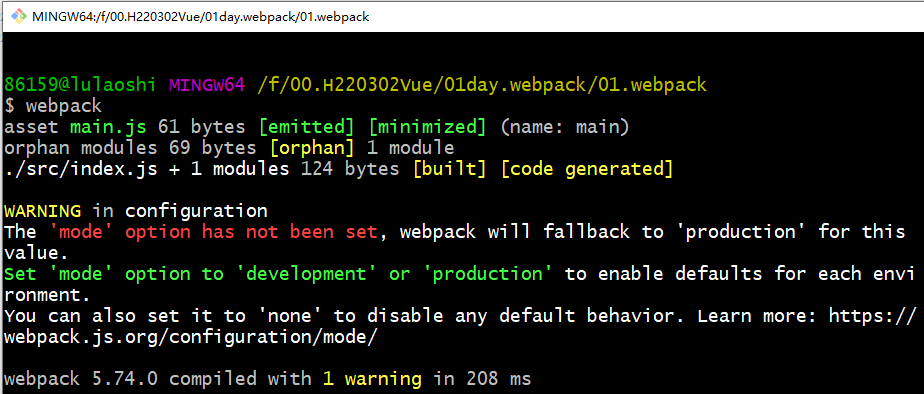

#  一、模块化开发认识

**工程化、模块化、组件化**


前端现在流行“模块化开发”这样一个理念，例如：我们的Nodejs 模块化，vue 组件化都是这样一个思想。

### 1. 什么是模块化？

模块化开发是一种管理生产方式，一个模块就是实现特定功能的文件，有了模块，我们就可以更方便地使用别人的代码，想要什么功能，就加载什么模块

### 2. 为什么要使用模块化开发

当项目变的复杂的时候，一个html页面可能需要加载好多个js文件，而这个时候就会出现各种命名冲突，如果js也可以像java一样，把不同功能的文件放在不同的package中，需要引用某个函数或功能的时候，import下相关的包，这样可以很好的解决命名冲突等各种问题

好处：

- 解决命名冲突
- 提供复用性
- 提高代码可维护性
- 灵活架构，焦点分离，方便模块间组合、分解
- 多人协作互不干扰

### 3. require  import的区别  面试题

- 遵守规范：require 是 AMD（CommonJS）规范引入方式(node平台)；import 是es6的一个语法标准。

- 调用时间：require是运行时调用，并且同步加载，所以require理论上可以运用在代码的任何地方；import是编译时调用，所以必须放在文件开头（代码最外层）。

- 本质：require是赋值过程，其实require的结果就是对象、数字、字符串、函数等，再把require的结果赋值给某个变量。

  1. require引入属于值的拷贝，可重新赋值

     1. 通过require引入基础数据类型时，属于复制该变量。

     2. 通过require引入复杂数据类型时，数据浅拷贝该对象。例如：

        A文件定义的`Redis`对象（状态M）。

        B文件通过`require()`的方式引用了A文件的`Redis`，进行了状态的修改（变为状态N）

        C文件通过`require()`的方式引用A文件的`Redis`，此时A文件的状态为N。

        也就是说，并不是进行一个深度拷贝后在进行修改。就因为是浅拷贝，所以我在初始化的时候，对`Redis`进行了初始化操作，我后续`require`的时候，拿到的`Redis`对象就是已经初始化完毕的。

  2. import引入属于值的引用

  3. 通过`import` export defaut方式导入的模块，不可以重新赋值或者定义。

  4. require运行时才引入模块的属性所以性能相对较低，import编译时引入模块的属性所所以性能稍高。

### 4. import-export  require-module.exports示例

```html
<div id="">
	模块的理解
</div>
注：浏览器打开type="module"的文件时，采用file协议来传输aaa.js这个文件的， type="module"脚本Sec-Fetch-Mode是cors   可是CORS规定要用http,data,https等方式传输，所以就会跨域。常规引入的脚本Sec-Fetch-Mode是no-cors，不受同源策略的影响。
解决在vscode 编辑器中测试时需要安装插件live server，打开页面时选择“Open with Live Server”。
<script type="module" src="./index.js"></script>
```

#### 4.1. export && import

```js
// hello.js
export default {
    sayHello: function() {
        console.log('hello');
    },
    run：function() {
        console.log('run');
    }
}
// index.js
import ex from './hello.js'
ex.sayHello();
ex.run();
```

```js
// hello.js
let sayHello = () => {
    console.log('hello');
}
let run = () => {
    console.log('I can run');
}
export { sayHello, run };

// index.js
import { sayHello, run } from './hello.js';
sayHello();
run();
```

#### 4.2 module.exports && require

```js
// index.js
const h = require('./hello.js');
h.sayHi();

// hello.js
module.exports = {
    sayHi() {
        console.log('Hi');
    }
}
```

```js
// index.js
const { sayHi, draw } = require('./hello.js');
sayHi();
draw();

// hello.js
function sayHi() {
    console.log('Hi');
}
function draw() {
    console.log('draw');
}
module.exports = { sayHi, draw }

// 或者
module.exports = {
    sayHi() {
        console.log('i');
    },
    draw() {
        console.log('d');
    }
}
```


# 二、webpack概念

**概念**：webpack视HTML，JS，CSS，图片等文件都是一种资源 ，每个资源文件都是一个模块（module）文件，webpack就是根据每个模块文件之间的依赖关系将所有的模块打包（bundle）起来。然后将所有这些模块打包成一个或多个文件

**理解**：WebPack可以看做是**模块打包机**：它做的事情是，分析你的项目结构，找到JavaScript模块以及**其它的一些浏览器不能直接运行**的拓展语言（Scss，TypeScript等），并将其打包为合适的格式以供浏览器使用。

从本质上讲 它就是一个工具，只是这个工具在使用时会使用代码去驱动它，通过代码去做配置

### 1. 为什么使用webpack?

现代JavaScript应用程序”的最大特点可能就是模块化了，这里面涉及很多新技术：

比如ES6、TS的使用越来越普及。

再比如Vue框架，包含了特定的语法：指令。

但是出现的问题是：这些新兴的技术并不是在所有的浏览器上都适用。**浏览器不支持模块化**，它不能像node.js那样快速地去本地加载一个个模块文件，所以这些文件都需要将源代码转化为可以直接在浏览器上运行的代码。

### 2. webpack与gulp的区别？

gulp强调的是前端开发的工作流程，webpack是一个前端模块化方案，更侧重模块打包

gulp相对于webapck来说更加轻量，webapck更深层次的来说它是面向对象的打包工具，gulp则是面向过程的

 

*webpack* 是组件化开发的基础，只是一个打包工具，这个工具是nodejs写的。

### 3. 官网

学会阅读文档，你会发现一切都是那么的顺理成章。

https://www.webpackjs.com/

# 三、Webpack安装

在安装Webpack之前，本地环境需要支持Node.js。

**本地全局安装**

- 由于npm安装速度慢，推荐使用淘宝镜像cnpm；

- 使用cnpm安装Webpack；

~~~shell
#注：安装webpack 及webpack-cli，不指定版本，我们学习最新版本5.0+
#全局安装
cnpm i webpack webpack-cli -g
~~~

- 查看webpack 和 webpack-cli版本

~~~shell
webpack -v
~~~


# 四、项目打包

### 1. 打包初识

- 目录结构

```c
+01.webpack
	|+src
 		|+module
   			|-hello.js
 		|-index.js
```

-   文件代码

```js
// ./src/module/hello.js
export default {
    say(){
        console.log('hello');
    }
}
// ./src/index.js
import sayHello from './module/hello';
sayHello.say();
```

- 在命令行输入**webpack** 完成打包

  

### 2. 默认选项

默认的入口文件：src/index.js  默认出口：dist/main.js

```json
webpack //不加模式
webpack --mode development // 开发环境模式
webpack --mode production // 生产环境模式
```

像一些比较小的项目，这样做自然是没问题的，但如果一个项目足够大，我们就需要专门的配置文件去做这些操作。

### 3. 指令参数

- 在命令中添加**模式设置**，解除警告

```js
webpack --mode development // 开发环境
webpack --mode production  // 生产环境
```

- webpack执行命令之后可以添加的一些参数，这些参数都有自己的作用

```js
// 参数列表
webpack --config webpack.config2.js // 使用指定的配置文件（webpack.config2.js）来打包
webpack --watch // 监听变动并自动打包
webpack --progress // 显示进度条
```


# 五、Webpack配置文件

- 创建webpack02文件夹，在文件夹下创建一个**webpack.config.js**文件，文件全名必须为"webpack.config.js"，写入配置

```js
const path=require("path");

module.exports={
	entry: "./input.js", // 入口文件(如果有多个，entry可配置为对象形式)
	output: {
		// path: path.resolve(__dirname,"dist"), // 出口文件路径
        path: __dirname + '/dist',
		filename: "bundle.js" // 出口文件名字
	},
	mode: "development" // 打包模式-开发环境
}

// 打包多个文件配置
const path=require("path");
module.exports={
	entry: {
       input1: "./input1.js",
       input2: "./input2.js"
    },
	output:{
		path: path.resolve(__dirname, "dist"),
		filename:"[name].js" // [name]中name分别取到entry中对应的文件名
	},
	mode:"development"
}
```

- 在webpack02下创建input.js文件，填入以下代码

```
console.log('123456');
```

- 在命令行中输入webpack即可完成打包


# 六 配置文件解析

### 1. 入口(entry)

**入口起点(entry point)**指示 webpack 应该使用哪个模块，来作为构建其内部***依赖图***的开始。进入入口起点后，webpack 会找出有哪些模块和库是入口起点（直接和间接）依赖的。

每个依赖项随即被处理，最后输出到称之为 *bundles* 的文件中。可以通过在 webpack 配置中配置 `entry` 属性，来指定一个入口起点（或多个入口起点）。默认值为 `./src`。 

~~~javascript
module.exports = {
  	entry: './path/to/my/entry/file.js'
    
    //entry:{
	//	myentry1:"./src/js/bar.js",
	//	myentry2:"./src/js/barTest.js",
	//}
};
~~~

 

### 2. 输出(output)

**output** 属性告诉 webpack **在哪里输出path**它所创建的 *bundles*，以及**如何命名filename**这些文件，默认值为 `./dist`。基本上，整个应用程序结构，都会被编译到你指定的输出路径的文件夹中。你可以通过在配置中指定一个 `output` 字段，来配置这些处理过程： 

~~~javascript
const path = require('path');

module.exports = {
  entry: './path/to/my/entry/file.js',
  output: {
    path: path.resolve(__dirname, 'dist'),
    filename: 'my-first-webpack.bundle.js'//单入口对应的单出口
    //filename:"[name].js"//多入口对应的多出口
  }
};
~~~

在上面的示例中，通过 `output.filename` 和 `output.path` 属性，来告诉 webpack bundle 的名称，以及我们想要 bundle 生成(emit)到哪里。 

上面导入的path 模块是一个 **Node.js 核心模块**，用于操作文件路径。 


### 3. 加载器(loader)

*loader* 让 webpack 能够去处理那些非 JavaScript 文件（webpack 自身只处理 JavaScript）。loader 可以将所有类型的文件转换为 webpack 能够处理的有效模块，然后你就可以利用 webpack 的打包能力，对它们进行处理。本质上，webpack loader **将所有类型的文件，转换为应用程序的依赖图**（和最终的 bundle）可以直接引用的模块。

loader 能够 `import` 导入任何类型的模块（例如 `.css` 文件），这是 webpack 特有的功能，其他打包程序或任务执行器可能并不支持。我们认为这种语言扩展是有很必要的，因为这可以使开发人员创建出更准确的依赖关系图。 

~~~JavaScript
const path = require('path');
const config = {
    context: __dirname + '/src', 
    // entry: ['./src/a.js', './src/b.js'],
    entry: {
        file1: './a.js',
        file2: './b.js',
        axios: './node_modules/axios/',
        myts: './my.ts'
    },
    //模式：开发者模式   生产者模式
    output: {
        filename: './js/[name].[hash].js',
        path: __dirname + '/static/'
    },
     module: {
        rules: [
            { test: /\.css$/, use: ['style-loader', 'css-loader'] },
            {
                test: /\.scss$/,
                use: [
                    { loader: "style-loader" },
                    { loader: "css-loader" },
                    { loader: "sass-loader" }
                ]
            },
            {
                test: /\.ts$/,
                use: ['ts-loader']
            },
            {
                test: /\.(png|jpg|gif)$/,
                use: [
                  {
                    loader: 'file-loader',
                    options: {
                        outputPath:'images'
                    }
                  }
                ]
              }
        ]
    },
};

module.exports = config;
~~~

以上配置表示当webpack 编译器碰到在 `require()`/`import` 语句中被解析为 '.txt' 的路径时，在对它打包之前，先**使用** `raw-loader` 转换一下。

以url-loader为例  url-loader是在文件大小（单位为字节）低于指定的限制时，可以返回一个 DataURL。那么这个DataURL就是一个base64的形式，为什么要这么做呢？（小图标就用base64展示）

一个网站上难免会有很多小图标，在过去，我们一般通过雪碧图/精灵图去展示，但是同时也产生了一个问题，就是我们在使用这些小图片的时候就只能通过background的形式去展示，并且还需要调整位置，尤其是在需要对小图标进行放大的时候计算过程比较繁琐，那除了这种方式之外，还有一种方式就是将小图片打包到css/js文件里面去，这base64格式的图片就可以直接放到js中进行使用

- 创建一个文件夹webpack03，cnpm init -y  npm init -y

- webpack文件夹下添加images文件夹，放上图片

- 在文件夹下创建input.js文件，填入以下代码


```js
import test from './images/test.jpg';
var element = document.createElement('img');
element.src = test;
document.body.appendChild(element);
```

- 在文件夹下创建webpack.config.js文件，填入以下代码

```js
const path = require("path");

const config = {
    entry: "./input.js",
    output: {
        path: path.resolve(__dirname, "dist"),
        filename: "bundle.js"
    },
    mode: "development", // 打包模式
    // 加载器loaders
    module: {
    rules: [
      {
        // 当匹配到以下后缀文件时
        test: /\.(png|jpg|gif)$/i,
        // 通过url-loader进行打包
        use: [
          {
            loader: 'url-loader',
            // url-loader配置项 如果文件大小小于819200000，则返回dataUrl(该文件的base64形式)
            options: {
              limit: 819200000,
            }
          }
        ]
      }
    ]
  }
}
module.exports = config;
```

- 在终端运行**cnpm i url-loader file-loader -save-dev(**当limit值为`Number|String` 

  指定文件的最大体积（以字节为单位）。 如果文件体积**等于**或**大于**限制，默认情况下将使用 [`file-loader`](https://webpack.docschina.org/loaders/file-loader/) ，并将所有参数传递给它。所以需要安装file-loader)

- 在终端运行webpack进行打包

- 新建index.html 文件 引入打包成功的文件，运行看是否可以看到图片

- tips: 

  file-loader: 文件加载

  url-loader:文件加载，在文件大小（单位 byte）低于指定的限制时，可以返回一个 DataURL；
  
  

### 4. 插件(plugins)

loader 被用于转换某些类型的模块，而插件则可以用于执行范围更广的任务。插件的范围包括，从打包优化和压缩，一直到重新定义环境中的变量。插件接口功能极其强大，可以用来处理各种各样的任务。 

想要使用一个插件，你只需要 `require()` 它，然后把它添加到 `plugins` 数组中。多数插件可以通过选项(option)自定义。你也可以在一个配置文件中因为不同目的而多次使用同一个插件，这时需要通过使用 `new` 操作符来创建它的一个实例 

~~~JavaScript
// 1、npm init -y（of course在这之前需要新建一个目录）
// 2、通过cnpm下载 cnpm install --save-dev html-webpack-plugin
// 3、新建index.js 或者 main.js 随便写几行代码
// 4、配置webpack.config.js
      // require引入node path模块
	  // require引入html-webpack-plugin插件
	  // plugins: [new HtmlWebpackPlugin()]
// 5、打包webpack
// 6、运行生成的html文件，看是否会执行js中的代码
const HtmlWebpackPlugin = require('html-webpack-plugin');
const path = require('path');

module.exports = {
  entry: './index.js',
  output: {
    path: path.resolve(__dirname, 'dist'),
    filename: 'index_bundle.js',
  },
  mode: 'development',
  plugins: [new HtmlWebpackPlugin()],
};
// 有html-webpack-plugin 就需要下载新的 webpack包 cnpm i webpack@5.24.3 webpack-cli@4.5.0
~~~


html-webpack-plugin为例，html-webpack-plugin将为你生成一个 HTML5 文件， 在 body 中使用 `script` 标签引入你所有 webpack 生成的 bundle。

上述代码将会生成 `dist/index.html` 文件

注：Script标签属性：async、defer。

Async: 表示应该立即下载脚本，但不应妨碍页面中的其他操作，比如下载其他资源或等待加载其他脚本。只对外部脚本文件有效（写在html文件中的js代码，添加此属性无效，仍按代码加载顺序执行）。Defer: 可选属性。标识脚本可以延迟到文档完全被解析和显示之后再执行。只对外部脚本文件有效。Async是异步加载，而不是优先加载，不阻塞

Defer: 标识脚本可以延迟到文档完全被解析和显示之后再执行。只对外部脚本文件有效。

使用场景：比如有些第三方库，要求在header中引入（这就意味着第三方插件库会优先加载），但是我们并不需要在页面加载之初就用到这个插件。那么我们可以加上defer属性使之最后加载。同理，如果页面加载的同时需要用到第三方插件，那么我们引用的时候可以加async属性，这样网站内的资源就可以与插件资源异步加载。这中方法会给网站其他资源的加载节省出一些时间，不失为一种页面优化的方法。

# 七 npm命令运行webpack 项目

**这种方式一定要通过cnpm init -y来初始化项目**

考虑到用 CLI 这种方式来运行本地的 webpack 不是特别方便，我们可以**设置一个快捷方式**。在 *package.json* 添加一个 npm 脚本(npm script)：

**package.json**

```json
  {
    "name": "webpack",
    "version": "1.0.0",
    "description": "",
    "main": "index.js",
    "scripts": {
      "test": "echo \"Error: no test specified\" && exit 1",
+     "build": "webpack"
    },
    "keywords": [],
    "author": "",
    "license": "ISC",
    "devDependencies": {
      "webpack": "^4.0.1",
      "webpack-cli": "^2.0.9",
      "lodash": "^4.17.5"
    }
  }
```

现在，可以使用 `npm run build` 命令，来替代我们之前使用的命令。

例如：

1、在scripts中添加命令

~~~shell
"start": "webpack --config webpack.config.js"
~~~

2、执行 **npm run start** 就可以将项目进行打包


# 八 加载器管理资源

## 1. 加载 CSS-loader style-loader与plugin综合

从 JavaScript 模块中 `import` 一个 CSS 文件，你需要在 [`module` 配置中](https://www.webpackjs.com/configuration/module) 安装并添加 [style-loader](https://www.webpackjs.com/loaders/style-loader) 和 [css-loader](https://www.webpackjs.com/loaders/css-loader)：

```shell
cnpm i --save-dev style-loader css-loader mini-css-extract-plugin html-webpack-plugin file-loader
```

- css-loader：处理 css 文件

- style-loader：把 js 中 import 导入的样式文件代码，打包到 js 文件中，运行 js 文件时，将样式自动插入到`<style>`标签中

- mini-css-extract-plugin：

  把 js 中 import 导入的样式文件代码，打包成一个实际的 css 文件，以<link>标签href 属性的形式实现外联引入

  手动(如果没有结合html-webpack-plugin生成html文件是自己建立的html文件 就需要自己将打包好的css文件引入) 

  可结合 html-webpack-plugin，在 dist/index.html 中以 link 插入 css 文件；默认将 js 中 import 的多个 css 文件，打包时合成一个

- 综合步骤：

  1. 创建项目文件夹webpack05  通过cnpm init -y初始化这个项目

  2. 在项目文件夹下创建 webpack05/index.js  webpack05/style/index.css文件 

  3. index.js为入口文件

     ```js
     import style from './style/index.css';
     
     let h1 = document.createElement('h1');
     h1.innerHTML = 'Hello Webpack';
     h1.classList.add('hello');
     document.querySelector('body').appendChild(h1);
     ```

  4. index.css定义样式

     ```css
     .hello {
         color: red;
     }
     ```

  5. 配置webpack.config.js

     ```json
     // 安装引入html-webpack-plugin
     const HtmlWebpackPlugin = require('html-webpack-plugin');
     module.exports = {
         entry: './index.js',
         output: {
             filename: 'output2.js',
             path: __dirname + '/dist'
         },
         mode: 'production',
         module: {
             rules: [{
                 test: /\.css$/,
                 // 安装style-loader css-loader
                 use: ['style-loader', 'css-loader' //解析css-loader必须要有，且放在数组第二项]
             }]
         },
         plugins: [
             new HtmlWebpackPlugin()
         ]
     }
     ```

  6. 配置启动命令

     ```json
     {
       "name": "07-webpack",
       "version": "1.0.0",
       "description": "",
       "main": "webpack.config.js",
       "scripts": {
         "test": "echo \"Error: no test specified\" && exit 1",
     +   "watch": "webpack --watch",
     +   "build": "webpack"
       },
       "keywords": [],
       "author": "",
       "license": "ISC",
       "devDependencies": {
         "clean-webpack-plugin": "^4.0.0-alpha.0",
         "mini-css-extract-plugin": "^1.6.0",
         "webpack-dev-server": "^3.11.2"
       }
     }
     ```

  7. 通过npm run build 执行项目

  8. 添加mini-css-extract-plugin（替代style-loader 区别见上）

     ```js
       const HtmlWebpackPlugin = require('html-webpack-plugin');
       // 安装并引入mini-css-extract-plugin
     + const MiniCssExtractPlugin = require('mini-css-extract-plugin');
     module.exports = {
         entry: './index.js',
         output: {
             filename: 'output2.js',
             path: __dirname + '/dist'
         },
         mode: 'production',
         module: {
             rules: [{
                 test: /\.css$/,
                 // 安装style-loader css-loader
                 use: [MiniCssExtractPlugin.loader, 'css-loader' //解析css-loader必须要有，且放在数组第二项]
             }]
         },
         plugins: [
             new HtmlWebpackPlugin(),
     +       new MiniCssExtractPlugin({
     +          filename: 'style.css' // 指定生成的css文件名
     +       })
         ]
     }
     ```

  10. 启用 webpack-dev-server

      ```js
      const HtmlWebpackPlugin = require('html-webpack-plugin');
      const MiniCssExtractPlugin = require('mini-css-extract-plugin');
      module.exports = {
          entry: './index.js',
          output: {
              // filename: 'output.js',
              filename: 'output2.js',
              path: __dirname + '/dist'
          },
          mode: 'production',
          module: {
              rules: [{
                  test: /\.css$/,
                  use: [
                      MiniCssExtractPlugin.loader,
                      'css-loader'
                  ]
                  // use: ['style-loader', 'css-loader']
              }]
          },
          plugins: [
              new HtmlWebpackPlugin(),
              new MiniCssExtractPlugin({
                  filename: 'style.css'
              })
          ],
          // 安装webpack-dev-server
      +   devServer: {
      +       contentBase: './dist', // html页面所在的相对目录，我们不配置，devServer默认html所在的目录为项目的根目录
      +       host: 'localhost', // devServer.host配置项用于配置DevServer服务监听的地址
      +       compress: true, // 是否启用 gzip 压缩。boolean 为类型，默认为 false。
      +       port: 8080, // 服务器端口
      +       open: true, // 是否自动打开默认浏览器
      +       hot: true // 是否热更替 也就是页面刷新。
      +    }
      }
      ```
      
      **配置了热更新 通过webpack server 启动热服务**
  
  11. 设定html-webpack-plugin
  
      ```js
      const HtmlWebpackPlugin = require('html-webpack-plugin');
      const MiniCssExtractPlugin = require('mini-css-extract-plugin');
      module.exports = {
          entry: './index.js',
          output: {
              // filename: 'output.js',
              filename: 'output2.js',
              path: __dirname + '/dist'
          },
          mode: 'production',
          module: {
              rules: [{
                  test: /\.css$/,
                  use: [
                      MiniCssExtractPlugin.loader,
                      'css-loader'
                  ]
                  // use: ['style-loader', 'css-loader']
              }]
          },
          plugins: [
              new HtmlWebpackPlugin({
                  // 是否为所有注入的静态资源(脚本和CSS文件)添加webpack每次编译产生的唯一hash值，添加hash形式如下所示：
                  // html <script type="text/javascript" src="common.js?a3e1396b501cdd9041be"></script> 每次都会重新引入 这对缓存清除很有用
      +            hash: true, 
      +            filename: 'index.html', // 打包后生成的文件名  放在output.path里面
      +            template: './my.html', // 来自哪里 模板文件
      +            inject: 'body', // 引入js的位置: 'head'-头部引入 'body'/true-</body>之前引入 false不引入
      +            minify: { // 压缩项配置
      +                removeComments: true, // 是否清除HTML注释  
      +                collapseWhitespace: true, // 是否压缩HTML  
      +                removeScriptTypeAttributes: true, // 是否删除< script>的type="text/javascript"  
      +                removeStyleLinkTypeAttributes: true, // 是否删除< style>和< link>的type="text/css"  
      +                minifyJS: false, // 是否压缩页内JS  
      +                minifyCSS: true // 是否压缩页内CSS  
      +            }
              }),
              new MiniCssExtractPlugin({
                  filename: 'style.css'
              })
          ],
          devServer: {
             contentBase: './dist', // html页面所在的相对目录，我们不配置，devServer默认html所在的目录为项目的根目录
             host: 'localhost', // devServer.host配置项用于配置DevServer服务监听的地址
             compress: true, // 是否启用 gzip 压缩。boolean 为类型，默认为 false。
             port: 8080, // 服务器端口
             open: true, // 是否自动打开默认浏览器
             hot: true // 是否热更替 也就是页面刷新。
          }
      }
      ```
      
  12. packge.json增加配置启动命令
  
      ```json
      {
        "name": "07-webpack",
        "version": "1.0.0",
        "description": "",
        "main": "webpack.config.js",
        "scripts": {
          "test": "echo \"Error: no test specified\" && exit 1",
          "watch": "webpack --watch",
      +   "dev": "webpack-dev-server --config webpack.config.js",
      +   "start": "npm run dev",
          "build": "webpack"
        },
        "keywords": [],
        "author": "",
        "license": "ISC",
        "devDependencies": {
          "clean-webpack-plugin": "^4.0.0-alpha.0",
          "mini-css-extract-plugin": "^1.6.0",
          "webpack-dev-server": "^3.11.2"
        }
      }
      
      ```

现在可以通过运行构建命令：npm run start 启动webpack-dev-server

13. 增加file-loader（使用vue需要增加）

    ```js
    {
        test: /\.(eot|svg|ttf|woff|woff2)(\?\S*)?$/,
        use: ['file-loader']
    }
    ```

    

# 九 插件处理输出

到目前为止，我们在 `index.html` 文件中手动引入所有资源，然而随着应用程序增长，手动地对 `index.html` 文件进行管理，一切就会变得困难起来。然而，可以通过一些插件，会使这个过程更容易操控。

## 1. 设定 HtmlWebpackPlugin

首先安装插件，并且调整 `webpack.config.js` 文件：

```shell
cnpm install --save-dev html-webpack-plugin
```

**webpack.config.js**

```javascript
  const path = require('path');
+ const HtmlWebpackPlugin = require('html-webpack-plugin');

  module.exports = {
    entry: './src/js/index.js',
+   plugins: [
+		new HtmlWebpackPlugin({
+			hash:true,				// 为所有包含的脚本和CSS文件附加唯一的编译哈希，这对缓存清除很有用
+			filename: 'index.html', // 打包后生成的文件名  放在output.path里面
+			template: './src/my.html',    // 来自哪里 模板文件
+			inject: 'body',         // 引入js的位置: 'head'-头部引入 'body'/true--</body>之前引入 false不引入
+			minify: {				  // 压缩项配置
+			    removeComments: true, // 是否清除HTML注释  
+			    collapseWhitespace: true, // 是否压缩HTML  
+			    removeScriptTypeAttributes: true, // 是否删除< script>的type="text/javascript"  
+			    removeStyleLinkTypeAttributes: true, // 是否删除< style>和< link>的type="text/css"  
+			    minifyJS: false, // 是否压缩页内JS  
+			    minifyCSS: true // 是否压缩页内CSS  
+			}
+		})
+   ],
    output: {
+     filename: './js/[hash:6].js',
      path: path.resolve(__dirname, 'dist')
    }
  };
```

让我们看下在执行 `npm run build` 后会发生什么：

**如果你在代码编辑器中将 `index.html` 打开，你就会看到 `HtmlWebpackPlugin` 创建了一个全新的文件，所有的 bundle 会自动添加到 html 中。**


## 2. 使用 webpack-dev-server 

`webpack-dev-server` 为你提供了一个简单的 web 服务器，并且能够**实时重新加载**(live reloading)。让我们设置以下：

```shell
cnpm install --save-dev webpack-cli webpack mini-css-extract-plugin html-webpack-plugin style-loader css-loader webpack-dev-server
```

修改配置文件，告诉开发服务器(dev server)，在哪里查找文件：

**webpack.config.js**

```js
  const path = require('path');
  const MiniCssExtractPlugin = require("mini-css-extract-plugin");  /*不能和style-loader一起开启哦*/
  const HtmlWebpackPlugin = require('html-webpack-plugin');

  module.exports = {
    entry: './src/index.js',
    output: {
      filename: 'bundle.js',
      path: path.resolve(__dirname, 'dist')
    },
    mode: 'development',
    module: {
      rules: [{
        test: /\.css$/, //正则表达式不要加igm 属性，影响loader 的多次匹配
        use: [
          // MiniCssExtractPlugin.loader, // 以<link>标签href 属性的形式实现外联引入,手动
          'style-loader', //以<style>标签的形式引入在html 页内，只能与上面方式二选一
          'css-loader' //解析css-loader必须要有，且放在数组第二项
        ]
      }]
    },
    plugins: [
      // new MiniCssExtractPlugin({
      //   filename: 'style.css'
      // }),
      new HtmlWebpackPlugin()
    ],
    devServer: {
        //告诉dev-server在服务器启动后打开浏览器。将其设置为true以打开默认浏览器。但是:如果你的电脑有防火墙或者有管理员权限的限制或者电脑很卡 可能不会自定打开浏览器
		open: true, //cli中 webpack serve --open					
						
		//本地服务器监听的端口
		port: 8080,
		
		//启用热更新,直接使用webpack的热更新模块.就是改了代码自动打包后自定刷新浏览器页面:bug就是同open,记住 卡了就刷新一下不用纠结
	    hot: true,
		
		//指定要使用的主机(localhost|ipv4|ipv6)。如果你想让你的服务器可以被外部访问,像这样指定:
        //让你同桌访问 然后你改项目代码 他就会刷新
		host: '192.168.2.60',
		
		//启用gzip压缩
		compress: true,
			
		//代理配置,这里只是配置,不用写代理服务器的代码(配置好了它帮我们实现)
		proxy: {
			'/api': 'http://localhost:7001',
		},
		 // proxy: {
		 //      '/api': {
		 //        target: 'http://localhost:7001',
         //        secure:true,//如果代理的target是https接口,需要配置它 
		 //        pathRewrite: { '^/api': '/chongxie' },//请求时重写pathname
		 //      },
		 //    },
	}
  };
```

以上配置告知 `webpack-dev-server`，在 `localhost:8080` 下建立服务，将 `dist` 目录下的文件，作为可访问文件。

通过webpack server 命令运行

也可以添加一个 script 脚本，可以直接运行开发服务器(dev server)：

**package.json**

```json
  {
    "name": "development",
    "version": "1.0.0",
    "description": "",
    "main": "webpack.config.js",
    "scripts": {
      "test": "echo \"Error: no test specified\" && exit 1",
      "watch": "webpack --watch",
+     "dev": "webpack-dev-server --open --progress --config webpack.config.js",
+     "start": "npm run dev",
+     "build": "webpack"
    },
    "keywords": [],
    "author": "",
    "license": "ISC",
    "devDependencies": {
      "clean-webpack-plugin": "^0.1.16",
      "css-loader": "^0.28.4",
      "csv-loader": "^2.1.1",
      "file-loader": "^0.11.2",
      "html-webpack-plugin": "^2.29.0",
      "style-loader": "^0.18.2",
      "webpack": "^3.0.0",
      "xml-loader": "^1.2.1"
    }
  }
```

现在，我们可以在命令行中运行 `npm run start`，就会看到浏览器自动加载页面。如果现在修改和保存任意源文件，web 服务器就会自动重新加载编译后的代码。试一下！

`webpack-dev-server` 带有许多可配置的选项。转到[相关文档](https://webpack.docschina.org/configuration/dev-server)以了解更多。

> 现在，服务器正在运行，你可能需要尝试[模块热替换(Hot Module Replacement)](https://webpack.docschina.org/guides/hot-module-replacement)！

**webpack打包与webpack-dev-server有什么区别：**

1、webpack不会实时更新修改，就只是一个打包工具，webpack-dev-server会实时自动更新修改
2、webpack打包输出路径，output字段为path，webpack-dev-server打包输出路径，output字段为publicPath(此值为空时默认是项目根目录 运行项目之后，访问localhost:8080即可，如果指定为dist，则应访问localhost:8080/dist/)
3、webpack打包输出的文件，是真的存在于物理地址path中，而webpack-dev-server打包输出的文件，是保存在内存中的，在项目目录中是找不到的。

注：devServer.compress 是一个布尔型的值，当它被设置为true的时候对所有的服务器资源采用gzip压缩

采用gzip压缩的优点和缺点：

​	优点：对JS，CSS资源的压缩率很高，可以极大得提高文件传输的速率，从而提升web性能

​	缺点：服务端要对文件进行压缩，而客户端要进行解压，增加了两边的负载

# 十 webpack 常遇面试题

<https://www.cnblogs.com/gaoht/p/11310365.html>

## 1. webpack 与 gulp 工具的区别？

​	webpack偏向于模块化开发的思想，gulp偏向于面向过程开发模式

​	webpack适用于大型复杂的前端站点构建，gulp 轻量级


## 2. webpack里loader与plugin的不同？

​	loader负责文件格式转换

​	plugin负责对转换后的文件进行修饰


## 3. webpack的构建流程是什么?

​	1、读取命令行或者配置文件里的参数

​	2、初始化工具

​	3、读取entry

​	4、使用loader

​	5、plugin

​	6、输出文件


## 4. webpack-dev-server思想？

wepack 静态打包和 webpack-dev-server区别

​	当文件发生修改，通知各个模块进行更新加载，加载到计算机内存，刷新浏览器


## 5. webpack 优化前端性能？

优化代码/优化前端性能？
html:	结构清晰
css:	文件合并，CDN分布式服务器，样式选择器预先写好
js:	dom 操作合并，尽量避免dom 操作放到for循环里，避免重绘和重排	

webpack 插件做优化：压缩，删除死代码，提取公共代码

​	1、添加配置，压缩代码

​	2、使用CDN

​	3、追加参数，删除死代码，--optimize-minimize

​	4、提取公共代码


# 课程拓展

## 1. npm中 -D --seve-dev --save -S 区别

- -D 就是 --save-dev的简写

- -S 就是 --save 的简写

- 理解：
  我们在安装工具包之前常常先写入npm init -y 来创建package.json帮我们记录包的名称以及版本号等等

  而通过输入 -D 命令时，包的名称及版本号就会在 devDependencies 中显示

  输入 -S 命令时，包的名称及版本号就在 dependencies 中显示。

  devDependencies即开发依赖，只在开发时使用，产品上线时不需要

  dependencies即生产依赖，在生产环境中使用。

## 2. 使用clean-webpack-plugin

这个插件是用来 帮我们清除 打包之后 dist 目录下的其他多余或者无用的代码
因为我们之前可能生成过其他的 代码 如果不清楚的话 可能 多个代码掺杂在一起 容易把我们搞混乱了
clean-webpack-plugin 插件 就是这样由来的 每次生成代码之前 先将 dist 目录 清空

1. 安装
   
   ```react
   npm i clean-webpack-plugin -D
   ```
   
2. 引入 

   ```react
   const {CleanWebpackPlugin}=require("clean-webpack-plugin");
   ```

3. 使用 在webpack.config.js的plugins 中配置
   new CleanWebpackPlugin() // 注意 老版本可能要写 清空的路径 新版本不需要自动指定的是 打包输出的目录与
   这样的话 运行 npm run build 就可以看到效果了

```json
const HtmlWebpackPlugin = require('html-webpack-plugin');
const MiniCssExtractPlugin = require('mini-css-extract-plugin');
+ const { CleanWebpackPlugin } = require('clean-webpack-plugin');
module.exports = {
    entry: './index.js',
    output: {
        // filename: 'output.js',
        filename: 'output2.js',
        path: __dirname + '/dist'
    },
    mode: 'production',
    module: {
        rules: [{
            test: /\.css$/,
            use: [
                MiniCssExtractPlugin.loader,
                'css-loader'
            ]
            // use: ['style-loader', 'css-loader']
        }]
    },
    plugins: [
        new HtmlWebpackPlugin({
            // 是否为所有注入的静态资源添加webpack每次编译产生的唯一hash值，添加hash形式如下所示：
            // html <script type="text/javascript" src="common.js?a3e1396b501cdd9041be"></script> 每次都会重新引入
            hash: true, // 为所有包含的脚本和CSS文件附加唯一的编译哈希，这对缓存清除很有用
            filename: 'index.html', // 打包后生成的文件名  放在output.path里面
            template: './my.html', // 来自哪里 模板文件
            inject: 'body', // 引入js的位置: 'head'-头部引入 'body'/true-</body>之前引入 false不引入
            minify: { // 压缩项配置
                removeComments: true, // 是否清除HTML注释  
                collapseWhitespace: true, // 是否压缩HTML  
                removeScriptTypeAttributes: true, // 是否删除< script>的type="text/javascript"  
                removeStyleLinkTypeAttributes: true, // 是否删除< style>和< link>的type="text/css"  
                minifyJS: false, // 是否压缩页内JS  
                minifyCSS: true // 是否压缩页内CSS  
            }
        }),
        new MiniCssExtractPlugin({
            filename: 'style.css'
        }),
+       new CleanWebpackPlugin()
    ],
    devServer: {
        //contentbase代表html页面所在的相对目录，如果我们不配置项，devServer默认html所在的目录就是项目的根目录，这个时候启动服务
        contentBase: './dist',
        //devServer.host配置项用于配置DevServer服务监听的地址，只能通 过命令行参数传入。host的默认值是 127.0.0.1，即只有本地可以访问DevServer的           HTTP服务。若想让局域网中的其他设备访问自己的本地 服务，则可以在启动DevServer时带上--host 0.0.0.0。
        host: 'localhost',
        // 是否启用 gzip 压缩。boolean 为类型，默认为 false。
        compress: true,
        // 服务器端口
        port: 8080,
        // 是否自动打开默认浏览器
        open: true,
        // 是否热更替 也就是页面刷新。
        hot: true
    }
}
```


## 3. surce map

当 webpack 打包源代码时，可能会很难追踪到错误和警告在源代码中的原始位置。例如，如果将三个源文件（`a.js`, `b.js` 和 `c.js`）打包到一个 bundle（`bundle.js`）中，而其中一个源文件包含一个错误，那么堆栈跟踪就会简单地指向到 `bundle.js`。这并通常没有太多帮助，因为你可能需要准确地知道错误来自于哪个源文件。

为了更容易地追踪错误和警告，JavaScript 提供了 [source map](http://blog.teamtreehouse.com/introduction-source-maps) 功能，将编译后的代码映射回原始源代码。如果一个错误来自于 `b.js`，source map 就会明确的告诉你。

source map 有很多[不同的选项](https://webpack.docschina.org/configuration/devtool)可用，请务必仔细阅读它们，以便可以根据需要进行配置。

对于本指南，我们使用 `inline-source-map` 选项，这有助于解释说明我们的目的（仅解释说明，不要用于生产环境）：

**webpack.config.js**

```javascript
  const path = require('path');
  const HtmlWebpackPlugin = require('html-webpack-plugin');
  const {CleanWebpackPlugin} = require('clean-webpack-plugin');

  module.exports = {
    entry: {
      app: './src/index.js',
      print: './src/print.js'
    },
+   devtool: 'inline-source-map',
    plugins: [
      new CleanWebpackPlugin(['dist']),
      new HtmlWebpackPlugin({
        title: 'Development'
      })
    ],
    output: {
      filename: '[name].bundle.js',
      path: path.resolve(__dirname, 'dist')
    }
  };
```

现在，让我们来做一些调试，在 `print.js` 文件中生成一个错误：

**src/print.js**

```javascript
  export default function printMe() {
-   console.log('I get called from print.js!');
+   cosnole.error('I get called from print.js!');
  }
```

运行 `npm run build`，就会编译为如下：

```
Hash: 7bf68ca15f1f2690e2d1
Version: webpack 3.1.0
Time: 1224ms
          Asset       Size  Chunks                    Chunk Names
  app.bundle.js    1.44 MB    0, 1  [emitted]  [big]  app
print.bundle.js    6.43 kB       1  [emitted]         print
     index.html  248 bytes          [emitted]
   [0] ./src/print.js 84 bytes {0} {1} [built]
   [1] ./src/index.js 403 bytes {0} [built]
   [3] (webpack)/buildin/global.js 509 bytes {0} [built]
   [4] (webpack)/buildin/module.js 517 bytes {0} [built]
    + 1 hidden module
Child html-webpack-plugin for "index.html":
       [2] (webpack)/buildin/global.js 509 bytes {0} [built]
       [3] (webpack)/buildin/module.js 517 bytes {0} [built]
        + 2 hidden modules

```

现在在浏览器打开最终生成的 `index.html` 文件，点击按钮，并且在控制台查看显示的错误。错误应该如下：

```
 Uncaught ReferenceError: cosnole is not defined
    at HTMLButtonElement.printMe (print.js:2)

```

我们可以看到，此错误包含有发生错误的文件（`print.js`）和行号（2）的引用。这是非常有帮助的，因为现在我们知道了，所要解决的问题的确切位置。


## 4. 使用 webpack-dev-middleware 

`webpack-dev-middleware` 是一个容器(wrapper)，它可以把 webpack 处理后的文件传递给一个服务器(server)。 `webpack-dev-server` 在内部使用了它，同时，它也可以作为一个单独的包来使用，以便进行更多自定义设置来实现更多的需求。接下来是一个 webpack-dev-middleware 配合 express server 的示例。

首先，安装 `express` 和 `webpack-dev-middleware`：

```
npm install --save-dev express webpack-dev-middleware
```

接下来我们需要对 webpack 的配置文件做一些调整，以确保中间件(middleware)功能能够正确启用：

**webpack.config.js**

```json
  const path = require('path');
  const HtmlWebpackPlugin = require('html-webpack-plugin');
  // 打包时，清空上一次打包的内容
  const CleanWebpackPlugin = require('clean-webpack-plugin');

  module.exports = {
    entry: {
      app: './src/index.js',
      print: './src/print.js'
    },
    devtool: 'inline-source-map',
    plugins: [
      new CleanWebpackPlugin(['dist']),
      new HtmlWebpackPlugin({
        title: 'Output Management'
      })
    ],
    output: {
      filename: '[name].bundle.js',
      path: path.resolve(__dirname, 'dist'),
+     publicPath: '/'
    }
  };
```

`publicPath` 也会在服务器脚本用到，以确保文件资源能够在 `http://localhost:3000` 下正确访问，我们稍后再设置端口号。下一步就是设置我们自定义的 `express` 服务：

**project**

```
  webpack-demo
  |- package.json
  |- webpack.config.js
+ |- server.js
  |- /dist
  |- /src
    |- index.js
    |- print.js
  |- /node_modules
```

**server.js**

```
const express = require('express');
const webpack = require('webpack');
const webpackDevMiddleware = require('webpack-dev-middleware');

const app = express();
const config = require('./webpack.config.js');
const compiler = webpack(config);

// Tell express to use the webpack-dev-middleware and use the webpack.config.js
// configuration file as a base.
app.use(webpackDevMiddleware(compiler, {
  publicPath: config.output.publicPath
}));

// Serve the files on port 3000.
app.listen(3000, function () {
  console.log('Example app listening on port 3000!\n');
});
```

现在，添加一个 npm script，以使我们更方便地运行服务：

**package.json**

```
  {
    "name": "development",
    "version": "1.0.0",
    "description": "",
    "main": "webpack.config.js",
    "scripts": {
      "test": "echo \"Error: no test specified\" && exit 1",
      "watch": "webpack --watch",
      "start": "webpack-dev-server --open",
+     "server": "node server.js",
      "build": "webpack"
    },
    "keywords": [],
    "author": "",
    "license": "ISC",
    "devDependencies": {
      "clean-webpack-plugin": "^0.1.16",
      "css-loader": "^0.28.4",
      "csv-loader": "^2.1.1",
      "express": "^4.15.3",
      "file-loader": "^0.11.2",
      "html-webpack-plugin": "^2.29.0",
      "style-loader": "^0.18.2",
      "webpack": "^3.0.0",
      "webpack-dev-middleware": "^1.12.0",
      "xml-loader": "^1.2.1"
    }
  }
```

现在，在你的终端执行 `npm run server`，将会有类似如下信息输出：

```
Example app listening on port 3000!
webpack built 27b137af6d9d8668c373 in 1198ms
Hash: 27b137af6d9d8668c373
Version: webpack 3.0.0
Time: 1198ms
          Asset       Size  Chunks                    Chunk Names
  app.bundle.js    1.44 MB    0, 1  [emitted]  [big]  app
print.bundle.js    6.57 kB       1  [emitted]         print
     index.html  306 bytes          [emitted]
   [0] ./src/print.js 116 bytes {0} {1} [built]
   [1] ./src/index.js 403 bytes {0} [built]
   [2] ./node_modules/lodash/lodash.js 540 kB {0} [built]
   [3] (webpack)/buildin/global.js 509 bytes {0} [built]
   [4] (webpack)/buildin/module.js 517 bytes {0} [built]
Child html-webpack-plugin for "index.html":
         Asset    Size  Chunks  Chunk Names
    index.html  544 kB       0
       [0] ./node_modules/html-webpack-plugin/lib/loader.js!./node_modules/html-webpack-plugin/default_index.ejs 538 bytes {0} [built]
       [1] ./node_modules/lodash/lodash.js 540 kB {0} [built]
       [2] (webpack)/buildin/global.js 509 bytes {0} [built]
       [3] (webpack)/buildin/module.js 517 bytes {0} [built]
webpack: Compiled successfully.
```

现在，打开浏览器，跳转到 `http://localhost:3000`，你应该看到你的webpack 应用程序已经运行！


## 5. 模块热替换（hot module replacement）

 模块热替换(HMR - Hot Module Replacement)功能会在应用程序运行过程中**替换、添加或删除模块**，而无需重新加载整个页面。主要是通过以下几种方式，来显著加快开发速度：

- 保留在完全重新加载页面时丢失的应用程序状态。
- 只更新变更内容，以节省宝贵的开发时间。
- 调整样式更加快速 - 几乎相当于在浏览器调试器中更改样式。


## 6. 启用 HMR 

启用此功能实际上相当简单。而我们要做的，就是更新 [webpack-dev-server](https://github.com/webpack/webpack-dev-server) 的配置，和使用 webpack 内置的 HMR 插件。我们还要删除掉 `print.js` 的入口起点，因为它现在正被 `index.js` 模式使用。

**webpack.config.js**

```
  const path = require('path');
  const HtmlWebpackPlugin = require('html-webpack-plugin');
  const CleanWebpackPlugin = require('clean-webpack-plugin');
+ const webpack = require('webpack');

  module.exports = {
    entry: {
-      app: './src/index.js',
-      print: './src/print.js'
+      app: './src/index.js'
    },
    devtool: 'inline-source-map',
    devServer: {
      contentBase: './dist',
+     hot: true
    },
    plugins: [
      new CleanWebpackPlugin(['dist']),
      new HtmlWebpackPlugin({
        title: 'Hot Module Replacement'
      }),
+     new webpack.HotModuleReplacementPlugin()
    ],
    output: {
      filename: '[name].bundle.js',
      path: path.resolve(__dirname, 'dist')
    }
  };
```

> 你可以通过命令来修改 [webpack-dev-server](https://github.com/webpack/webpack-dev-server) 的配置：`webpack-dev-server --hotOnly`。

现在，我们来修改 `index.js` 文件，以便当 `print.js` 内部发生变更时可以告诉 webpack 接受更新的模块。

**index.js**

```
  import _ from 'lodash';
  import printMe from './print.js';

  function component() {
    var element = document.createElement('div');
    var btn = document.createElement('button');

    element.innerHTML = _.join(['Hello', 'webpack'], ' ');

    btn.innerHTML = 'Click me and check the console!';
    btn.onclick = printMe;

    element.appendChild(btn);

    return element;
  }

  document.body.appendChild(component());
+
+ if (module.hot) {
+   module.hot.accept('./print.js', function() {
+     console.log('Accepting the updated printMe module!');
+     printMe();
+   })
+ }
```

更改 `print.js` 中 `console.log` 的输出内容，你将会在浏览器中看到如下的输出。

**print.js**

```
  export default function printMe() {
-   console.log('I get called from print.js!');
+   console.log('Updating print.js...')
  }
```

**console**

```
[HMR] Waiting for update signal from WDS...
main.js:4395 [WDS] Hot Module Replacement enabled.
+ 2main.js:4395 [WDS] App updated. Recompiling...
+ main.js:4395 [WDS] App hot update...
+ main.js:4330 [HMR] Checking for updates on the server...
+ main.js:10024 Accepting the updated printMe module!
+ 0.4b8ee77….hot-update.js:10 Updating print.js...
+ main.js:4330 [HMR] Updated modules:
+ main.js:4330 [HMR]  - 20
```


## 7. 通过 Node.js API 

当使用 webpack dev server 和 Node.js API 时，不要将 dev server 选项放在 webpack 配置对象(webpack config object)中。而是，在创建选项时，将其作为第二个参数传递。例如：

`new WebpackDevServer(compiler, options)`

想要启用 HMR，还需要修改 webpack 配置对象，使其包含 HMR 入口起点。`webpack-dev-server` package 中具有一个叫做 `addDevServerEntrypoints` 的方法，你可以通过使用这个方法来实现。这是关于如何使用的一个小例子：

**dev-server.js**

```javascript
const webpackDevServer = require('webpack-dev-server');
const webpack = require('webpack');

const config = require('./webpack.config.js');
const options = {
  contentBase: './dist',
  hot: true,
  host: 'localhost'
};

webpackDevServer.addDevServerEntrypoints(config, options);
const compiler = webpack(config);
const server = new webpackDevServer(compiler, options);

server.listen(5000, 'localhost', () => {
  console.log('dev server listening on port 5000');
});
```


## 8. HMR 修改样式表 

借助于 `style-loader` 的帮助，CSS 的模块热替换实际上是相当简单的。当更新 CSS 依赖模块时，此 loader 在后台使用 `module.hot.accept` 来修补(patch) `<style>` 标签。

所以，可以使用以下命令安装两个 loader ：

```shell
npm install --save-dev style-loader css-loader
```

接下来我们来更新 webpack 的配置，让这两个 loader 生效。

**webpack.config.js**

```javascript
  const path = require('path');
  const HtmlWebpackPlugin = require('html-webpack-plugin');
+ const webpack = require('webpack');

  module.exports = {
    entry: {
      app: './src/index.js'
    },
    devtool: 'inline-source-map',
    devServer: {
      contentBase: './dist',
+     hot: true
    },
+   module: {
+     rules: [
+       {
+         test: /\.css$/,
+         use: ['style-loader', 'css-loader']
+       }
+     ]
+   },
    plugins: [
      new CleanWebpackPlugin(['dist'])
      new HtmlWebpackPlugin({
        title: 'Hot Module Replacement'
      }),
+     new webpack.HotModuleReplacementPlugin()
    ],
    output: {
      filename: '[name].bundle.js',
      path: path.resolve(__dirname, 'dist')
    }
  };
```

热加载样式表，与将其导入模块一样简单：

**project**

```
  webpack-demo
  | - package.json
  | - webpack.config.js
  | - /dist
    | - bundle.js
  | - /src
    | - index.js
    | - print.js
+   | - styles.css
```

**styles.css**

```css
body {
  background: blue;
}
```

**index.js**

```javascript
  import _ from 'lodash';
  import printMe from './print.js';
+ import './styles.css';

  function component() {
    var element = document.createElement('div');
    var btn = document.createElement('button');

    element.innerHTML = _.join(['Hello', 'webpack'], ' ');

    btn.innerHTML = 'Click me and check the console!';
    btn.onclick = printMe;  // onclick event is bind to the original printMe function

    element.appendChild(btn);

    return element;
  }

  let element = component();
  document.body.appendChild(element);

  if (module.hot) {
    module.hot.accept('./print.js', function() {
      console.log('Accepting the updated printMe module!');
      document.body.removeChild(element);
      element = component(); // Re-render the "component" to update the click handler
      document.body.appendChild(element);
    })
  }
```

将 `body` 上的样式修改为 `background: red;`，你应该可以立即看到页面的背景颜色随之更改，而无需完全刷新。

**styles.css**

```css
  body {
-   background: blue;
+   background: red;
  }
```


